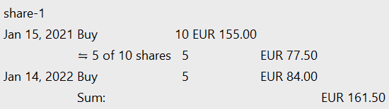
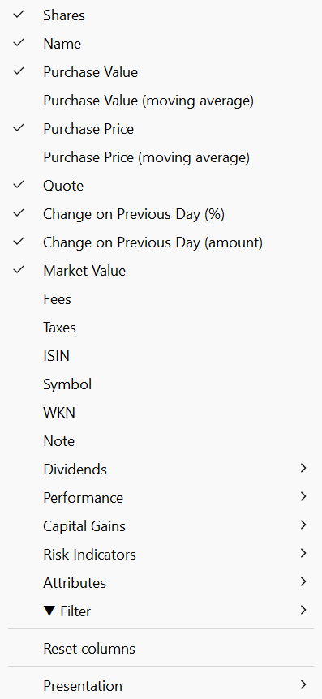
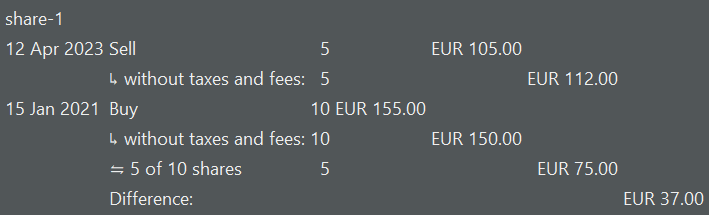

While the Reports > Performance menu gives you the most important key performance indicators on portfolio level such as IRR and TTWROR, the Reports > Performance > Securities menu provides you with much more detail on security level. However, it's important to understand the difference; especially in terms of cashflows (see section on performance).

Figure: Overview of Performance > Reports > Securities. {class=pp-figure}

## Main Pane
The Reports > Performance > Securities menu contains a main pane (top) and an information pane (bottom) of the selected security from the main pane. Performance calculation is always dependent on the chosen Reporting Period, which could be set with the drop-down at the top-right. 

The first Filter group (top right) allows you to narrow down the securities list to `shares` &ne; `0` or `shares = 0`. The latter filter will display only those shares that have been completely sold, where the number of purchased shares has dropped to zero. Without either of these filters, all shares, regardless of quantity, are displayed. The second filter group is also detailed in the [Performance > Calculation menu](calculation.md#main-pane), allowing you to choose either the entire portfolio or specific individual accounts.

The top and/or bottom sum line displays the total of columns such as Purchase Value, Market Value, paid Dividends, and others, including fees (see below to add this column), but only for the filtered securities. Using the **Settings** :gear: icon, you can choose to display the sum at the top, bottom, both, or not at all.

The `Export as CSV file` option will save the current table, including only the visible columns, as a CSV file.

The `Show or Hide columns` icon provides access to the entire (lengthy) list of available fields that can be displayed.

### Visible columns
- Shares: the number of shares in the security account at the valuation time; which is the end date of the reporting period; e.g. June 12, 2023 in Figure 1.
- Name: the name of the security.
- Purchase value: The small icon preceding the heading name indicates that this concept deviates from the more common `Bying price`. When hovering over the column heading with the mouse, a small popup will appear, explaining the meaning of the concept. The purchase value of the available shares (at valuation time) is calculated using the FIFO (First-in/First-Out) method and includes transaction fees and taxes.
    For `share-2` in Figure 1, this calculation is relatively straightforward. On September 30, 2022, eight shares were purchased at a quoted price of 16 EUR/share, totaling 67 EUR, which includes 3 EUR of transaction fees and taxes.

    Hovering over the purchase value of `share-1` will display a transaction history (refer to Figure 2), which is more complex. On January 15, 2021, ten shares were purchased for 155 EUR (including fees and taxes). Of these 10 shares, 5 remain after the sale on April 12, 2023, valued at 77.50 EUR (half of the original 155 EUR). A second purchase of 5 shares was made on January 14, 2022, for 84 EUR, bringing the total purchase value to 161.50 EUR at the time of valuation.

    Figure: Purchase Value. {class=pp-figure}

    

- Purchase price: As with the Purchase Value, this is the calculated buying price, taking into account multiple purchases and sales. For example, the five remaining shares of `share-1` from the first purchase were priced at 15 EUR excluding fees and taxes. The second purchase of 5 shares was priced at 16 EUR (excl fees and taxes). The *weighted* average purchase price is [(5 x 15) + (5 x 16)]/10 = 15.50 EUR.
- Quote at the end of the reporting period (valuation time).
- &delta; %: Represents the change in the quote compared to the previous day, calculated from today. Hovering over the value will display the exact quote prices for the two days.
- &delta; amount: Similar to the above, but noted in absolute value; e.g. euro.
- Market value: Is equal to the amount of shares x the quote price at valuation time; e.g. 190.06 EUR = 10 x 19.006 EUR for `share-1`.
- &sum; Div: the total of paid dividends, inclusive fees and taxes.
- TTWROR and IRR: see section on performance calculation below.
- Absolute Performance: Absolute Performance = market value + sell/outbound deliveries + dividends - taxes - fees - initial valuation - buy/inbound deliveries. The absolute performance is always limited to the reporting period, e.g. the purchase value is the valuation at the beginning of the reporting period. The absolute performance differs from the capital gains (current holdings) to the effect that dividends, taxes, and capital gains of sold securities are included. FROM popover!!!

### Available columns

In addition to the default visible columns described above, several other fields can be added (see Figure 3).

Figure: Available fields Securities. {class=align-right style="width:30%"}

- Purchase Value (Moving Average): By default, PP employs the FIFO method to value the stock inventory. Under this method, upon sale, the stock that was first purchased will also be the first sold, leaving the more recent purchases as the remaining stock. In a rising market, this means the most expensive shares remain and performance appears to be more favorable, especially when compared to the LIFO method.

    In the moving average method, no assumptions are made regarding which securities will be used upon a sale. It could be the first purchased, the last, or some randomly chosen shares. The weighted average price of the stock is calculated. As new stock is purchased, this weighted average moves towards the price of the newly purchased stock.

    With a single purchase, such as with `share-2`, there is no difference between the two methods. The `Purchase Value` (default column) and `Purchase Value (Moving Average)` will be the same: 67 EUR. However, the difference becomes evident at the time of sales with a multiple purchase stock, such as `share-1`. The default FIFO method calculation amounts to 177.50 EUR (refer above for calculation details). The (simple) moving average methodis calculated as follows: initially 10 shares at 15.5 EUR/share (inclusive of fees and taxes) and later 5 shares at 20 EUR/share, resulting in [(10 x 15.5) + (5 x 20)] / (10 + 5) = 17 EUR/share. The remaining 10 shares after the sale are valued at 170 EUR.

- Purchase Price (moving average): The price does *not* include fees and taxes. The calculation becomes: [(10 x 15) + (5 x 19.20)] / (10 + 5) = 16.40 EUR/share. 
- Fees & Taxes: This is the total amount of paid fees and taxes.
- ISIN, Symbol, WKN, Note: see [Reference > File > New Master data](../../../file/new.md#security-master-data). 

- Dividends: By default the sum of dividends is displayed.
    - Div %: Also named the dividend rate of return = the sum of dividend payments / purchase value based on FIFO. For `share-1`: 30 / 177.50 = 16.90%.
    - Div % (moving average): as above but based on the moving average method (see above). For `share-1`: 30 /170 = 17.65%.
    - Div%/year: Also named Dividend rate of return per year = dividend payment / share price at time of dividend payment (average per year). The quote price of share-1 on dividend payment date (2022-12-15) was 18.898 EUR/share. The Div%/year = 30/
    - Number of dividend payments: Total number of dividend payments in the reporting period.
    - Date of last dividend payment: Date of the last dividend payment in the reporting period.
    - Periodicity: The periodicity is estimated, based on the payments during the reporting period. `share-2` has no dividend payments; so the value is `none`. And, because, there is only 1 dividend payment for `share-1`, it is for the time being `unknown`. If there are multiple payments, the periodicity could be `anual`, `semi-anual`, `quarterly` or `monthly`.
- Performance: By default, the TTWROR (cumulative), IRR, and Absolute Performance % is displayed.
    - TTWROR (annualized): see section on Performance calculation.
    - Capital Gains (FIFO, current holdings): For the securities in the portfolio at the end of the reporting period (current holdings) = Market value - Purchase value (FIFO). For `share-1`: 190.06 - 177.50 = 12.56 EUR. 
    - Capital Gains % (FIFO, current holdings): Same as above, but as percentage: (Market value - Purchase value (FIFO))/ Purchase value (FIFO). 
    - Capital Gains (moving average, current holdings): Same as above, but the moving average purchase value is utilized. For `share-1`: 190.06 - 170 = 20.06
    - Capital Gains % (moving average, current holdings): Same as above, but as percentage: (Market value - Purchase value (moving average))/ Purchase value (moving average).
    - Absolute Performance %: The absolute performance (see above), but expressed as percentage.

- Capital Gains: for a more detailed explanation of `capital gains`; see section on [Reports > Performance > Calculation](calculation.md#).

    - Realized Gains: Hovering over the value displays a popup with more info. For example, the realized gain of `share-1` is 37 EUR. The five shares are sold for the gross value of 112 EUR; while the purchase value (without fees and taxes) was 75 EUR. The realized gain is thus 37 EUR. () 

        Figure: Realized gains for share-1. {class=pp-figure}

        

    - Currency gains / Realized Gains: If a foreign currency security is sold, currency gains could occur. For example, an investment of 100 USD on 2022-04-01 was worth 90.48 EUR; due to the USD/EUR = 0.9048 exchange rate. Selling this investment on 2024-04-26 would realize 93.34 EUR; only because the exchange rate has increased to USD/EUR = 0.9334. Without even any change in quote price, this investment should have a currency gain of 2.86 EUR.  
    - Unrealized gains: The unrealized gains come from securities that are not yet sold. `share-2` hasn't been changed since the first purchase. So, the realized gains are zero EUR. The share has been purchased on September 2022 for 64 EUR (without taxes and fees). At the end of the reporting period (June 12, 2023) the market value is 11.76 EUR. The unrealized gains are 47.76 EUR. 
    - Currency gains / Unrealized Gains: same as above, except for unrealize gains.

- Risk indicators (see [View > reports > Performance](../performance/index.md) for more info on these conepts):

    - Maximum Drawdown (MDD): A measure of the maximum loss that an investment has experienced during the reporting period; peak value - lowest value of the security. For share-1, this is 28.98%: 339 EUR on 2023-04-11 147 on 2021-01-30-- see article on [Investopedia](https://www.investopedia.com/terms/m/maximum-drawdown-mdd.asp)
    If an investment never lost a penny, the maximum drawdown would be zero. The worst possible maximum drawdown would be -100%, meaning the investment is completely worthless.
    - Max Drawdown Duration: the worst (the maximum/longest) amount of time an investment has seen between peaks (equity highs)
    - Volatility: Volatility in portfolio performance refers to the degree of variability in the returns of a portfolio over time.
    - Semivariance: The Semivariance exclusively considers the negative fluctuations of an investment. 

The only cashflows that matter from a portfolio perspective are the deposit/removal transactions on a cash account OR the money value of the Inbound/Outbound Deliveries of securities into a securities account. Only money from these transactions flow into or out of the portfolio.

From a security (account) perspective, the performance of a security is influenced by the value (price) of Buy or Sell transactions or the equivalent Inbound or Outbound Deliveries. The payment of a dividend is considered as a cash inflow into the security (increasing the performance), as are Fees refunds. Paying fees on security transactions however will decrease the performance and will reduce the cash flow as a result of the Buy/Sell or Inbound/Outbound Delivery.

Taxes are an exception. In PP they are considered as performance neutral, when viewed from the security perspective. 

Quotation" generally refers to the price of a single security or commodity at a specific point in time, as quoted on an exchange or by a market maker. In contrast, "valuation" refers to the process of determining the overall worth or value of a portfolio of securities or assets, taking into account various factors such as market conditions, financial performance, and future growth prospects.