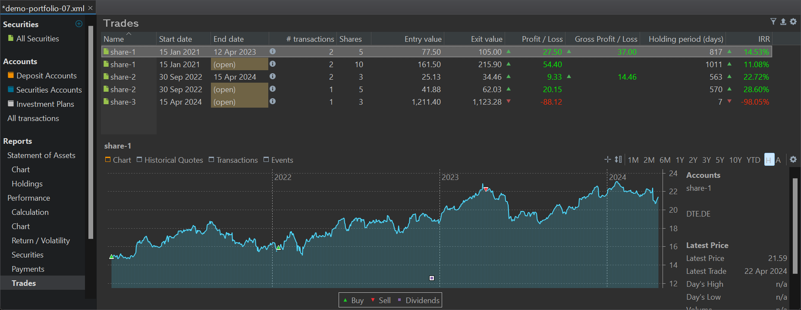

A trade refers to the act of buying or selling a financial security, such as a stock or bond. In PP, this can be executed through buy/sell transactions as well as through Inbound or Outbound Deliveries.

Figure: The Reports > Performance > Trades view. {class=pp-figure}

In the `Reports > Performance > Trades` menu, an open trade is constructed by consolidating all buy/Inbound Delivery transactions associated with a particular security. Hence, an open trade may encompass several buy transactions. Conversely, each sell or outbound delivery transaction generates one individual closed trade. For example, in Figure 1, `share-1` is characterized by one sell transaction, depicted by the first closed trade (row 1), and two buy transactions, consolidated into the open trade (row 2).

With the `Filter` menu, you can limit the list of trades to `Only open trades` or `Only closed trades`. If neither is selected in this group, all trades are displayed. In the second group, you can choose between `Only profitable trades` or `Only lossmaking trades`; essentially the green colored versus the red colored rows.

The `Export as CSV` icon contains one export, named `Trades` which represents the table from Figure 1. Fields added or removed with the `Settings` icon will also be added or removed in the CSV-file. Most of the available fields are already shown in Figure 1.

## Available columns

- *Name*: The trades are named by the name of the security that is traded (e.g. share-1). You can rename the trade by double-clicking the name.
- *Start date*: The date of the first buy/Inbound delivery transaction.
- *End date*: Either the selling date of the security or `(open)` if there are still securities left in the portfolio.
- *&#35; transactions*: The number of transactions in a trade is typically one (buy) or two (buy + sell). Hovering over the cell near the :material-information-outline: icon will trigger a pop-up displaying additional information. From Figure 2, it can be deduced that 5 shares of `share-1` were sold on April 12, 2023. Hovering over the open trade (row 2) will reveal that 5 shares were purchased on January 15, 2021, and another 5 on January 14, 2022. Here, you can observe the FIFO principle in action. The five sold shares are subtracted from the first purchase, which initially consisted of 10 shares.

    Figure: Info overlay closed trade share-1. {class=pp-figure}

    

- *Shares*: The number of shares in the trade.
- *Entry value*: This represents the Net Transaction Value (NTV) of the trade, which includes fees and taxes. For an open trade with a single buy transaction, this is the NTV of the purchase. For example, if 3 shares of share-3 are bought at 413.64 USD per share with 50 USD in fees and taxes, the Net Transaction Value after conversion at a rate of 0.9384 USD/EUR is 1211.40 EUR.
    For a single buy/sell trade like share-2, the Net Transaction Value of the original purchase (67 EUR) is distributed over the open trade of 5 shares (41.88 EUR = 67/8 * 5) and the closed trade of 3 shares (25.13 EUR).

    The situation is more complex with the multiple buy/sell trade of share-1. The entry value (161.50 EUR) of the open trade is formed by 5 shares from the first purchase and 5 from the second, following the FIFO principle. The original Net Transaction Value of the purchase of 10 shares on January 15, 2021, was 155 EUR. The second purchase of 5 shares had a net transaction value of 84 EUR. Combined, 161.50 EUR equals (155/2 + 84).

- *Entry value (per share)*: Enable this column by using the Settings (gear) icon. The value can be easily calculated by dividing the Entry value by the number of shares.
- *Exit value*: For open trades, this is the market value, which equals the number of shares multiplied by the current quote price. For example, the current quote price of `share-2` is 12.405 EUR/share. The exit value is 5 x 12.405 = 62.03 EUR. For closed trades, the exit value is the Net Transaction Value of the sale. For instance, if `share-2` was sold on April 15, 2024, for 3 shares x 12.48 EUR/share minus fees & taxes (4 EUR), the exit value is 34.46 EUR.
- *Exit value (per share)*: Similar to Entry value (per share); as described above.
- *Profit/Loss*: The profit/loss is the difference between the Exit value and the Entry value. Green numbers indicate a profit, while red numbers indicate a loss.
- *Gross Profit/Loss*: This equals the value of the previous column plus taxes and fees. Because for closed trades, the taxes and fees of the sell transaction are included in the Gross Profit/Loss column, this field cannot be calculated for the open trades. 
- *Holding period (days)*: For single purchase closed trades, it equals the number of days between the End and the start date. For open trades, it is the difference between today and the Start date. This calculation does not consider weekends, holidays or any other calendar.

    !!! Note
        For multiple purchase trades, the holding period is an average, weighted by the number of shares. For example, assuming today is 2024-04-22, then the holding period for the first purchase in Figure 2 is: (2024-04-22 - 2021-01-15) = 1193 days and for the second buy 829 days. The weighted average is [(5 x 1193) + (5 x 829)]/10 = 1011 days.

- *Latest Trade*: Enable this column using the Settings (gear) icon. It typically contains either the End Date for closed trades or the Start date for open trades. An exception is an open trade with multiple buy transactions, in which case the date of the last transaction is used.
- *IRR*: The Internal Rate of Return; for detailed calculation, refer to the following section.
- *Return*: This actually represents the True Time-Weighted Rate of Return (TTWROR); for further explanation, see below. This column is not visible by default; use the Settings (gear) icon to display it.
- *Note*: The note associated with the security.

Additionally, the following columns can be made visible using the Settings (gear) icon: `Securities Account`, `ISIN`, `Symbol`, and `WKN`. Explanation of these fields can be found at the description of the [master data](../../../file/new.md#security-master-data) of the security.

## Performance calculation

The IRR and Return column represent the performance of the open or closed trade. Please note that you cannot set a Reporting period explicitly. The Reporting period of a trade is always between today and the start date of the trade. The column Holding period (days) gives an indication of the number of days between these two dates.

In the section [Reference > Basic concepts > Performance > Money-weighted return](../../../../concepts/performance/money-weighted.md#irr-at-trade-level) an extensive calculation of the IRR of open and closed trades is given (using the same example of `share-1` as above).

In summary, given the [IRR equation](../../../../concepts/performance/money-weighted.md): $\mathrm{MVE = MVB \times (1 + IRR)^{\frac{RD_1}{365}} + \sum_{t=1} ^{n}CF_t \times (1+IRR)^{\frac{RD_t}{365}} \qquad \text{(Eq 1)}}$

- Closed trade (share-1): 105 EUR = 77.50 EUR x (1 + IRR)^(817/365). An IRR of 14.53% will solve this equation exactly. To reach an Exit value of 105 EUR, it would require an initial Entry value of 77.50 EUR to grow at a compound annual interest rate (IRR) of 14.53%, over a period of 817 days.

- Open trade (share-1): The open trade has two cashflows (buy). Hovering over the Transactions cell will reveal the data (see Figure 2). The holding period for the first buy is 1193 days = (2024-04-22 - 2021-01-15) and for the second buy 829 days = (2024-04-22 - 2022-01-14). The IRR equation becomes: 216.10 EUR = 77.50 EUR x (1 + IRR)^(1193/365) + 84 EUR x (1 + IRR)^(829/365) or 11.12%. Please note that the holding periods and Exit value will change upon trying this example on a later date.

The Return column is in fact a simple return or the [TTWROR](../../../../concepts/performance/time-weighted.md#time-weighted-rate-of-return) with a single subperiod. It is the result of Exit value/Entry value or Profit/loss/Entry value.

- Closed trade (share-1): r = 105 EUR/77.50 EUR = 35.48%
- Open trade (share-1): r = 216.10 EUR/161.50 EUR = 33.81% 

