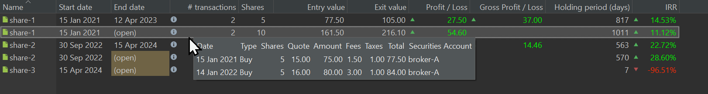

A trade occurs whenever you buy or sell a financial security through a `Buy` or `Sell` transaction or an `Inbound` or `Outbound Delivery`. All trades are listed in the `Reports > Performance > Trades` view. There are two kinds of trades:

- **Open Trade**: An open trade is initiated with the first `Buy` or `Inbound Delivery` transaction for a security. The `Start Date` is set to the date of this initial transaction, while the `End Date` remains open as no `Sell` or `Outbound Delivery` has occurred yet. Subsequent purchases of the same security are added to *this* open trade, updating the number of shares and performance indicators such as Entry Value and Profit/Loss. Thus, an open trade can include multiple purchases.

- **Closed Trade**: A closed trade is generated with *each* `Sell` or `Outbound Delivery` transaction of a security. If you sell a specific security on three different dates, three separate closed trades will be created, each identified by their respective buy and sell dates. Selling a security can affect the `Start Date` of the associated open trade, as the system uses the FIFO (First In, First Out) methodology. If all shares from a specific purchase are sold, the `Start Date` of the open trade will shift to the date of the next purchase.

For example, in Figure 1, `share-1` has two associated trades, characterized by one sell transaction, depicted by the first closed trade (row 1), and two buy transactions, consolidated into the open trade (row 2).

Figure: The Reports > Performance > Trades view. {class=pp-figure}

With the `Filter` menu, you can limit the list of trades to `Only open trades` or `Only closed trades`. If neither is selected in this group, all trades are displayed. In the second group, you can choose between `Only profitable trades` or `Only lossmaking trades`; essentially the green colored versus the red colored rows.

The `Export as CSV` icon contains one export, named `Trades` which represents the table from Figure 1. Fields added or removed with the `Settings` icon will also be added or removed in the CSV-file. Most of the available fields are already shown in Figure 1.

## Available columns

- *Name*: The trades are named by the name of the security that is traded (e.g. `share-1`). You can rename the trade by double-clicking the name.
- *Start date*: The date of the first buy/Inbound delivery transaction. If all shares from a particular purchase are sold (following the FIFO method), the start date will update to the date of the next purchase.
- *End date*: This is either the date when the security is sold or marked as (open) if the position is still active. Once all shares are sold, the open trade will be removed from the list.
- *&#35; transactions*: The number of transactions in a trade is typically one (only one buy transaction) or two (buy + sell). Hovering over the cell near the :material-information-outline: icon will trigger a pop-up displaying additional information. From Figure 2, it can be deduced that 5 shares of `share-1` were sold on April 12, 2023. Hovering over the open trade (row 2) will reveal that 5 shares were purchased on January 15, 2021, and another 5 on January 14, 2022. Here, you can observe the FIFO principle in action. The five sold shares are subtracted from the first purchase, which initially consisted of 10 shares.

    Figure: Info overlay closed trade share-1. {class=pp-figure}

    

- *Shares*: The number of shares in the trade.
- *Entry value*: This represents the Net Transaction Value (NTV) of the trade, which includes fees and taxes. You can find this value in Figure 1, in the top panel's last column. For an open trade with no sell transaction, this is the NTV of the purchase. For example, the purchase of `share-3` is accomplished by a single purchase with NTV of 1211.40 EUR; including (foreign) taxes and fees. For a buy + sell trade like `share-2`, the Net Transaction Value of the original purchase (67 EUR for 8 shares) is distributed over the open trade of the remaining 5 shares (41.88 EUR = 5/8 * 67 EUR) and the closed trade of 3 shares (25.13 EUR = 3/8 * 67 EUR).

    The situation is more complex with the 2 buy + 1 sell trade of `share-1`.  The original Net Transaction Value of the purchase of 10 shares on January 15, 2021, was 155 EUR. The second purchase of 5 shares had a net transaction value of 84 EUR. The entry value of the remaining 5 shares in the open trade (161.50 EUR) is formed by 5 shares from the first purchase and 5 from the second, following the FIFO principle in the sell transaction. The 5 shares that were sold came from the first purchase. The NTV of the open trade becomes then: (5/10 * 155 EUR) + (5/5 * 84 EUR) or 161.50 EUR.

- *Entry value (per share)*: Enable this column by using the Settings :gear: (gear) icon. The value can be easily calculated by dividing the Entry value by the number of shares.
- *Exit value*: For open trades, this is the market value, which equals the number of shares multiplied by the current quote price. For example, the current quote price (Oct 11, 2024) of `share-2` is 11.645 EUR/share. The exit value is 5 x 11.645 = 58.23 EUR. For a closed trade, the exit value is the Net Transaction Value of the sale. For instance, `share-2` was sold on April 15, 2024: 3 shares x 12.48 EUR/share minus fees & taxes (4 EUR). The exit value is thus 34.46 EUR.
- *Exit value (per share)*: Similar to Entry value (per share); as described above.
- *Profit/Loss*: The profit/loss is the difference between the Exit value and the Entry value. Green numbers indicate a profit, while red numbers indicate a loss.
- *Gross Profit/Loss*: This equals the value of the previous column plus taxes and fees. 
- *Holding period (days)*: For a single purchase closed trade, it equals the number of days between the End and the start date. For open trades, it is the difference between **today** and the Start date. This calculation does *not* consider weekends, holidays or any other calendar.

    !!! Note
        For multiple purchase trades, the holding period is an average, weighted by the number of shares. For example, assuming today is 2024-10-13, then the holding period of `share-1` for the first purchase in Figure 2 is: (2024-10-13 - 2021-01-15) = 1367 days and for the second purchase (2024-10-13 - 2022-01-14) = 1003 days. The weighted average is [(5 x 1367) + (5 x 1003)]/10 = 1185 days.

- *Latest Trade*: Enable this column using the Settings :gear: (gear) icon. It typically contains either the End Date for closed trades or the Start date for open trades. An exception is an open trade with multiple buy transactions, in which case the date of the last transaction is used.
- *IRR*: The Internal Rate of Return; for detailed calculation, refer to the following section.
- *Return*: Enable this column using the Settings :gear: (gear) icon. The Return is calculated as: `(Exit Value/Entry Value) -1`. This serves as an indicator of the trade's performance (see below for more details).
- *Note*: The note associated with the security. You cannot have a separate note for each trade.

Additionally, the following columns can be made visible using the Settings (gear) icon: `Securities Account`, `ISIN`, `Symbol`, and `WKN`. Explanation of these fields can be found at the description of the [master data](../../../file/new.md#security-master-data) of the security.

## Performance calculation

The IRR and Return column represent the performance of the open or closed trades. Please note that you cannot set a Reporting period explicitly. The Reporting period of a trade is always between today and the start date of the trade. The column Holding period (days) gives an indication of the number of days between these two dates.

In the section [Reference > Basic concepts > Performance > Money-weighted return](../../../../concepts/performance/money-weighted.md#irr-at-trade-level) an extensive calculation of the IRR of open and closed trades is given (using the same example of `share-1` as above).

In summary, given the [IRR equation](../../../../concepts/performance/money-weighted.md): $\mathrm{MVE = MVB \times (1 + IRR)^{\frac{RD_1}{365}} + \sum_{t=1} ^{n}CF_t \times (1+IRR)^{\frac{RD_t}{365}} \qquad \text{(Eq 1)}}$

- Closed trade (`share-1`): `105 EUR = 0 + 77.50 EUR * (1 + IRR)^(817/365)`. An IRR of 14.53% will solve this equation exactly. To reach an Exit value of 105 EUR, it would require an initial Entry value of 77.50 EUR to grow at a compound annual interest rate (IRR) of 14.53%, over a period of 817 days. The MVB of a trade is always zero, because the trade starts with the first purchase or cash flow. 

- Open trade (`share-1`): The open trade has two cashflows (buy). Hovering over the Transactions cell will reveal the data (see Figure 2). Assuming today is 2024-10-13:

    - First purchase: 5 remaining shares, bought at 77.50 EUR (=5/10 * 155 EUR), held for 1367 days (`2024-10-13 - 2021-01-15`).
    - Second purchase: 5 shares bought for 84 EUR, held for 1003 days (`2024-10-13 - 2022-01-14`).
    
    The IRR equation becomes: `271.40 EUR = 0 + 77.50 * (1 + IRR)^(1367/365) + 84 * (1 + IRR)^(1003/365)` or 11.12%. Please note that the holding periods and Exit value will change upon trying this example on a later date.

The Return column is a [simple measure of performance](../../../../concepts/performance/index.md): `Exit Value/Entry Value) -1`.

- Closed trade (share-1): r = (105 EUR/77.50 EUR) - 1 = 35.48%
- Open trade (share-1): r = (271.40 EUR/161.50 EUR) - 1 = 68.05%

For a single purchase trade, such as the open trade of share-3, the Internal Rate of Return (IRR), the Time-Weighted Rate of Return per annum (TTWROR p.a.), and the simple Return are identical. For example the *periodical* simple return of `share-3` is -5.74%. The *annualized* IRR is -11.24%. You can annualize a periodical return r with the [formula](../../../../concepts/performance/time-weighted.md#ttwror-pa): `((1 + r)^(365/HP)) - 1`; where HP is the holding period. For example, the periodical return of -5.74% for a holding period of 181 days has an annualized value of `((1 - 0.0574)^(365/181)) - 1` or -11.24%, which is exactly the IRR. 

