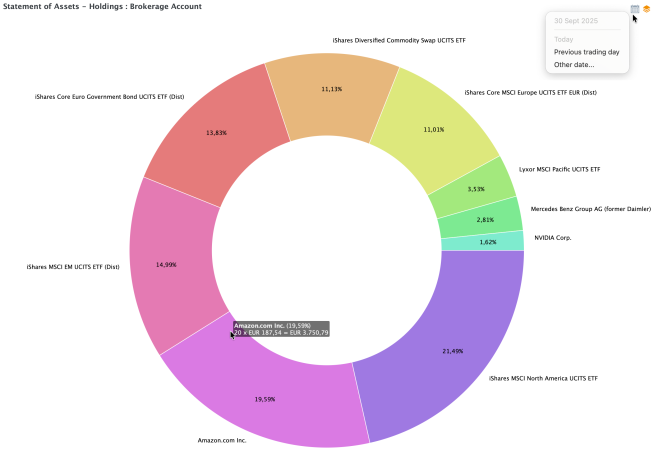

# Statement of Assets &rsaquo; Holdings

A doughnut chart of the value per instrument - either of the total portfolio or a specific account (e.g. Brokerage) - is provided in the Holdings view (menu `View` > `Statement of Assets` > `Holdings` or via the sidebar). The chart  displays the proportion of different instruments within the total, with the entire doughnut representing 100%.

Figure: Doughnut chart of the Brokerage account of kommer.xml.{class=pp-figure}

Hovering the mouse pointer over a segment of the doughnut chart reveals the following instrument details: name, percentage, number of shares, current share price, total market value in the portfolio currency. In the case of a deposit account, the number of shares is fixed at one (see Figure 1).

Positions with negative values, such as a deposit account with a negative balance, are not shown. Since these positions are omitted, the displayed percentages may not add up to the actual total. An error message is shown in such cases.

With the filter icon :material-layers-triple: (top right), you can show the entire portfolio or selected account combinations (e.g. Brokerage with or without its associated deposit account). You can create a new filter, rename or remove existing ones.

The Portfolio Time Machine :material-calendar-month: icon allows you to go back to any chosen date and review your holdings as they were at that time (see Figure 1, top right).  

For a portfolio with a large number of securities, the chart can become unreadable, and it's advisable to implement a filter.

