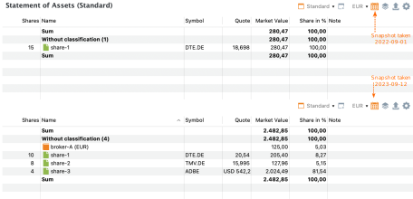
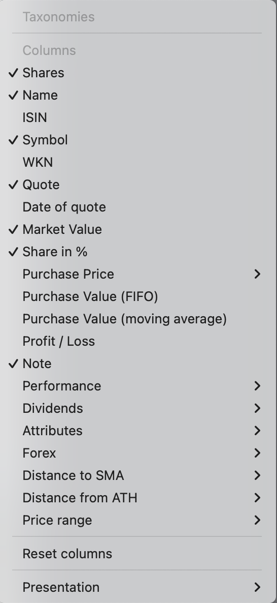

# Statement of Assets
The **Statement of Assets** report provides a snapshot of your portfolio’s assets (securities and accounts) at a specific point in time. By default, it displays the current day. However, you can select a different date using the :material-calendar-month: Time Machine, accessed via the calendar icon at the top right (see Figure 1).

Figure: Statement of Assets report of demo-portfolio-04.xml (two snapshots){class=pp-figure}

As shown in Figure 1, the two snapshots of [demo-portfolio-04.xml](../../../../assets/portfolios/demo-portfolio-04.xml) differ significantly. On the first snapshot date, *only* `share-1` had been purchased. By the second snapshot, all transactions for this portfolio had been completed, including dividend payment. Note that the deposit account `broker-A (USD)` is not mentioned, even though it exists. This is because its balance is zero USD.

The toolbar contains the icons: `Standard View`, `New View`, `Currency`, `Portfolio Time Machine`, `Filter Data`, `Export Data`, and `Columns`. A [detailed description](../../../../how-to/user-interface.md) is given in the section on User Interface. 

The Currency button should be labeled with the base currency of the portfolio (in this case EUR), but you have the option to choose other currencies, even if your portfolio does not contain any assets in that currency. All calculated fields such as `Market Value` are then converted to the selected currency. The quote price however stays in the currency that the quote is traded in. 

The report in Figure 1 (bottom half) displays all the available assets on September 12, 2023, including the deposit account with the result of the sale of `share-1`. The securities are valued at their market prices based on the closing quotes from the previous day, which is -in this case- September 11, 2023. `Share-2` is handled in USD. The conversion to EUR is based on the exchange rate provided by the ECB (closing previous day).

The report displays a total line above and below the assets. With the Presentation option of the columns (:gear:) icon (see Figure 2 bottom), you could add or remove the Total lines. The default setting is above *and* below. Since no taxonomy has been added to the demo portfolio, all assets are listed as `Without classification`.

## Available columns

Figure: Available columns. {class=align-right}

The default columns that are displayed are `Shares`, `Name`, `Symbol`, `Quote`, `Market Value`, `Share in %`, and `Note`. Many more columns/fields are available (see Figure 2). While the column headings are mostly self-explanatory, a few of them may require further clarification. You can customize the default columns using the :gear: icon located in the top-right corner (see Figure 1).

As mentioned in the discussion about [Purchase Value](../../../../concepts/purchase-value.md), Portfolio Performance uses the FIFO (First-in, First-out) method to calculate prices and values. "Moving average", however, is another commonly used method. For example, the Purchase Price is a bit different in both methods (taxes and fees included): 16,15 EUR (MA) versus 15,93 EUR (FIFO) at 2023-09-12 but not at 2022-09-01 (15,93 EUR). Why? Let's take a look at the transactions.

- Purchase of 10 shares at 15.00 EUR on January 15, 2021 for a total amount of 155 EUR (incl fees and taxes).
- Purchase of 5 shares at 16.00 EUR on January 14, 2022 for a total of 84 EUR.
- Sale of 5 shares at 22.40 EUR on April 12, 2023 for a total of 105 EUR.

What is the Purchase Price of the remaining 10 shares in the portfolio?

- The moving/weighted average method states that the average price of the original 15 shares is (155 + 84)/15 = 15,93 EUR. The remaining 10 shares are valuated at this price.
- The FIFO method asserts that the remaining 10 shares are composed of 5 shares of the first purchase and 5 shares of the second purchase and valuated at (155/2) + 84 = 161,5 EUR. The FIFO average price is thus 161.5/10 = 16.15 EUR.

The available fields under `Performance` and `Dividends` are discussed in a separate chapter. With the `Attributes` option, you can add custom fields to the table. These fields are defined in `left sidebar > settings > Attributes: Securities` and following panels. You can enter a specific attribute value for a security in the `Additional attributes` panel of the security (see for example, Figure 3 in [Getting started > Adding securities](../../../../getting-started/adding-securities.md))

The `Forex` (Foreign Exchange) option allows you to view the currency of the quote for each asset and its exchange rate relative to the base currency of the portfolio. The fields labeled as `Market value**`, `Purchase Price**`, and `Profit/Loss**` (with a double *) retain the same meaning as their counterparts in the base currency, but they are presented in the foreign currency. For instance, let's consider `share-2`, which is traded in USD. In the default view, the Market Value is expressed in EUR (127.96 in Figure 1 bottom half). If you wish to view that value in USD instead, you can achieve this by adding the `Market Value**` field (see Figure 3).

Figure: Statement of Assets report of demo-portfolio-04.xml (Market Value **, SMA and ATH){class=pp-figure}

The `Distance to SMA` is a metric that measures the difference between the current price of a share and the average price of that share over a specified number of past days. The acronym "SMA" presumably represents "Simple Moving Average."

When you choose to include this column, you'll also need to specify a period, such as 5 days, 20 days, 50 days, or 200 days. Suppose that you want to know the &Delta; to SMA5 (Distance to SMA for a 5 days period) of `share-1`. The last 5 available prices (before 2023-09-12) are: 20.43, 20.14, 20.015, 19.942, and 19.868 EUR/share. The calculation is carried out as follows:

1. Calculate the average price of the last 5 days = (20.43 + ... + 19.868)/5 = 20.10 EUR.
2. Calculate the difference of today's price with the average price = 20.43 - 20.08 = 0.33 EUR.
3. Divide this difference by the average price and convert to a percentage = -0.33/20,43 = 1.62%. The last price is 1.62% higher than the average price of the last 5 days.

`Distance from ATH` (All Time High) is a likewise metric that shows how far the last price in a reporting period is from the highest price in that period. For example, the highest price of `share-1` in the year 2022 was 19,766 EUR on November 25, 2022. You can view the exact price and date of the all-time high (ATH) by hovering over the field. The last price in that period was 18.638 EUR/share on december 30. So the &Delta; ATH for 2022 (Distance to ATH for year 2022) is equal to (18.638 - 19.766)/19.766 or -5,71%.

## Available views

Using the `Reset Columns` option in Figure 2, you can revert to the default arrangement of columns. It's advisable to keep this layout as the `Standard` view, which is represented by the first button at the top (see Figure 1). By clicking the triangle icon next to the button, you can access options to rename, duplicate, or delete the current view.

If you find yourself needing a custom layout regularly, you can duplicate the standard view, give it a new name, and customize it to your preferences. Additionally, there is a `New View` button available to create a new view based on the default setup.

The `Filter` icon located in the top right corner allows you to filter the assets that will be used in the calculations. You have several options:

1. You can select the entire portfolio.
2. You can choose only one security account.
3. You can select the security account along with the associated deposit account.

Additionally, you have the option to create a custom filter. To do this, you will need to make a selection from all the available assets within the portfolio.

 