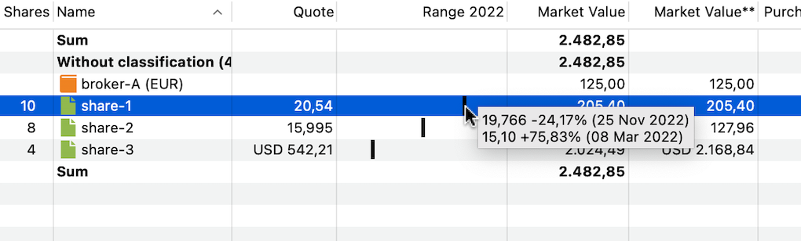

# Statement of Assets
The **Statement of Assets** report provides a snapshot of your portfolio’s assets (securities and accounts) at a *specific* point in time. By default, it displays the current day. However, you can select a different date using the :material-calendar-month: Time Machine, accessed via the calendar icon at the top right (see Figure 1).

Figure: Statement of Assets report of demo-portfolio-04.xml (two snapshots){class=pp-figure}

As shown in Figure 1, the two snapshots of [`demo-portfolio-04.xml`](../../../../assets/portfolios/demo-portfolio-04.xml) differ significantly. On the first snapshot date, *only* `share-1` had been purchased, meaning this share accounted for 100% of the portfolio's value. By the second snapshot, all transactions for this portfolio had been completed, including the purchase of `share-2` and `share-3` (in USD) and a dividend payment. Note that the deposit account `broker-A (USD)` is not mentioned, even though it exists. This is because its balance is zero USD.

## Toolbar

The toolbar contains the icons: :material-window-maximize:{.active}`Standard View`, :pp-view-plus: `New View`, EUR :octicons-triangle-down-16: `Currency`,:material-calendar-month:{.active}`Portfolio Time Machine`, :material-layers-triple:`Filter Data`, :octicons-upload-16:`Export Data`, and :gear:`Columns`. A [detailed description](../../../../how-to/user-interface.md) is given in the section on User Interface.

- :material-window-maximize:{.active}`Standard View`: Figure 1 displays the `Standard View` of the Statements of Assets report, showing the columns `Shares`, `Name`, `Symbol`, `Quote`, `Market Value`, `Share in %`, and `Note`. A total sum is added at the top and bottom. You can customize this `Standard View` by adding or removing columns or totals. Using the :gear: `Reset Columns` option in Figure 2, you can revert to the default arrangement of columns. To rename, duplicate, or delete the current view, click the triangle to the right of the view. If you frequently need a custom layout, you can duplicate the standard view, give it a new name, and tailor it to your preferences. Additionally, there is a `New View` button available to create a new view based on the default setup.

- EUR :octicons-triangle-down-16: `Currency`: The Currency button is labeled with the base currency of the portfolio (in this case EUR), but you can choose other currencies, even if your portfolio does not contain any assets in that currency. All calculated fields, such as `Market Value`, are converted to the selected currency. However, the quote price remains in the currency in which the quote is traded.

- :material-calendar-month:{.active}`Portfolio Time Machine`: The Portfolio Time Machine icon allows you to set the date used in the calculations. By default, the `Market Value` of an asset is calculated for the current day `Today`. You can also choose the `Previous trading day` or an `Other day` that you can select from a calendar. The chosen date is *not* saved with the view. The report in Figure 1 (bottom half) displays all available assets on September 12, 2023, including the deposit account with the result of the sale of `share-1`. The securities are valued at their market prices based on the closing quotes from the previous day, which is September 11, 2023. `Share-2` is handled in USD, and the conversion to EUR is based on the exchange rate provided by the ECB (closing previous day).

- :material-layers-triple:`Filter Data`: This option allows you to filter the assets used in the calculations. You can select the entire portfolio, a single security account, or a security account along with its associated deposit account. Additionally, you can create a custom filter to select other accounts.

- :octicons-upload-16:`Export Data`: The table, as displayed with the selected columns and rows, can be exported as a Comma-Separated Value (CSV) file.

- :gear:`Columns`: This option shows all available columns (see below). The currently visible columns are marked with a checkmark on the left. Using the Presentation option at the bottom of the list (see Figure 2 bottom), you can add or remove the Total lines. The default setting is to display totals above *and* below. Since no taxonomy has been added to the demo portfolio, all assets are listed as `Without classification`.

## Available columns

Figure: Available columns. {class=align-right}

You can customize the default columns using the :gear: icon located in the top-right corner (see Figure 1). The default columns that are displayed are `Shares`, `Name`, `Symbol`, `Quote`, `Market Value`, `Share in %`, and `Note`. Many more columns/fields are available (see Figure 2). While the column headings are mostly self-explanatory, a few of them may require further clarification.

**Purchase Price & Value (FIFO & MA)**

As mentioned in the discussion about [Purchase Value](../../../../concepts/purchase-value.md), Portfolio Performance uses the FIFO (First-in, First-out) method to calculate prices and values. "Moving average", however, is another commonly used method. For example, in Figure 1, the Purchase Price differs slightly between the two methods (taxes and fees included): 16.15 EUR (MA) versus 15.93 EUR (FIFO) on 2023-09-12, but not on 2022-09-01 (15.93 EUR). Why? Let's take a look at the transactions:

- Purchase of 10 shares at 15.00 EUR on January 15, 2021, for a total amount of 155 EUR (including fees and taxes).
- Purchase of 5 shares at 16.00 EUR on January 14, 2022, for a total of 84 EUR.
- Sale of 5 shares at 22.40 EUR on April 12, 2023, for a total of 105 EUR.

What is the Purchase Price of the remaining 10 shares in the portfolio?

- *Moving Average Method*: The average price of the original 15 shares is calculated as (155 + 84) / 15 = 15.93 EUR. The remaining 10 shares are valued at this price.
- *FIFO Method*: The remaining 10 shares consist of 5 shares from the first purchase and 5 shares from the second purchase. Their total value is calculated as (155 / 2) + 84 = 161.5 EUR. The FIFO average price is therefore 161.5 / 10 = 16.15 EUR.

**Profit/loss**

The `Profit/Loss` field represents the difference between the (current) `Market Value` and the `Purchase Value` (FIFO). For example, in Figure 1, the `Market Value` of `share-1` is 205.40 EUR. The calculated `Purchase Value` (FIFO) of the remaining 10 shares is 10 × 16.15 EUR/share, or 161.50 EUR. Therefore, the profit is 43.90 EUR.

**Performance & Dividends**

The available fields under `Performance` and `Dividends` are discussed in a [separate chapter](../performance/index.md).

**Attributes**

With the `Attributes` option, you can add custom fields to the table. These fields are defined in `left sidebar > settings > Attributes: Securities` or the menu `View > Settings`and following panels. You can enter a specific attribute value for a security in the `Additional attributes` panel of the security (see for example, Figure 3 in [Getting started > Adding securities](../../../../getting-started/adding-securities.md))

**Forex**

The `Forex` (Foreign Exchange) option allows you to view the currency of the quote for each asset and its exchange rate relative to the base currency of the portfolio. The fields labeled as `Market Value**`, `Purchase Price**`, and `Profit/Loss**` (with a double asterisk) retain the same meaning as their counterparts in the base currency (see above), but they are presented in the foreign currency. 

For instance, let's consider `share-3`, which is traded in USD. In the default view, the `Market Value` is expressed in EUR (127.96 in Figure 1, bottom half). If you wish to view that value in USD instead, you can achieve this by choosing the `Market Value**` field (see Figure 3).

**Distance to SMA**

Figure: Statement of Assets report of demo-portfolio-04.xml (Market Value **, SMA and ATH){class=pp-figure}

The `Distance to SMA` is a metric that measures the difference between the current price of a share and the average price of that share over a specified number of past days. The acronym "SMA" presumably represents "Simple Moving Average."

When you choose to include this column, you'll also need to specify a period, such as 5 days, 20 days, 50 days, or 200 days. Suppose that you want to know the &Delta; to SMA5 (Distance to SMA for a 5 days period) of `share-1`. The last 5 available prices (before 2023-09-12) are: 20.43, 20.14, 20.015, 19.942, and 19.868 EUR/share. The calculation is carried out as follows:

1. Calculate the average price of the last 5 days = (20.43 + ... + 19.868)/5 = 20.10 EUR.
2. Calculate the difference of today's price with the average price = 20.43 - 20.08 = 0.33 EUR.
3. Divide this difference by the average price and convert to a percentage = -0.33/20,43 = 1.62%. The last price is 1.62% higher than the average price of the last 5 days.

**Distance from ATH**

`Distance from ATH` (All Time High) is a likewise metric that shows how far the last price in a reporting period is from the highest price in that period. You must select this period in a submenu. For example, the highest price of `share-1` in the year 2022 was 19,766 EUR on November 25, 2022. You can view the exact price and date of the all-time high (ATH) by hovering over the field. The last price in that period was 18.638 EUR/share on december 30, 2022. So the &Delta; ATH for 2022 (Distance to ATH for year 2022) is equal to (18.638 - 19.766)/19.766 or -5,71%.

**Price Range**

Figure: Statement of Assets report of demo-portfolio-04.xml (Price Range){class=pp-figure}

For this field, you need to specify a reporting period, such as 1, 2, or 3 years, and optionally an evaluation date using the Time Machine.

The `Price Range` column displays the current price in relation to the highest and lowest prices of a security within the selected period. However, the current price depends on the chosen time period.

Figure 4 illustrates the price range for the year 2022, with the evaluation date set to September 12, 2023 (see also Figure 1). In this case, the current price is equal to the last available price/quote from the year 2022, e.g., December 30, 2022. This is NOT the quote price shown in the third column, which is the price at the evaluation date set by the Time Machine, e.g., 2023-09-12. If a more natural period, such as 1 year, is selected, the current price would indeed reflect the latest available quote.

Hovering over the first (little black) bar of `share-1` displays a tooltip explaining the calculation of the price range:
- The highest price in the period (All-Time High) is 19.766 EUR on November 25, 2022.
- The lowest price in the period is 15.10 EUR on March 8, 2022.
- The 'current price' is 18.638 EUR, which is the quote price on December 30, 2022.

Assuming the difference between the highest and lowest prices represents 100%, the relative position of the current price against the lowest price is calculated as follows:

`(current price - lowest price) / (highest price - lowest price)`

For this example:
`(18.638 - 15.10) / (19.766 - 15.10) = 75.83%`

The current price is positioned at 75.83% of the interval between the highest and lowest prices. The little black bar in the column is indeed located at approximately 3/4 of the column width. Alternatively, you can calculate how far the current price is from the highest price:

`(current price - highest price) / (highest price - lowest price)`

For this example:
`(18.638 - 19.766) / (19.766 - 15.10) = -24.17%`

The sum of the absolute values of both indices equals 100%.