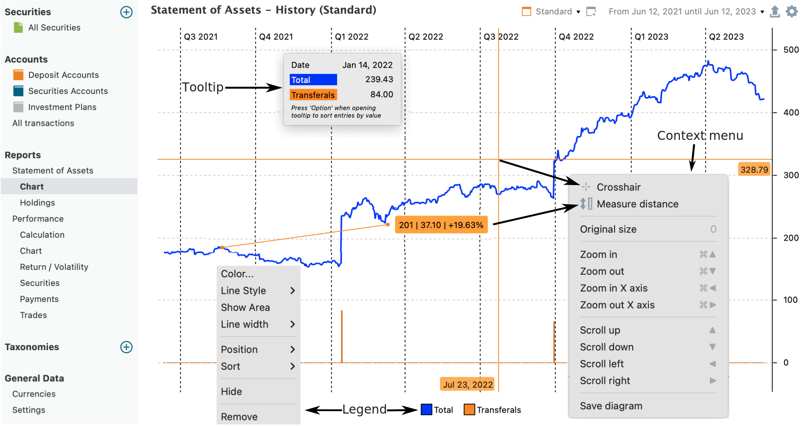
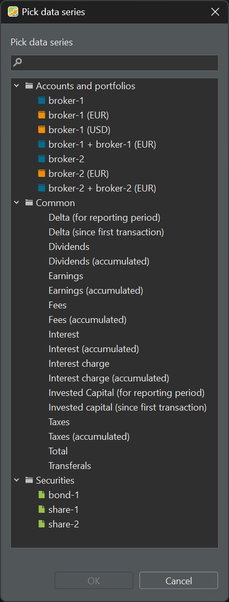

# Statement of Assets &rsaquo; Chart

Using the menu `View > Reports > Statement of Assets > Chart` or the sidebar, you can generate a graphical representation of the value of your assets over time.

The x-axis represents time. You can select the desired reporting period using the dropdown menu in the top-right corner. By default, the periods of 1 year, 2 years, 3 years, 4 years, 6 years, and the previous day are available. Additionally, you have the option to create a custom time period using the 'New' feature; see [Reporting Period](../../../../concepts/reporting-period.md) for a description. Unlike the performance chart (found under [View > Reports > Performance > Chart](../performance/performance-chart.md)), you cannot adjust the time interval in this chart, as it is fixed at 1 day.

## Axes

The y-axis displays the total value of your assets, denominated in the portfolio's default currency. Larger numbers are condensed by adding 'k', where 1k equals 1000 units of the portfolio currency. You can adjust the scale of this axis by scrolling with the middle mouse button. Hold the mouse position at the value (e.g. 4k) where you want to increase or decrease the scale around.

Figure: Chart of the Total value of the demo portfolio.{class=pp-figure}

## Canvas

The canvas is a graphical representation of one or more data series. A data series typically comprises a set of paired data points presented in a table format, such as dates and their corresponding values. By default, two data series are displayed: 'Transferals' (primarily deposits) and 'Total' (see below for an explanation of all possible data series). When you left-click the canvas and hold the mouse down on a specific day, for example, March 28, 2022, a dialog box will appear, displaying detailed values for all data series on that day.

Right-clicking on the chart canvas provides additional options (see Figure 1).

- Crosshair: Upon selecting this option, a large crosshair will appear above the chart when you left-click the canvas. The origin is centered at the mouse position of the click, facilitating easier reading of the exact value of a specific point within the data series.
- Measure distance: Select this option if you want to determine the exact number of days between two points on the chart. It also displays the difference in value and the corresponding percentage between the two points.
- Original size: Pressing the "O" key, which is a shortcut for "Original size", will reset the chart to its maximum visibility, reverting any zoom in or out adjustments that have been made.
- Various navigation options with their respective shortcut keys, such as Zoom In (Ctrl+Arrow Up), Scroll Up (Arrow Up), and more.
- Save diagram: This feature allows you to save the visible chart as a PNG or JPG image on your computer.

## Legend

Right-clicking on the legend icons (for example, the blue and red squares from Figure 1) will give you access to additional formatting options. For all types of data series and their legend entries, you can modify the `Color`, `Position` (Send backwards, Send to back or Bring forward, and Bring to Front), and `Sort` (A-Z or Z-A). The latter two options will reorganize the legend entries accordingly. In the case of a line-type data series like the Total value, you can also adjust the `Line Style` (solid, dash, dot, ...), and the `Show Area` option (which fills the area below the data series). In addition, you have the option to either hide (where the legend entry remains visible but is crossed out, and the data series is not displayed on the chart) or remove it entirely (both the legend and the data series are completely removed from the chart). You can also hide or reveal a data series by double-clicking on the corresponding legend icon.

Figure: Data series for chart.{class=align-right}

Using the gear icon located at the top right, you can reveal additional data series on the chart. Once a data series is added to the chart, it will no longer be visible in the list of Figure 2. Remember that in the demo-portfolio, we have two brokers; where broker-1 has two deposit accounts (EUR and USD). Broker-2 has only one EUR-deposit account. 

With the `Accounts and Portfolios` option, you can choose to display specific combinations of accounts, such as broker-1 along with its USD deposit account. Select the appropriate option and hold Ctrl to add more selections. Once you've added a data series, it will no longer appear in the list of available data series in Figure 2, but you'll find it checked in the gear menu. You can remove a data series from the chart by unchecking it in the gear menu or by deleting it from the legend (as explained above).

The `Common` option in Figure 2 will display some additional info.

- Delta (for reporting period or since first transaction): represents how much the portfolio's value has increased or decreased from the beginning of the reporting period until the end or from the first transaction until the end of the period. This Delta will fluctuate around zero, for example for the first transaction day the delta will be zero. The chapter on [Reporting Period](../../../../concepts/reporting-period.md) explains that the valuation of a portfolio can differ according to the selected `Reporting Period`.

- Dividends, Earnings (= dividends + interests), Fees, Interest, Interest Charge, and Taxes are available in both accumulated and 'instance' versions. For example, an 'instanced' dividend will be represented as a spike, whereas the accumulated version will display a graph that steadily increases as dividends accumulate over time. These fields are described in [Transactions](../../../transaction/index.md) and are recorded as part of each transaction.

- Invested Capital (for reporting period or since first transaction): the term "invested capital" refers to the total amount of money that an investor has used to purchase various securities, such as stocks, bonds, or other financial instruments. It includes the initial purchase price of the securities, additional investments made over time, and other factors such as fees, taxes, ...

- Total: the total value of the portfolio valuated over time.

- Transferals (instanced and accumalated): Each transferal, whether a deposit/removal or delivery inbound/outbound, is represented by a small spike (positive or negative) on the day the transferal was made (instance). The accumulated version is represented by a block diagram, showing the cumulative net value of all transferals over time.

With `Securities`, you can make a graph of each separate or combination of securities in your portfolio, for example only `share-1` or the combination of `share-1` and `share-2`.

In the default configuration, the `Standard` view only includes two data series: Total and Transferals. However, you have extensive customization options, as mentioned earlier. Using the dropdown menu, you can `Duplicate`, `Rename`, or `Delete` this view. You can also create a new view by clicking on the New icon, located in the top right corner between the Standard and Period options. Similar to the existing one, you can duplicate, rename, or delete your newly created view. If you wish to have this view as the leftmost view, select the `Bring to front` option from the dropdown menu.

