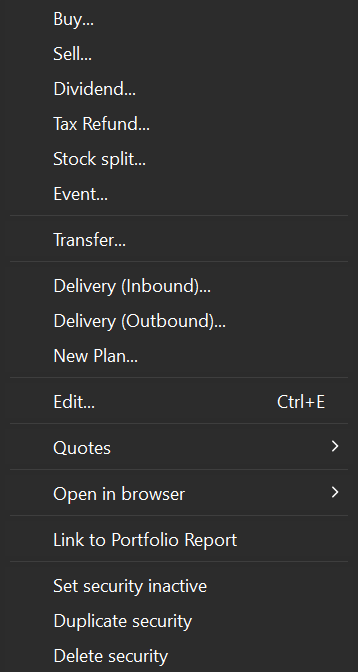
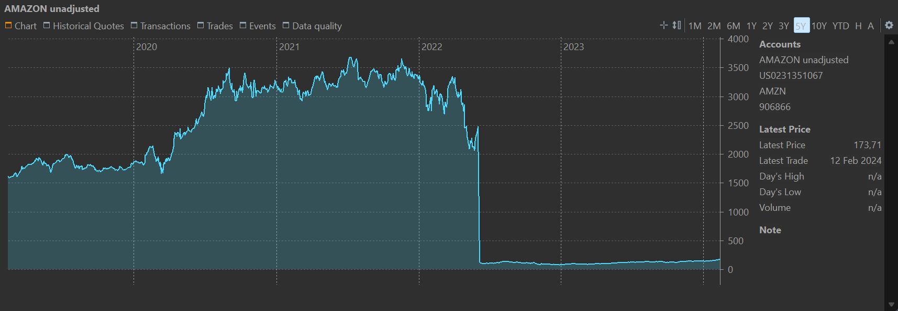
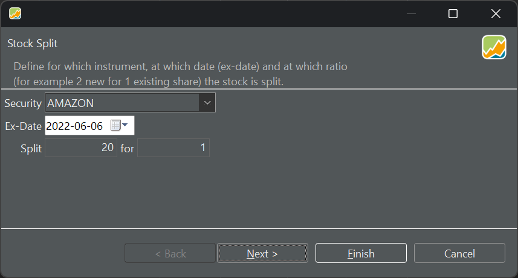
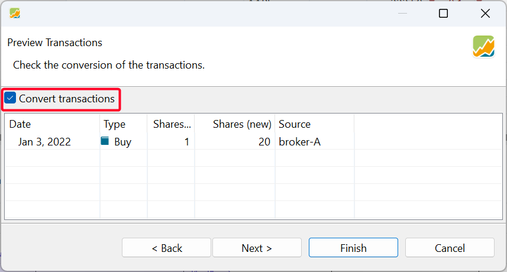
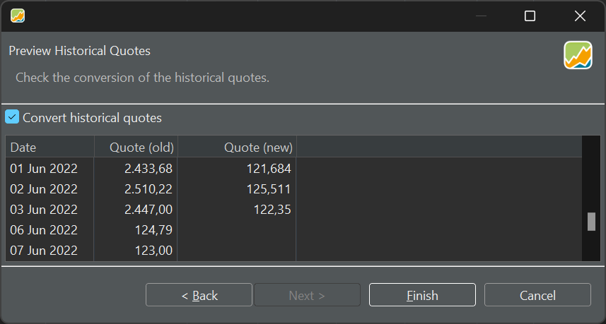
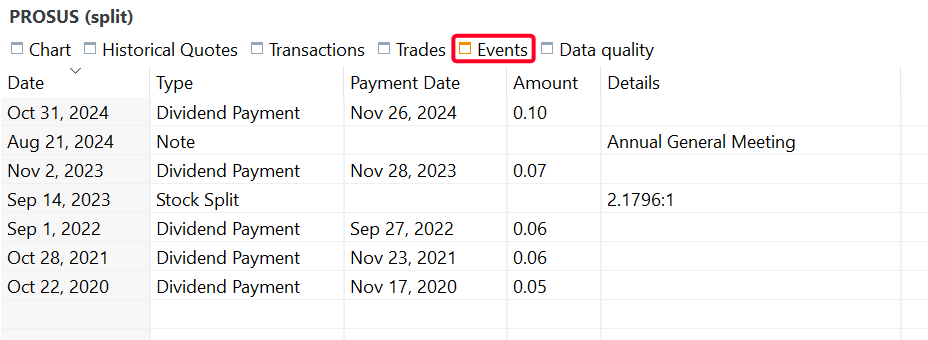

Figure: Context menu of a selected security.{class=align-right style="width:30%"}

The context menu of a security contains several additional options that are not available within the `view menu`. You can access the context menu by selecting a security or a security view (e.g., securities account) and right-clicking. A pop-up, as shown in Figure 1, will be displayed. The menu items Buy, Sell, Dividend, Tax Refund, Delivery (Inbound & Outbound) are already available in the [Transaction menu](../../transaction/index.md). Other items such as Events could be accessed in other views.

## Documented elsewere

Several menu items do also appear in other menu's or views and are already documented in other sections of the documentation.
- Buy, Sell, Dividend, Tax Refund, Delivery (Inbound), Delivery (Outbound) appear and are documented in the [Transaction menu](../../transaction/index.md).
- The Transfer item appear under the slightly different label `Security transfer ...`, also in the the [Transaction menu](../../transaction/index.md).
- New Plan ... is covered in the sidebar menu Accounts > Investment plans and is documented in [ Reference > View > Accounts > Investment Plans](../../view/accounts/investment-plans.md).

## Stock split ...

A stock split is a corporate action where a company adjusts the number of its outstanding shares, either by increasing or decreasing them, while keeping the overall market value of the company unchanged. In a **forward** stock split, e.g. 5-for-1, the number of shares increases and the price per share decreases proportionally. In a **reverse** stock split, e.g. 1-for-5, the number of shares decreases and the price per share increases proportionally. Regardless of the type, the total value of an investor’s holdings remains the same.

For example, by early 2022, Amazon's stock had risen to approximately 3,000 USD per share, a price too high for most investors (see Figure 2). To address this, Amazon approved a 20-for-1 stock split, which took effect on June 6, 2022. In this split, each existing share of the company's stock was divided into 20 new shares, with each new share worth one-twentieth of the original share price.

Figure: Historical prices of Amazon.{class=pp-figure}

The resulting graph of the historical prices (see Figure 2) is unattractive and difficult to interpret; for instance, it’s unclear by how much the stock rises in 2023-2024. PP currently handles stock splits in the same manner as most financial services, but this approach has some disadvantages (see the [forum discussion](https://forum.portfolio-performance.info/t/aktiensplit-buchen/11758)). Essentially, it retroactively assumes that the shares have *always* been split. In the case of the 20-for-1 stock split mentioned earlier, the historical share prices before June 6, 2022, are adjusted to one-twentieth of their original value, while the quantity of shares in transactions is multiplied by 20; hereby breaking the link with the *real* figures on paper notes. For more detailed information and background, please refer to [How-to > Recording Stock Split](../../../how-to/recording-stock-split.md).

Selecting the Stock Split option will initiate a wizard that will guide you through three steps to execute the split. In **Step 1** you select the security, and define the split date and the split ratio.

You can use the drop-down menu to select the security if it's not already filled in. The Ex-date (execution date) is the date when the stock exchange first trades the split shares at the adjusted price. For instance, in case of the Amazon split, the Ex-date would be June 6, 2022. Additionally, you'll need to specify the split ratio, such as 20-for-1. A reverse split would be 1-for-20. It's worth noting that these ratios can also be decimal numbers.

Figure: Split stock wizard - step 1. {class=pp-figure}

**Step 2** will show you the impact of this stock split on each transaction (buy, sell, delivery). The result is that the number of shares in your possesion will be changed, according to the split ratio. You can skip this step and maintain the transactions unchanged by unchecking the `Convert transactions` option. If there aren't any transactions, this step has no effect.

As can be seen in Figure 2 and 4, there was only one buy transaction on January 3, 2022 (before the split date) of one share. Thus, from Janary 3, 2022 on, you will have 20 shares in your account, given that the default `Convert transactions` is checked.

The historical prices can be adjusted in the the following step.

Figure: Split stock wizard - step 2. {class=pp-figure}

**Step 3** will show you the converted historical prices. If you don't want to change the historical prices, uncheck `Convert historical quotes`. It's important to note that only prices before the split date will be changed; e.g. Quote (new). Prices after the split will naturally be automatically adjusted correctly by the exchange market.

The conversion is simple math. For example, on June 3 the old price was 2443 USD. The new price will be 1/20 or 122 USD.

Figure: Split stock wizard - step 3. {class=pp-figure}

In the chart view of the historical prices, a small vertical line with the split ratio at the bottom will indicate the Stock split. With the :gear: menu `Configure Chart > Marking > Events` you can toggle this line. You can also delete the event in the Events tab in the bottom panel; see [Events](./all-securities.md#chart-menu). This will remove the marker in the chart but will **NOT** remove the split from the transactions and historical prices.

Figure: Result of Split stock wizard (Amazon). {class=pp-figure}

Please note the difference between this chart and Figure 2. The rise in 2023 and 2024 is clearly visible, with prices before June 6, 2022 aligning with the adjusted prices. For example, the Buy transaction on January 3, 2022, of one share at approximately 3,400 USD is now shown as a Buy transaction of 20 shares at around 170 USD each.

## Event

An event is a kind of note that could be attached to a specific security on a particular date. They can be displayed on the historical price chart of that security. They are automatically inserted to mark occurences of stock split or dividend announcements, but can also be used for important stock news.

Events are generated automatically upon a stock split operation or a dividend announcement. Additionally, you can create your own custom event notes via the context menu of a security (see Figure 1) or the context menu in the Events tab of the information pane.

Figure: Adding an event. {class=pp-figure}

When creating a custom event, you need to provide the security name (from the drop-down list), the date, and free text. This text can be quite long, but since it will be displayed on the chart, it is recommended to keep it concise—just a few words.

In addition to appearing on the historical prices chart, you can view all events associated with a security in the Events tab of the information pane for the selected security (see Figure 8).

Figure: Event types. {class=pp-figure}

The Events table contains five columns: `Date`, `Type`, `Payment Date`, `Amount`, and `Details`. The event types include:
- `Stock Split`: Automatically generated after a stock split operation (see [above](context-menu.md#stock-split-))
- `Dividend announcement`: Automatically retrieved by connecting to the web service of (see how-to > Dividend announcements) for more details.
- `Note`: Manually created custom notes (see above).

Using the context menu (right-click) in the Events table, you can delete one or multiple selected events. To edit an event, you have to double-click the field `Date` or `Details`. The other fields are non-editable.

