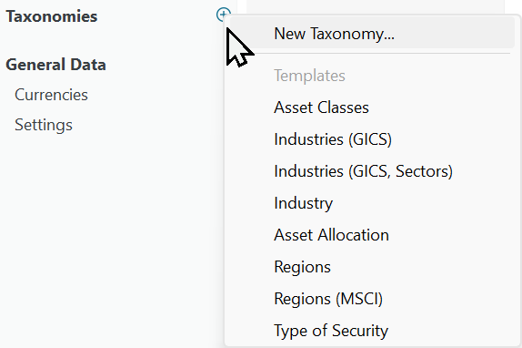

Figure: Adding taxonomies. {class=align-right style="width:50%"}

A taxonomy is a tool for categorizing and evaluating the investments within your portfolio. This classification system creates a framework that helps you to better understand the composition of your investments and make informed decisions.

Taxonomies typically group securities based on shared characteristics such as industry, sector, geographical region, market capitalization, or asset class. By organizing your investments in this manner, you can more easily identify risks and opportunities such as overrepresentation or underrepresentation in a specific segment.

Portfolio Performance offers several predefined and widely recognised taxonomies or templates. You can also create your own custom taxonomy.

- **Asset Classes**: The following classes are distinguished: Cash, Equity, Debt, Real Estate, and Commodity.

- **Industries (GICS)**: The Global Industry Classification Standard (GICS) was developed by MSCI in collaboration with S&P Dow Jones Indices. It contains 11 Sectors (e.g. Information Technology), 24 Industry Groups (e.g. Software), 69 Industries (e.g. IT Services), and 158 Sub-Industries (e.g. IT Consulting); see [website](https://www.msci.com/our-solutions/indexes/gics).

- **Industries (GICS, Sectors)**: This template covers only the top-level Sectors classification of GICS (see above); not the Industry Groups, ....

- **Industry**: Another Industry classification with sectors such as Construction industry, Biotechnology, Chemistry, Energy, and many more.

- **Asset Allocation**: Classification into Risk Free assets (e.g. Deposit accounts) and Risk based assets. The latter category is further divided into Regions, such as USA, Western Europe, and others.

- **Regions**: Purely geographic classification into Europe, America, Asia, Africa, and Oceania with the individual countries. 

- **Regions (MSCI)**: The MSCI Regions taxonomy differentiates between Developed markets (Australia, Austria, Belgium, ...), Emerging markets (Brazil, Chile, China, ...), and Frontier and standalone markets (Argentina, Bahrain, Bangladesh, ...)

- **Type of Security**: Differentiates between Stock, Equity Fund, Exchange Traded Fund (ETF), Bond, Stock Option, Index, and Currency.

Each of the taxonomies can be customized to suit your investment needs. To make changes, use the context menu to add or delete entries. Additionally, you can double-click on the name of a category to rename it. 
