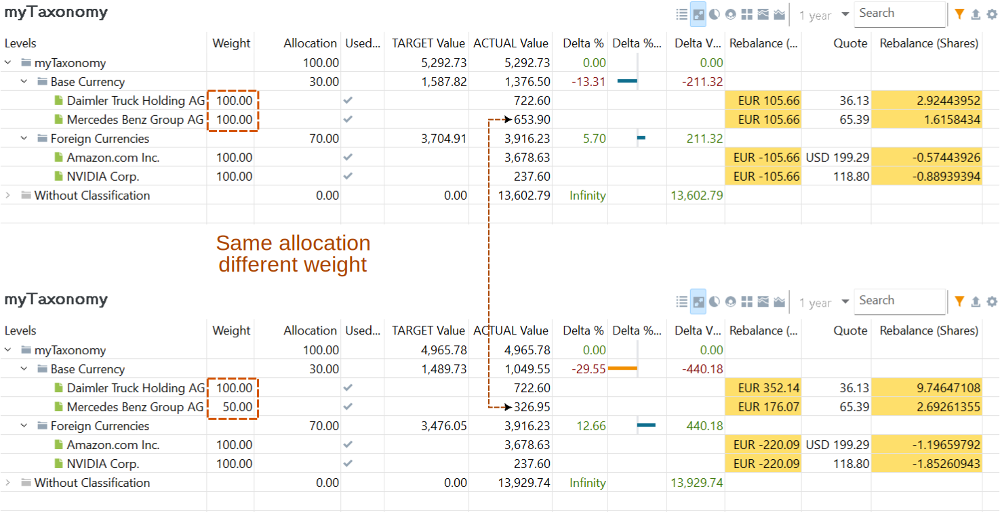
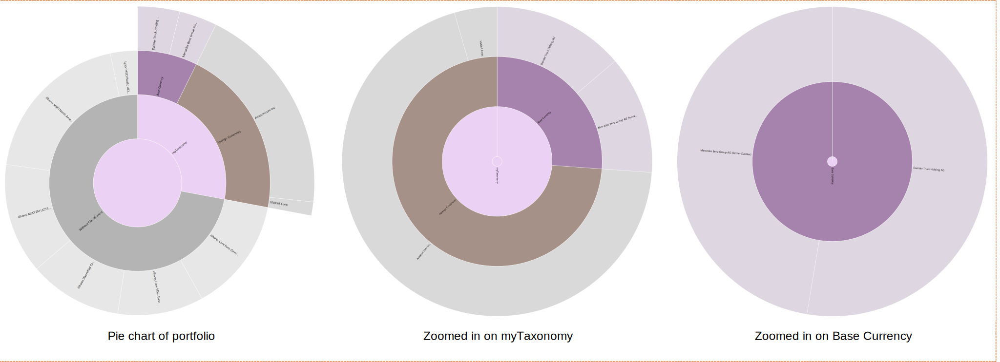

Selecting a taxonomy from the sidebar or the view menu will display the classification in the main pane. The header contains the standard data icons, a search box, the reporting period selector, and seven display options.

Figure: Main pane of a taxonomy. {class=pp-figure}

## Definition view

By default, the definition view displays a table with the five columns:

- **Weight**: The weight represents the proportion or percentage that a security can contribute to its total value. A weight of 100% indicates that all securities are included in calculating the total value. This field is used in the Rebalancing view.

- **Color**: Each category is automatically assigned a color. You can change the color using the context menu.

- **Actual Value**: The market value of a security on the current day. For a category, this is the summed market value of all securities assigned to that category. For example, as of 2024-07-08, the market value of Daimler Trucks is 20 shares x 36.36 EUR = 727.20 EUR, and for Mercedes: 10 shares x 65.47 EUR = 654.70 EUR. Thus, the total value for the category is 727.20 EUR + 654.70 EUR = 1381.90 EUR. Please note that there is a significant number of unassigned securities in `myTaxonomy`.Foreign securities (e.g. Amazon) are calculated in the base currency.

- **Actual %**: The percentage of a security or category, relative to its immediate parent category. For example, 727.20 EUR of Daimler represents 52.62% of the value in its immediate parent category `Base Currency`. The 1381.90 EUR of the `Base Currency` category is 27.98% of the highest category `myTaxonomy`.

- **Actual % of Total**: The percentage of a security or category relative to the total value of the portfolio (including assigned and unassigned securities). For instance, the 1381.90 EUR of the `Base Currency` category represents only 6.25% of the total portfolio value.

With data icon :gear: gear icon, other fields could be added: Category Key, Symbol, ISIN, Note, Forex (Exchange Rate, Actual Value**), Expected return, and Attributes. The `Actual Value **` is the value of the security in the original currency without any conversion.

The :material-upload: icon, `Export Data as CSV`, will save the table displayed on the screen as a CSV file.

By default, the entire portfolio is included in the table. Using the :material-filter: icon, you can limit the result to only securities and categories whose value is not zero or to only the active accounts/securities. The result can also be limited to the available security accounts, with or without their respective reference deposit accounts.

If you have a long table, you can use the search box. For instance, the Regions (MSCI) taxonomy is quite detailed. To find a share from Mexico, you would normally need to expand (double-click) the Emerging Markets > Americas > Mexico category. The search box offers a quicker alternative.

The Definition view provides a snapshot of the current taxonomy status. The Reporting Period (defaulting to 1 year) is therefore greyed out. Only the Stacked and Stacked Area charts utilize the time information from the Reporting Period.

## Rebalancing view

Rebalancing is a strategy of bringing a portfolio that has deviated away from one's target asset allocation back into line [[Wikipedia](https://en.wikipedia.org/wiki/Rebalancing_investments)]. Any taxonomy (such as Industries or Regions) can be used as a basis for target asset allocation. Typically, though, you would use your own classification.
Figure: Rebalancing view. {class=pp-figure}

The first step in the rebalancing process involves entering the target `Allocation` for each category and the `Weight` of each security.

- Allocation:  The desired percentage of each subcategory within the parent category of a taxonomy. The sum of allocations within a category must always add up to 100%.
- Weight: The proportion or percentage that a security can contribute to its total value. A weight of 100% indicates that the security's entire value is used in calculating its actual contribution. Setting the weight to 50% means only half of the security's value contributes to its actual worth. Setting the weight to 0% removes the security from the category, placing it in the `Without Classification` list.

The rebalancing process will calculate the target value for each category based on its allocation and the total portfolio value. If the actual value deviates from the target value, the system computes the difference (delta). It then determines how much each security within the category should be increased or decreased based on its weight.

For example, the total value of `myTaxonomy` is 5292.73 EUR, consisting of 1376.50 EUR from the Base Currency and 3916.23 EUR (!) from the Foreign Currency. However, the Base Currency category should be 30% of the total or 1587.82 EUR. Thus, there is a difference of -211.32 EUR (-13.31%) between the target and the actual value (see Figure 2).

To rebalance this subcategory, you would need to sell securities. For both Daimler and Mercedes, which each have a weight of 100%, you would sell 105.66 EUR worth of each security. This would correspond to approximately 2.9 securities of Daimler and 1.6 securities of Mercedes.

If, for instance, the weight of Mercedes were set to 50%, its actual value would be reduced to 336.95 EUR (instead of 653.90 EUR), and the Base Currency subcategory's actual value would decrease to 1049.55 EUR (instead of 1376.90 EUR). In this scenario, the delta would then be 440.18 EUR. This could be achieved by selling 9.7 securities of Daimler and 2.6 securities of Mercedes, considering that only 50% of Mercedes is available for sale.

## Pie Chart

Figure: Pie chart of the portfolio + zoomed-in variants. {class=pp-figure}

The pie chart representing the entire portfolio in Figure 3 appears simple and incomplete because not all securities are assigned to categories within `myTaxonomy`. From Figure 1, it can be inferred that approximately 28% of the securities are assigned, represented by the purple-colored segment.

By clicking on a segment of the pie chart, you can zoom in on that particular part. The second pie chart displayed in the middle of Figure 3 shows the categories within `myTaxonomy`, such as Base Currency and Foreign Currencies. The third pie chart specifically focuses on the `Base Currency` category.

## Donut chart

Figure: Donut chart of the portfolio. {class=pp-figure}

The donut chart represents the filtered result of the taxonomy. As such, it is the graphical representation of the column `Actual % of Total` in Figure 1. With the :gear: icon, you can choose to include the category `Without Classification`. 

## Tree map

A tree map is a type of chart that uses rectangles to visualize data. Each rectangle represents a security, and the size of the rectangle corresponds to the market value of the security. Similar to the donut chart, the tree map reflects the value of the securities. However, in the tree map, the percentage is represented by the area of the rectangles rather than by segments. Each category is also distinguished by a different color. Like the donut chart, you have the option to include the `Without classification` category.

Figure: Tree map of the portfolio. {class=pp-figure}

Figure: Gear menu of the tree map. {class=align-right}

With the `:gear:` icon, you can pick the base color scheme of the chart (see Figure 6). You can choose between: `Green-Yellow-Red`, `Green-White-Red`, `Green-Grey-Red`, `Blue-Grey-Orange`, and `Yellow-White-Black`. The actual color of the rectangles can be determined by the `Taxonomy` of a security or by the performance of the security.

Choose `Color by Taxonomy` to assign a different color to each category of the taxonomy. Alternatively, select `Color by True-time Weighted Rate of Return (Cumulative)` to assign colors based on the TTWROR performance of the security. For this option, you also need to set the `Reporting Period` (e.g., Current year (YTD) in Figure 5). Securities with negative performance are shaded closer to the third color in the color scheme, while positive performance is shaded closer to the first color. In Figure 5, the color scheme `Blue-Grey-Orange` is used.

The (sub)category name, such as `Commodities`, of the grouped securities can be added using the `Show headlines` option.

Hovering over a security will display a `Category breadcrumb` below the tree chart. For example, in Figure 5, the cursor was positioned over the Mercedes share, showing the breadcrumb path starting at `Asset Allocation Taxonomy > Risk-Based Portfolio Part > Western Europe > Mercedes Benz Group AG`.

You can zoom in on a specific category by left-clicking on the corresponding rectangle in the chart. For instance, selecting the menu `View > Taxonomies > Asset Allocation` in the `kommer.xml` example will display only two categories: `Risk-Based` and `Risk-free portfolio part`. In Figure 5, the `Risk-Based` category was clicked, revealing subcategories such as `USA/North America` (with iShares and Amazon), `Assets Emerging Markets`, and `Western Europe`.

## Stacked chart

Figure: Stacked chart of the portfolio. {class=pp-figure}

A stacked chart is a type of chart that displays data as a series of colored lines, where each line represents a category. The position of the line on the y-axis corresponds to cumulative value of the category. The lines are stacked on top of each other to show the total value of all categories combined, which is 100%. By default, the categories are stacked from large to small, with the largest category at the bottom of the chart. The order of stacking can be adjusted using the :gear: icon, allowing bars to be stacked based on magnitude or according to their position in the taxonomy list.

Both the stacked and stacked area charts plot time on the X-axis, set by the selected reporting period (default=1 year).

## Stacked Area chart

Figure: Stacked chart area of the portfolio. {class=pp-figure}

The Y-axis of the stacked area chart represents the actual monetary value of different categories over time. Similar to the stacked chart, it displays the cumulative values of stacked categories. However, unlike the stacked chart where the values add up to 100%, the stacked area chart shows the actual monetary amounts for each category over time.