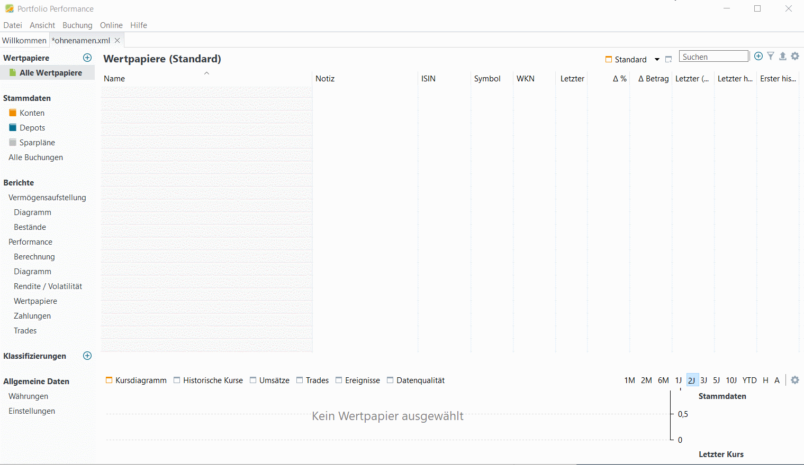

# Wertpapiere erstmalig anlegen

Aus der großen Menge aller möglichen Wertpapiere sind nur wenige für uns relevant - weil wir sie im Bestand haben, sie kaufen wollen oder als Referenz verfolgen. 

Deshalb bauen wir hier die Liste der für uns relevanten Wertpapiere auf. Du kannst beliebige Wertpapiere in die Wertpapierliste aufgenommen werden, unabhängig davon, ob es dazu Bestände in den Depots gibt oder nicht. 

## Wertpapiere zum Portfolio hinzufügen

Um neue Wertepapiere zum Portfolio hinzuzufügen, wählst du `Wertpapiere > alle Wertpapiere` links in der Navigationsleiste und klicken dann auf das `+` Zeichen ***ganz rechts oben neben dem Feld Suchen*** , dann `Neues Wertpapier`wählen. Es gibt auch ein kleines `+` Zeichen links über "alle Wertpapiere", das ist aber nicht das richtige.

Jetzt gibst du im Suchfeld den Namen, die ISIN oder WKN ein. Klicke `Suchen`. Das Wertpapier erscheint in der Ergebnisliste und kann mit `Übernehmen` ausgewählt werden. Die Stammdaten zum ausgewählten Wertpapier werden nachfolgend angezeigt, mit `OK` wird das Wertpapier in die Wertpapierliste übernommen.

Dabei ergänzt Portfolio Performance die Stammdaten, aktuelle und historische Kurse mit Informationen aus dem Internet.

## Wertpapiernamen anpassen

So sieht die Wertpapierliste aus, nachdem du eine Reihe von Wertpapieren hinzugefügt hast. 

In diesem Fall sind die von Portfolio Performance vorgeschlagenen Namen der Wertpapiere nicht einfach verständlich. Es sind aber die selben Namen, die auch im Online-Banking angezeigt werden (zumindest bei ING). Daher ist es eine gute Idee, die automatisch erzeugten Namen in die Spalte Notiz zu kopieren, und dann den Namen in der ersten Spalte mit einem aussagekräftigen Namen zu überschreiben. Die Tabellenfelder können direkt mit Doppelklick selektiert werden, dann kann man mit `Ctrl-C / Ctrl-V` kopieren und einfügen.

## Die fertige Wertpapierliste

Die fertige Wertpapierliste enthält die ausgewählten Wertpapiere mit den Stammdaten sowie den letzten Kursen und Kursbewegungen zum Vortag. Bei Auswahl eines Wertpapiers zeigt Portfolio Performance im unteren Teil den Kursverlauf und den aktuellen Kurs an.

