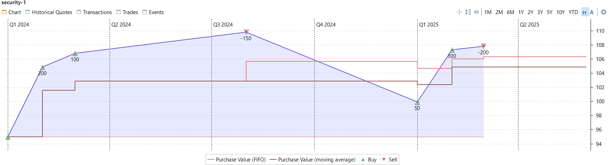
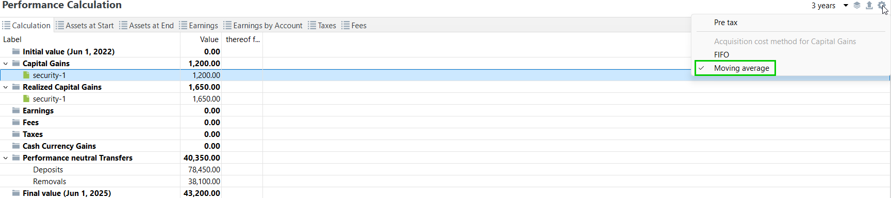
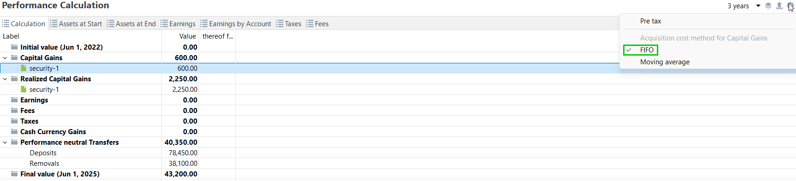
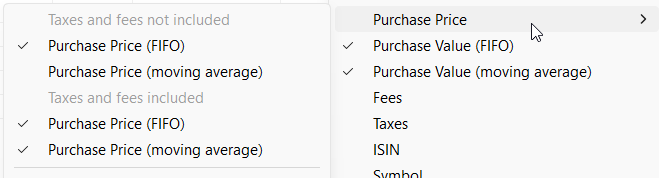
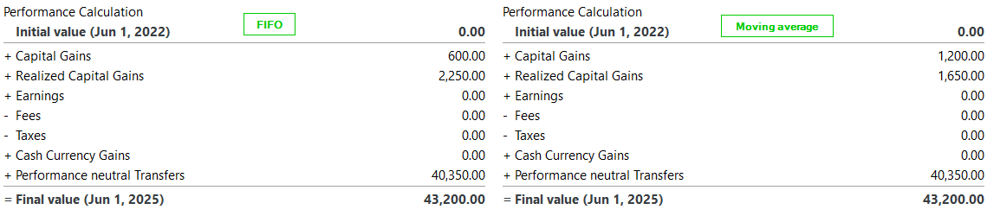
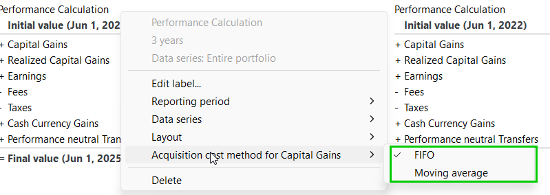

# 收益与买入成本原则：先进先出与移动平均

要在卖出证券后准确评估已实现与未实现的收益，必须把卖出数量与剩余市值同该证券的买入成本相比较。在"单次买入后卖出"的情形下这很直观，但当存在多次不同价格的买入与卖出时，就有各种定义与方法适用。Portfolio Performance 用两种方法计算收益：

- **先进先出**（FIFO, First-In, First-Out）原则
- **移动平均**原则，又称**调整后成本基础**（ACB, Adjusted Cost Base）

在 FIFO 方法中，每份股票都保留其原始买入价。卖出时先卖出最早买入的部分，由此产生的收益或亏损根据其买入成本确定。
在移动平均方法中，所有股票被赋予相同的平均买入价。

!!! info "典型适用场景"
	**先进先出**在德国 🇩🇪 最为常见。  
	**移动平均**则在奥地利 🇦🇹（[*GLD-Preis: gleitender Durchschnittspreis*](https://de.wikipedia.org/wiki/Gleitender_Durchschnittspreis)）、加拿大 🇨🇦（[*ACB: Adjusted Cost Base*](https://www.adjustedcostbase.ca/blog/how-to-calculate-adjusted-cost-base-acb-and-capital-gains/)）、法国 🇫🇷（[*CUMP: Coût Unitaire Moyen Pondéré*](https://bofip.impots.gouv.fr/bofip/3619-PGP.html/identifiant%3DBOI-RPPM-PVBMI-20-10-20-40-20191220)）最为常见。

### 示例 1： {#example-1}

设想某项证券有以下账目：

买入：100 份，每份 95 €  
买入：200 份，每份 105 €  
买入：100 份，每份 107 €  
卖出：150 份，每份 110 €。  

**移动平均法：**

这 400 份股票的移动平均买价为：$\frac{(100 * 95 €)+(200 * 105 €)+(100 * 107 €)}{400} = 103 €$  
这既是所卖出 150 份的买价，也是剩余 250 份的买价。  
因此本次卖出的**已实现收益**为：$150 * 110 € - 150 * 103 € = 1050 €$  
剩余股票的**未实现收益**为 $250 * 110 € - 250 * 103 € = 1750 €$
注意：剩余股票的买入价格与卖出前相同。  

**先进先出法：**

所卖出的 150 份是最早买入的部分：第一次买入的 100 份，加上第二次买入的 50 份。  
因此本次卖出的**已实现收益**为 $100 * (110 € - 95 €) + 50 * (110 € - 105 €) = 1750 €$  
这等价于所卖出股票的平均先进先出买价为 $\frac{(100 * 95 €) + (50 * 105 €)}{150} = 98.33 €$  

剩余股票的**未实现收益**为：$150 * (110 € - 105 €) + 100 * (110 € - 107 €) = 1050 €$  
这等价于剩余股票的平均先进先出买价为 $\frac{(150 * 105 €) + (100 * 107 €)}{250} = 105.8 €$  

注意：剩余股票的平均买入价与卖出前不同，它从 103 € 变为 105.8 €。  

### 示例 2： {#example-2}
在上述示例的基础上，我们现在持有剩余的 250 份，并新增以下账目：  
买入：50 份，每份 100 €   
买入：300 份，每份 107.5 €   
卖出：200 份，每份 108 €  

**移动平均法：**

这 600 份股票的移动平均买价为：$\frac{(250 * 103 €)+(50 * 100 €)+(300 * 107.5 €)}{250+50+300} = 105 €$  
这既是所卖出 200 份的买价，也是剩余 400 份的买价。  
因此本次卖出的**已实现收益**为：$200 * 108 € - 200 * 105 € = 600 €$  
两次卖出的已实现收益合计为 $1050 € + 600 € = 1650 €$  
剩余股票的**未实现收益**为 $400 * 108 € - 400 * 105 € = 1200 €$  

**先进先出法：**

所卖出的 200 份是最早买入的部分：第二次买入的 150 份，加上第三次买入的 50 份。  
因此本次卖出的**已实现收益**为 $150 * (108 € - 105 €) + 50 * (108 € - 107 €) = 500 €$  
这等价于所卖出股票的平均先进先出买价为 $\frac{(150 * 105 €) + (50 * 107 €)}{200} = 105.5 €$  
 
两次卖出的已实现收益合计为 $1750 € + 500 € = 2250 €$  
剩余股票的**未实现收益**为：$50 * (108 € - 107 €) + 50 * (108 € - 100 €) + 300 * (108 € - 107.5 €) = 600 €$  
这等价于剩余股票的平均先进先出买价为 $\frac{(50 * 107 €) + (50 * 100 €) + (300 * 107.5 €)}{400} = 106.5 €$

图： 证券图表上的买价。{class= pp-figure}

请注意，卖出发生时移动平均买价保持不变，而先进先出平均买价则会改变。  

总结如下： 

| 收益            | 移动平均 | 先进先出 |  
| :--------------: | :------------: | :------| 
| 未实现收益 | 1200 €         | 600 €  | 
| 已实现收益   | 1650 €         | 2250 € | 
| 合计            | 2850 €         | 2850 € | 

总收益保持不变，只是会根据所采用的成本方法，在已实现与未实现收益之间进行不同的分配。Portfolio Performance 在 [报告 > 收益 > 计算](../reference/view/reports/performance/calculation.md)中呈现的正是如此：
图： 采用移动平均法的绩效计算。{class= pp-figure}

图： 采用先进先出法的绩效计算。{class= pp-figure}

在 Portfolio Performance 中，你可以获取：

- 你所持股份的**买价**（每股平均买入成本），见[证券图表](../reference/view/securities/all-securities.md)
 以及 [报告 > 资产明细](../reference/view/reports/statement/index.md)
 和 [报告 > 收益 > 证券](../reference/view/reports/performance/securities.md)中的各列
- **成本**（买价 × 份额数），见 [报告 > 资产明细](../reference/view/reports/statement/index.md) 和 [报告 > 收益 > 证券](../reference/view/reports/performance/securities.md)中的各列
图： 买价与成本两列。{class= pp-figure}

- **未实现**与**已实现资本利得**，见 [报告 > 收益 > 计算](../reference/view/reports/performance/calculation.md)
 及其对应的组件，以及 [报告 > 资产明细](../reference/view/reports/statement/index.md) 和 [报告 > 收益 > 证券](../reference/view/reports/performance/securities.md)中的各列。

图： 绩效计算组件。{class= pp-figure}

