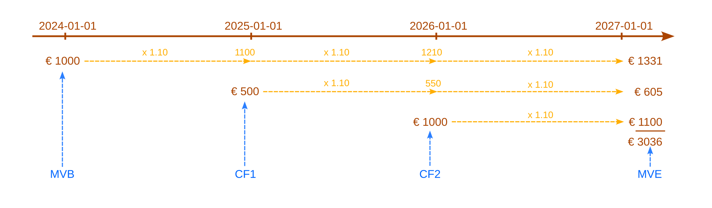
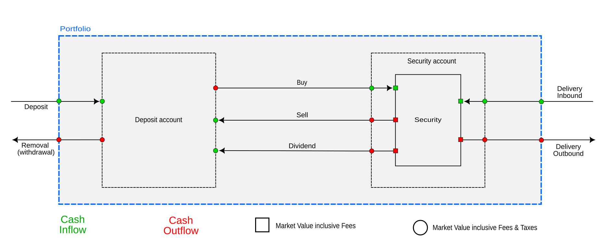
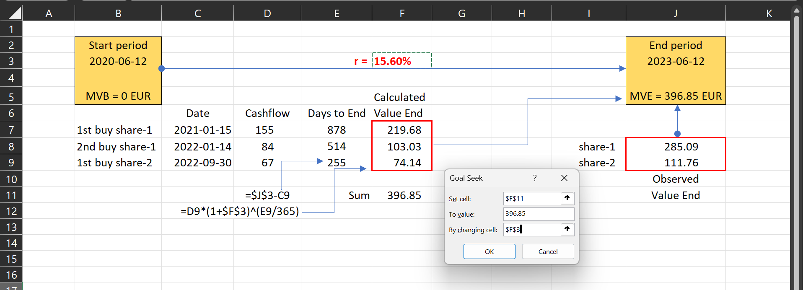
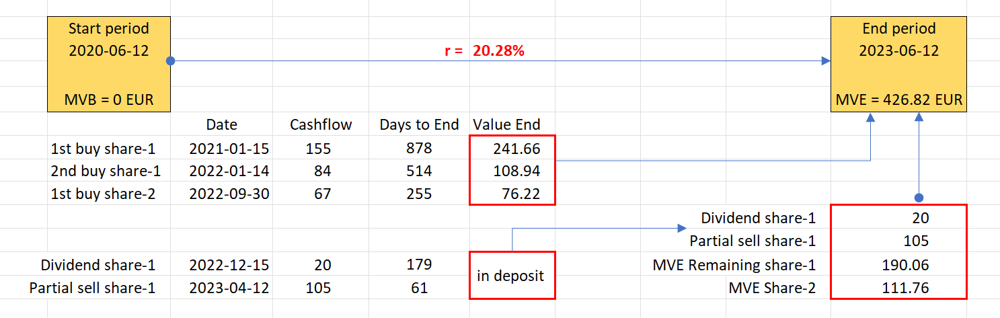
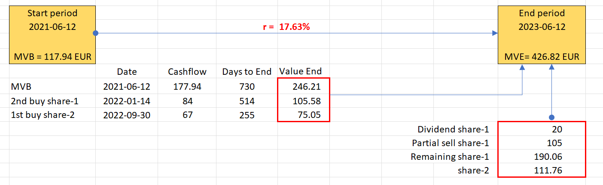
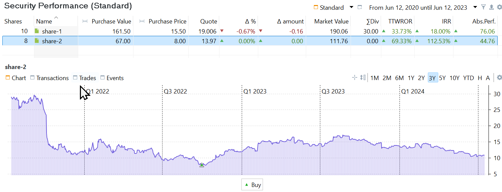
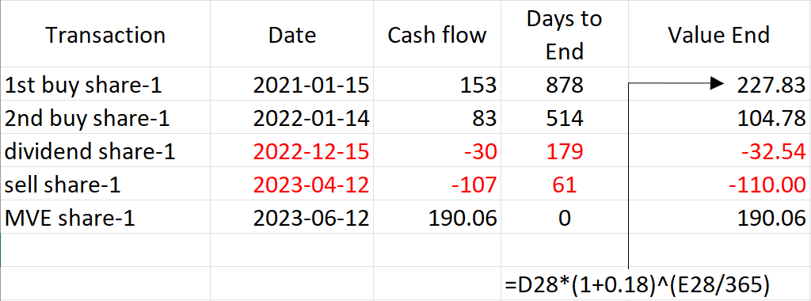
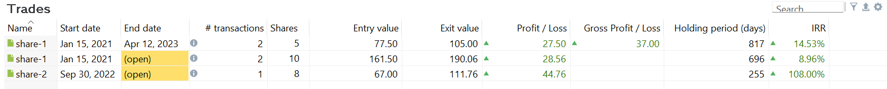

# 资金加权收益率
资金加权收益率与项目管理中常用的内部收益率 (IRR) 技术完全相同。该计算同时考虑报告期内现金流的**时点**（何时）与**规模**（多少）。现金流是指流入或流出投资组合的任何一笔金额。IRR 计算的基础公式为：

<a id="irr-equation"></a>

$$\mathrm{MVB \times (1 + IRR)^{\frac{RD}{365}} + \sum_{t=1} ^{n}CF_t \times (1+IRR)^{\frac{RD_t}{365}} = MVE \qquad \text{(Eq 1)}}$$

其中 *n* = 报告期内现金流的笔数，CF<sub>t</sub> = 时点 *t* 的现金流，RD<sub>t</sub> = CF<sub>t</sub> 之后至期末所剩的天数。对 MVB 而言，RD 等于整个期间的长度（以天计）。若要求年化收益率，需将剩余天数除以 365。若要计算整个期间（例如 2 年）的期间收益率，则应除以整个期间的天数，例如 730 天。

公式 1 与未来值的计算非常相似。在图 1 中，假设你的投资年利率为 10%，初始本金 1000 EUR 在三年后会增长到未来值 1331 EUR。其后两年再分别投入 500 EUR 与 1000 EUR，届时将分别变为 605 EUR 与 1100 EUR。三年后，该投资的总未来值为 3036 EUR。


图： 未来值计算的可视化。{class=pp-figure}

 

计算 IRR 是计算投资未来值 (FV) 的逆运算。你并不知道利率或 IRR，但你知道期初市值、期末市值，以及期间陆续发生的各笔现金流。依公式：

`1000 * (1 + IRR)^(3x365/365) + 500 * (1 + IRR)^(2x365/365) + 1000 * (1 + IRR)^(365/365) = 3036`

自此以后，公式均以电子表格风格书写：用星号 (*) 表示乘法，用插入符 (^) 表示乘方。这样写出的公式更简洁，也便于直接复制粘贴到电子表格中验证。

因此，`500 * (1 + IRR)^(2x365/365)` 表示时点 2025-01-01 的一笔 500 EUR 现金流，在年利率 = IRR 的条件下，到期末（即 2*365 天之后）所形成的预期未来值。请注意：在没有任何现金流的情况下，公式 1 与（年化的）简单收益率公式 [MVE = MVB x (1 + r)](./index.md) 等价。

IRR 是这样一个年利率：把投资的期初价值（MVB）及其后所有现金流按各自期限以该利率增长，其结果须等于期末价值（MVE）。换句话说，投资组合的 IRR 就是它必须按多少年利率增长（或收缩）才能得到期末价值。

遗憾的是，没有简便的方法从公式 1 中解出 IRR 的值。Excel 等软件工具提供 IRR、XIRR 之类的函数，它们采用试算法：用不同的 IRR「猜测值」反复代入公式求解，直到找到合适的匹配结果。在下面的示例中，我们将用 Excel 的单变量求解来说明求解过程。

## 定义现金流 {#defining-the-cashflows}

现金流的概念看似浅显：它指流入或流出一个系统的现金。不过，我们以 demo-portfolio-03 为例来看（见图 2）。

图： 账目总览——存款（3 笔）、买入（3 笔）、股息与部分卖出，以及 share-1 与 share-2 的图表。{class=pp-figure}

 

该投资组合有一个现金账户 `broker-A (EUR)` 和一个证券账户 `broker-A`，后者持有两项证券 `share-1` 与 `share-2`。只发生了四种[账目类型](../../reference/transaction/index.md)：存款、买入、股息和卖出。问题是，在这一情境下，公式 1 中相关的现金流究竟有哪些？例如，一笔存款账目会把资金转入投资组合*以及*现金账户。而一笔卖出账目会把资金从某项证券与证券账户中取出*并*转入现金账户，*但*它并不影响投资组合。

在定义相关现金流之前，必须先确定绩效计算需要在哪个层面进行。你需要计算的是整个投资组合的绩效（以及针对哪个期间）、某个特定账户或证券的绩效，还是某一笔头寸的绩效？

从投资组合的角度看，只有当现金或证券进入或离开投资组合时才产生现金流。相关的账目类型只有四种：`存款`、`取款`、`证券转入` 和 `证券转出`（参见图 3 的左右两侧）。买入、卖出和股息账目都不会产生投资组合层面的现金流。资金既未进入也未离开投资组合，只是在投资组合*内部*的账户之间划转。

从证券或证券账户的角度看，只有五种账目是相关的：`买入`、`卖出`、`股息`，以及 `证券转入` 和 `证券转出`。这些账目会使资金流入或流出该证券（账户）。有些人可能难以接受"股息不是投资组合现金流"这一点。看上去似乎是资金像存款一样从外部来源进入了投资组合。然而，股息是公司作为利润分配支付给股东的。你作为股东，实质上是部分所有者，因此这份股息是这些股票自己付给你的。

从图 3 可以看出，流入或流出一项证券的现金流，与进入或离开证券账户或投资组合的现金流，表示方式不同（方块与圆形之别）。以 `share-1` 的第一笔买入账目为例。从现金账户流出的金额显然是 155 EUR。这笔金额用于买入本金（150 EUR）、费用（3 EUR）和税款（2 EUR）。那么，流入该证券（账户）的金额是多少呢？有四种可能：
    
- **含费用与税款（155 EUR）**：这个金额正是我们实际为 `share-1` 付出的代价。但是，即便股价略有*上涨*，期末市值很可能仍低于期初市值，结果是*负的*绩效
- **仅含费用（153 EUR）**：不应把我们支付的 2 EUR 税款计入其中。税款的征收方式在各国差异很大，也不由我们控制。有些国家在买入时征税（如本例），有些一部分在买入时、一部分在以后征收，还有些在卖出时才征收。因此，把税款排除在绩效计算之外也说得通。
- **仅含税款（152 EUR）**：不计费用，只计税款。费用虽然同样有很大差异，但它与买入的关系比税款更为内在，因为费用应当反映券商执行这笔账目的实际成本。计税款而不计费用多少有些自相矛盾。
- **不含费用与税款（150 EUR）**：这是这 10 份股票在买入时的价值。今后该证券（账户）更值钱或不值钱时，就与这个数字相比。按这种看法，绩效计算中不应计入费用与税款。

事实证明，Portfolio Performance 取的是折中立场。计算整个投资组合的绩效时，费用与税款都计入（例如 155 EUR）；而在证券与证券账户层面，只计费用，不计税款。


图： 定义投资组合内所有可能的现金流。{class=pp-figure}

 

## <span style="color:orange">投资组合层面的 IRR</span> {#irr-at-portfolio-level}

以下示例将计算整个投资组合的 IRR。你可以在 `视图 > 报告 > 收益` 仪表板中找到这一绩效指标。所得的 IRR 不能外推到单个账户或单项证券，它反映的是整个投资组合的绩效。要计算[特定证券](#irr-at-security-level)或[头寸](#irr-at-trade-level)的 IRR，请参见后续章节。所有示例均基于 [demo-portfolio-03](../../assets/demo-portfolio-03.xml)。

### **示例 1**：一笔存款 + 一笔买入账目 {#example-1-one-deposit-buy-transaction}

假设在 demo-portfolio-03 中，*只有* 2021 年 1 月 15 日的第一笔**存款账目**发生。对于三年报告期（2020-06-12 :material-arrow-right: 2023-06-12），投资组合的期初市值为零。2020 年 6 月 12 日时投资组合确实是空的。2021 年 1 月 15 日，现金账户余额增加到 155 EUR，并一直保持到 2023 年 6 月 12 日。因此投资组合的期末市值也是 155 EUR。依公式 1，IRR 可由下式得出：

```
MVB*(1+IRR)^(RD/365) + CF1*(1+IRR)^(RD1/365) = MVE
         ↓                        ↓            ↓
0*(1+0)^(1095/365)  +  155*(1+0)^(878/365) =  155
```

显然 `IRR=0` 就能满足该公式，因为 (1+0) 的任意次幂都等于 1。因此，即使有多笔存款，现金账户乃至投资组合的绩效仍为零。原因在于，存款同时增加现金账户余额与投资组合的期末市值，使公式 1 在 IRR = 0 时依然保持平衡。

Portfolio Performance 对这类现金流或转账有专门的术语：`绩效中性转账`；例如可参见[绩效计算组件](../../reference/view/reports/performance/calculation.md)。存款之所以是「绩效中性」的，是因为这笔资金划转对期末市值和账户的影响金额相同。现金账户不产生利息，也不发生成本。所存入的金额在期末之前会原封不动地留在账户中，对绩效（例如 IRR）的影响为零。

如果再加入一笔**买入账目**（与图 2 中的第二笔账目类似），结果会怎样？会产生两方面的影响：

- 现金账户减少 155 EUR，余额归零，第一笔账目的效果被抵消。
- `share-1` 的份额数增加 10 份，其买入时的价值为 150 EUR。其余 5 EUR 支付了费用（3 EUR）与税款（2 EUR）。

由于我们仍然是在计算*投资组合*的绩效，上面的公式依然成立。唯一的区别是，期末 `share-1` 的报价为每股 19.006 EUR，因此投资组合的期末市值为 190.06 EUR。

```
           MVB           +               CF1         =   MVE
            ↓                             ↓               ↓
0*(1+IRR)^(1095/365)  +  155*(1+IRR)^(878/365) =  190.06
```

`IRR = 8.85%` 可解出该公式。要得到 190.06 EUR 的期末市值，初始现金流 CF1（155 EUR）须按年利率 8.85% 增长 2.41 年，即 878 个剩余天数。

### **示例 2**：多笔买入账目 {#example-2-multiple-buy-transactions}

当涉及多笔现金流时，求解内部收益率 (IRR) 就复杂得多。例如图 1 中的三笔买入账目。此前提到的逻辑同样适用。

- 2020-06-12 时 MVB 仍为零。期间长度为三年，即 1095 天。
- 共六笔账目：3 笔存款与 3 笔买入（见图 2），因而在多个组成部分上产生多笔现金流。
- 投资组合层面的现金流依次为：155、84、67 EUR（含费用与税款）。
- 这三笔现金流在报告期内的剩余天数依次为 878、514、255 天。
- MVE = 15 份按报价 19.006 EUR 计，加上 5 份按 13.77 EUR 计，合计 396.85 EUR。现金账户已清空。

`IRR = 15.60%` 可解出该公式。
```
MVB           CF1                    CF2                    CF3             MVE
↓              ↓                      ↓                      ↓               ↓
0 + 155*(1+IRR)^(878/365) + 84*(1+IRR)^(514/365) + 67*(1+IRR)^(255/365) = 396.85`
```


图 5 展示了在 Excel 中的计算过程（[下载工作簿](../../assets/demo-portfolio-03-calculation.xlsx)）。若持有期为 878 天、年利率为 15.60%，初始现金流 155 EUR 将增长到 219.68 EUR。第二笔买入则从 84 EUR 增长到 103.03 EUR。`share-2` 的收益显得较小，是因为其持有天数更少。可以使用 Excel 的 `数据 > 单变量求解` 来模拟 IRR 的计算（见图 4）。该方法的做法是：反复改变 IRR 的值（单元格 F3），使计算出的 MVE（单元格 F11）等于观测到的 MVE（手动输入值），直至找到匹配值（15.60%）。

请注意，各份额单独计算出的期末值未必与实际观测到的期末值一致。比如比较一下 `share-2` 的预期值与观测值，观测值（单元格 J9）要高得多。只有整个投资组合的总和能够对上，且同一个算出的 IRR 被应用到所有份额上。当然，Portfolio Performance 也能针对单项证券计算 IRR；如何计算[单项证券](#irr-at-security-level)与[头寸](#irr-at-trade-level)的绩效，见下文。

图： 三笔买入账目的 IRR 计算。 {class=pp-figure}



### **示例 3**：买入—股息—卖出账目 {#example-3-buy---dividend---sell-transactions}

在 PP 中，卖出账目所得的现金会存入现金账户。因此，卖出账目正好与买入账目相反：证券（账户）减少，而关联的现金账户按相同金额增加。两笔现金流相互抵消。

派发股息时，关联的现金账户也会按股息金额增加。不过，这笔钱的来源可能并不清楚。它看似来自外部来源，但 Portfolio Performance 把它视为由该证券自身产生。没有这项证券，也就没有股息。公司向股东派发股息，实质上意味着你作为股东/所有者，是从公司的收入或利润中给自己派发股息。其结果是，公司的价值以及你所持份额的价值相应下降。

不过，从计算投资组合绩效的角度看，这些细节并不重要。由于没有任何资金离开或进入投资组合，绩效公式与示例 2 相同，只是 MVE = 426.82 EUR，其中已包含卖出与股息支付的结果。

```
MVB              CF1                       CF2                       CF3             MVE
↓                 ↓                         ↓                         ↓               ↓
0 + 155*(1+0.2028)^(878/365) + 84*(1+0.2028)^(514/365) + 67*(1+0.2028)^(255/365) = 426.82`
```

图： 买入—卖出—股息账目的 IRR 计算。 {class=pp-figure}



然而，如果股息或卖出所得被「花掉」（比如你用它给自己买了杯咖啡），从而形成一笔外部现金流（取款），就应当在 PP 中记录这笔账目。同样，如果你选择把股息或卖出所得再投资，也需要在 PP 中记录一笔新账目。

### **示例 4**：MVB > 0 {#example-4-mvb-0}
在前面的示例中，所有账目都发生在报告期内。但情况并非总是如此。区分以下几种情形非常重要：

  1. CF<sub>t</sub> 发生在报告期开始（MVB 日期）之前。Portfolio Performance 将使用时点 *t* 的历史报价来计算 CF<sub>t</sub> 的价值。此时用的是投资在时点 *t* 的市值，而非成本。持有期为整个报告期。

  2. CF<sub>t</sub> 发生在报告期开始之后、结束之前。CF<sub>t</sub> 的价值由账目数据确定。持有期为从时点 *t* 到报告期结束所剩的天数。

  3. CF<sub>t</sub> 落在报告期结束之后。CF<sub>t</sub> 不计入 MVE，也不纳入该报告期的 IRR 计算。

 设想持有期只有 *两* 年（从 2021-06-12 到 2023-06-12），即 730 天。由于 `share-1` 的第一笔买入发生在该期间之外（属于上述第 1 种情形），因此这里使用的是 `share-1` 在期初的报价，而不是实际买入价。

- MVB = 177.94 EUR，对应 10 份 `share-1` 按 2021 年 6 月 11 日的收盘价 17.794 EUR 计（即期间开始前一日的收盘价）。
- 另有两笔买入：均在报告期内，剩余天数分别为 514 天与 255 天，买入价格已知。
- 股息与卖出在 MVE 中按期末日期估值，在本计算中不计为现金流。
- MVE = 426.82 EUR，其中包含现金账户中来自股息与卖出的 125 EUR。

由此得到的公式为（`IRR = 17.63%`）：

```
            MVB                       CF2                    CF3             MVE
             ↓                         ↓                      ↓               ↓
177.94 x (1+IRR)^(730/365) + 84*(1+IRR)^(514/365) + 67*(1+IRR)^(255/365) = 426.82`
```

图： 2 年持有期的 IRR 计算（MVB > 0）。{class=pp-figure}




## <span style="color:orange">证券层面的 IRR</span> {#irr-at-security-level}

在投资组合层面算出的 IRR，几乎说明不了某一项特定证券的绩效。例如，`demo-portfolio-03` 的 IRR（3 年报告期）为 20.28%（见图 5），而 `share-2` 的证券 IRR 为 112.53%（见图 7 上部）。看一眼图 7（下部）就能明白原因：该项证券是在整个期间内价格最低时买入的。你可以用菜单 `视图 > 报告 > 证券` 分别取得每项证券的 IRR（见图 7）。

图： 单项证券的 IRR 计算。{class=pp-figure}



 计算单一项证券的绩效时，需要考虑的账目是买入、卖出与股息（见图 3）。本例中没有涉及任何证券转入或转出。请注意，从单一项证券的角度来看：
 
- 买入：从现金账户产生一笔现金流出，并向该证券产生一笔现金流入。
- 卖出：从该证券产生一笔现金流出，并向现金账户产生一笔现金流入。
- 股息：从该证券产生一笔现金流出，并向现金账户产生一笔现金流入。

!!! Important
    - 流入与流出一项证券的现金流始终*包含*费用。费用被视为该证券内在的组成部分，证券的绩效部分取决于费用的高低。

    - 计算证券 IRR 时*不计*税款。这样处理是有道理的：税款与某一项具体证券并无直接关联，它由政府征收（有时还会延迟征收），且不在投资者的控制范围之内。费用尚可在一定程度上加以影响，税款则不能。因此，计算证券 IRR 时应采用的现金流，是该笔账目的借记金额减去税款。

    - 与投资组合 IRR 不同，股息、买入与卖出账目都被视为现金流。这些账目的资金会「进入」或「离开」该证券，且发生在账目日期。以（有利或不利的时点）买卖证券以及派发股息，都会影响该证券的绩效。其副作用是，现金账户*不*计入证券 IRR 的计算。

    - 对于存在多笔账目的证券，买价与成本较难确定。例如，`share-1` 剩余的 10 份是两笔买入与一笔卖出共同的结果。按照先进先出原则，这 10 份由第一次买入后剩下的 5 份与第二次买入的 5 份组成，由此得出平均价格 15.50 EUR（见示例 6）。


### **示例 5**：只有一笔买入账目的证券 {#example-5-a-security-with-one-buy-transaction}

`share-2` 的 IRR 计算是一个直观的例子。这唯一的一笔买入账目落在每一个持有期（1 年、2 年或 3 年）之内。该笔账目的现金流总额为 66 EUR（含费用，不含税款）。

- MVB = 0 EUR。
- 第一笔也是唯一一笔现金流：8 份 × 8 EUR/份 + 2 EUR 费用。3 年期间截至 `2023-06-12`，剩余天数 = 255。
- MVE = 111.76 EUR，即 8 份 × 13.97 EUR/份。

把这些值代入公式 1，可得解 `IRR = 112.53%`；另见图 8。

```
          MVB        +            CF1       =   MVE
           ↓                       ↓             ↓
0 x (1+IRR)^1095/365 + 66 x (1+IRR)^255/365 =  111.76
```


### **示例 6**：存在多笔账目的证券 {#example-6-a-security-with-multiple-transactions}

如图 2 所示，`share-1` 存在多笔账目：2 次买入、部分卖出和股息。务必把日期和现金流弄清楚，见图 9。

图： 存在多笔账目的单项证券的 IRR 计算。{class=pp-figure}



第一笔和第二笔现金流相当直观：10 份 × 15 EUR/份 + 3 EUR 费用，以及 5 份 × 16 EUR/份 + 3 EUR 费用。假设 `IRR = 18%`（见图 7），`share-1` 计算出的期末值为 153 x 1.18^(878/365) = 227.81 EUR。 

请注意，股息支付与卖出是按账目日期记为现金流的。这与投资组合层面 IRR 计算中的处理方式不同。

把这些值代入公式 2 得：

```
MVB             CF1 (buy)                CF2 (buy)                CF3 (dividend)             (sell)          MVE
↓                ↓                        ↓                        ↓                           ↓              ↓
0 + 153 x (1+IRR)^(878/365) + 83 x (1+IRR)^(514/365) - 30 x (1+IRR)^(179/365) - 107 x (1 + IRR)^(61/365) = 190.06`
```

如图 8 所示，`IRR = 18.00%` 可以满足该公式。


## <span style="color:orange">头寸层面的 IRR</span> {#irr-at-trade-level}
一笔头寸由与某项特定证券相关的全部买入与卖出账目汇集而成。头寸可分为「已结」与「未结」两种。已结头寸意味着该头寸内不会再有后续账目，未结头寸则意味着还可能发生更多账目。`demo-project-03` 包含 3 笔头寸（见 `报告 > 收益 > 头寸`；图 9）。一笔*已结*头寸始于 2021-01-15 买入 `share-1`，止于 2022-01-14 的部分卖出。剩余份额开启第二笔*未结*头寸，始于 2022-01-14，止于当前日期（例如 `2023-06-12`）。第三笔头寸也未结，因为 `share-2` 尚未卖出。

!!! Important
    - 头寸的绩效计算**始终包含费用与税款**。
    - 与投资组合层面和证券层面的 IRR 计算不同，此处**不能**设置报告期。已结头寸有固定的开始与结束日期；所有未结头寸的结束日期均设为今天。
    - Portfolio Performance 遵循**先进先出原则**来判断卖出的是哪些份额。2023-04-12 卖出的 5 份对应的是 2021-01-15 取得的那部分，而不是 2022-01-14 取得的那部分。

图： 头寸的 IRR 计算。{class=pp-figure}



### **示例 7**：已结头寸的 IRR 计算 {#example-7-irr-calculation-of-a-closed-trade}

2023 年 4 月 12 日卖出了 5 份 `share-1`。当天的历史收盘价为每股 22.40 EUR。费用与税款合计 7 EUR，得出净额 105 EUR（见图 1），即图 10 中的离场价格。

由于遵循先进先出原则，这 5 份来自第一次买入，其买入成本为 5 x 15 EUR = 75 EUR。费用与税款（10 份共 5 EUR）按比例分摊，本例中为 5/2 = 2.5 EUR。因此这笔已结头寸的入场价格为 77.50 EUR。证券的持有期为 817 天（自 `2021-01-15` 至 `2023-04-12`）。卖出账目与 MVE 相对应。此时可以使用[简化公式](index.md)（不含任何账目）。`IRR = 14.53%` 可解出该公式。

```
MVB x (1 + IRR)^RD/365   =   MVE
↓                        ↓
 0  x (1 + IRR)^817/365  =   105
```


### **示例 8**：未结头寸的 IRR 计算 {#example-8-irr-calculation-of-an-open-trade}

!!! Important
    Portfolio Performance 计算未结头寸的 IRR 时始终使用当前日期。若想沿用上一个示例的情形，可以试着更改计算机的系统日期。无需重启 Portfolio Performance。

假设今天是 2023-06-12。涉及 `share-2` 的未结头寸相当简单。如图 2 所示，这批份额于 `2022-09-30` 取得，净值为 64 EUR，另加 3 EUR 费用与税款；若今天是 2023 年 6 月 12 日，那已是 255 天之前。当前价值为 111.76 EUR，于是 `67 * (1 + IRR)^255/365 = 111.7 `，即 `IRR = 108%`。

涉及 `share-1` 的未结头寸则是一个特殊情况。由于它是未结头寸，其结束日期为当天（`2023-06-12`）。从买入日期到今天共 696 天。该日的历史价格为每股 19.006 EUR，因此离场价格为 190.06 EUR。

这笔头寸由 2021 年与 2022 年买入的份额组成。其中 5 份来自 2021 年，现金流为 77.5 EUR（另见上文）。今天它们的估值为 95.03 EUR。另外 5 份来自 `2022-01-04`，现金流为 5 x 16 EUR/份 + 4 EUR 费用与税款（见图 1）。这 5 份今天（`2023-06-12`）同样值 95.03 EUR。

这与 Portfolio Performance 的结果一致（见上文图 9）：离场价格为 190.06 = 2 x 95.03 EUR，入场价格为 77.5 + 84 = 161.50 EUR。把这些值代入公式 1，可得解 `IRR=9.16%`：

`77.5*(1+IRR)^(878/365) + 84*(1+IRR)^(514/365) = 190.06`

