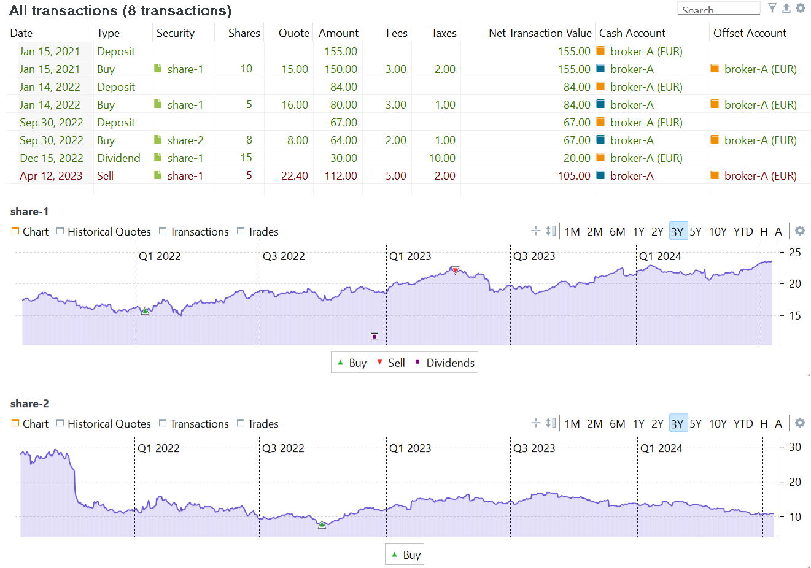
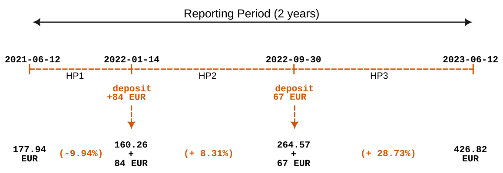
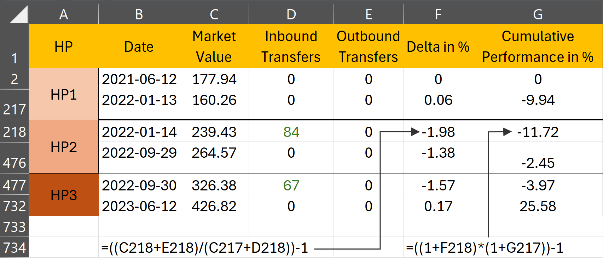
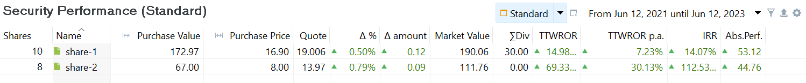
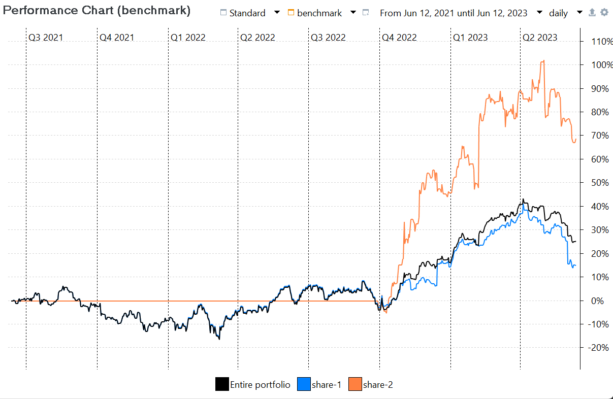
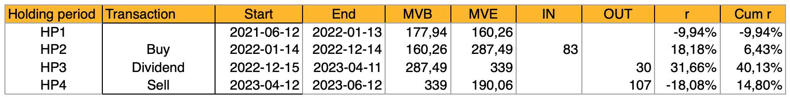

# 时间加权收益率
时间加权收益率 (TWROR) 在计算收益率时对每个时间段一视同仁，与这些期间投入的金额多少无关。相比之下，资金加权收益率 (MWROR) 会给投入金额较大的期间更高权重，同时考虑现金流的规模与时点。

时间加权收益率 (TWROR) 的目的，是反映真实的市场收益率，排除存款、取款等外部因素的影响。举例来说，假设昨天的期末市值 (MVE) 为 100 EUR。今天 MVE 增加到 110 EUR，但这一变化由两部分构成：1% 的市场回报（1 EUR）和一笔 9 EUR 的存款。

此时 TWROR 应为 **1%**（101/100 - 1），而不是 10%（110/100 - 1）。

现在假设几天之后，MVE 从 110 EUR 上升到 120 EUR，但其中同样包含该期间 1% 的市场回报（1.1 EUR），以及最后一天的 8.9 EUR 存款。

该期间的 TWROR 仍应为 **1%**（111.1/110 - 1），而不是 9.09%（120/110 - 1）。

最后，整个期间的累计市场收益率 (TWROR) 应为 (1+1%) x (1+1%) - 1 = **2.01%**，而不是 120/100 - 1 = 20%。

*简单收益率* r = (MVE/MVB) - 1 的公式（见[绩效度量中的公式 1](index.md#performance-measurement)）须加以调整，以中和或抵消现金流的影响。

## 通用方法 {#general-method}

在多数财务管理教科书中，计算一个报告期的时间加权收益率被描述为三个步骤：

1. 把报告期划分为若干**子期间**，例如周、月或季度。不过，最好以现金流日期为基准来划分子期间。采用这种方法时，一个子期间要么始于报告期起点，要么始于某笔现金流发生之前；它要么结束于下一笔现金流发生之前，要么结束于报告期末。因此，各子期间的时长很可能并不相等。

2. 用公式 1 计算各子期间的**增长率**：
    
    $$\mathrm{1 + r = \frac{MVE}{MVB + CF} \qquad \text{(Eq 1)}}$$

    其中 MVE = 该资产在持有期末的市值，MVB 是持有期初的市值（与上一持有期末的 MVE 相同）。CF 是该期间流入的现金流（正数），或流出的现金流（负数）。公式 1 假定现金流发生在期间起点。正如后文将会看到的，Portfolio Performance 把现金流入 (*CFin*) 视为发生在当日开始时，而把现金流出 (*CFout*) 视为发生在交易日结束时。

3. 用公式 2 把各子期间的收益率**复利**合成报告期的整体绩效：

    $$\mathrm{r = [(1 + r_1)  \cdots  \times (1 + r_n)] - 1 \qquad \text{(Eq  2)}}$$

    其中 *n* 是持有期的个数，rt 是第 *t* 个持有期的收益率。

## 在 PP 中的实现 {#implementation-in-pp}

为求最高的精确度，上述方法要求在每笔现金流发生之前都对应一次资产估值。然而在某些情形下这并不可行，估值只能按月或按季获得。这些估值日期可能与现金流日期重合，也可能不重合。在这种情况下，结果只是 TTWROR 绩效的一个近似值。不过，当每笔现金流之前都有可用估值时，就可以计算时间加权收益率 (TTWROR)。这一名称正是为了把该方法与上述近似方法区分开来。

过去，算力成本高昂，因此把持有期设得较长以减轻计算负担是合理的，尤其是为了减少在每笔现金流处所需的估值次数。如今情况已非如此，Portfolio Performance 之类的软件几乎可以实时计算投资的市值。因此，Portfolio Performance 按*日*计算各组成部分的市值，无论当日是否有现金流。因此，各持有期的时长都相等，均为一天。

采用每日估值时，合理的假设是现金*流入*发生在当日最开始的时候。这笔钱当天即可用于投资。Portfolio Performance 同时假定现金*流出*发生在当日最后、也就是每日估值之前。因此，在公式 1 中反映这一点就是合理的：流入按公式 1 加到 MVB 上，流出则加到 MVE 上。像卖出账目这样的现金流出会使 MVE 变小（资金已离开投资组合）；把它加到 MVE 上，即可中和该笔现金流对当日绩效的影响。

 $$\mathrm{1 + r = \frac{MVE + CFout}{MVB + CFin} \qquad \text{(Eq 3)}}$$

其中 MVE = 该资产在持有期末的市值，MVB 是持有期初的市值（与上一持有期末的 MVE 相同）。CFin 是该期间流入的现金流，CFout 是流出的现金流。

## 投资组合层面的 TTWROR {#ttwror-at-portfolio-level}

投资组合层面绩效计算所涉及的现金流是：`存款`、`取款`、`证券转入` 和 `证券转出`。详见[定义现金流一节](money-weighted.md#defining-the-cashflows)，尤其是资金加权收益率一章中的[图 3](./images/transaction-cashflows.svg)。请注意，`share-1` 的股息或卖出不会影响*投资组合*绩效，因为所得款项仍留在投资组合内的现金账户中。图 1 给出了计算 `demo-portfolio-03` 之 TTWROR 所需的信息。

图： 账目总览——存款（3 笔）、买入（3 笔）、股息与部分卖出，以及 share-1 与 share-2 的图表。{class=pp-figure}

下面的示例将使用一个自 2021 年 6 月 12 日开始的 **2 年报告期**。由于以 155 EUR 首次买入 `share-1` 发生在该报告期之外，影响绩效的现金流入只有两笔：84 EUR 的存款和 67 EUR 的存款。截至 2021 年 6 月 12 日，投资组合的市值 (MVB) 为 177.94 EUR；见图 2。

图： 来自 demo-portfolio-3.xml 的投资组合（2 年报告期）。{class=pp-figure}

如果某个持有期内没有现金流（如 HP1），则可以使用[简单收益率](index.md)公式。当然，这等同于没有现金流时的公式 1：`r = MVE/MVB - 1 = 160.26/177.94 - 1 = - 0.0994`，即 HP1 的收益率为 - 9.94%。

第二个持有期始于第一笔现金流入（+ 84 EUR）之前，结束于下一笔现金流入之前。MVE 为 264.57 EUR。依公式 1，收益率 `1 + r = 264.57 / (160.26 + 84)`，即 r = 8.31%。把现金流入加到分母上，就中和了这笔现金流对绩效的影响。

HP3 的 MVB 与 HP2 的 MVE 相同，均为 264.57 EUR。该期间有一笔 67 EUR 的现金流入，MVE = 426.82 EUR。绩效 `1 + r = 426.82 / (264.57 + 67)`，即 r = 28.73%。

需要强调的是，现金流的时点在这一计算中不予考虑。HP1 无论长短都不影响结果。此外，绩效的计算与现金流金额大小无关，因为现金流入是被加到投资组合的期初市值 (MVB) 上的。这种做法与资金加权收益率的计算形成对比，后者在计算中同时考虑现金流的时点与规模。

对每个期间而言，你需要 MVBt（或 MVEt-1）以及该期间的 MVEt。由于市值是在交易日结束时（按收盘价）确定的，MVEt-1 也就是次日开始时、现金流发生之前的价值。

!!! Note
    也可以认为，既然按公式 1 需要把现金流 CFin 加到 MVEt-1 上，那么另一种做法是采用 MVEt 的市值——它已经包含了这笔现金流 CFint。但必须注意，在一天之内，市场力量可能使原有的 MVEt-1 发生波动，而确定当日开始时、现金流之前的市值时，应当排除这些波动。

整个期间的 TTWROR 为：`[(1 - 0.0994) * (1 + 0.0831) * (1 + 0.2873)] - 1 = (0,9006 * 1,0831 * 1,2873) - 1  = 25,58%`，可用菜单 `视图 > 报告 > 收益` 验证

### 从 PP 导出数据 {#exporting-data-from-pp}

你可以轻松地把每日投资组合数值导出为 CSV 文件。选择菜单 `视图 > 报告 > 收益 > 图表`，点击（右上角的）`Export Data as CSV` 图标。选择 `整个投资组合`（缩略示例见图 3）。其中 `Delta in %` 一列对应计算出的收益率 *r*。`Cumulative Performance in %` 即累计 TTWROR，也就是把此前各天的全部收益率复利合成。

图： 从 Export Data as CSV 导出的 CSV 文件摘录（2 年期间，投资组合层面）。{class=pp-figure}

图 3 中的计算与前述手工计算的说明完全类似，只是持有期为一天。请注意，Excel 工作表中的多数行处于隐藏状态。`2021-06-12` 时投资组合的市值为 177.94 EUR。到 HP1 结束的 `2022-01-13`，该值降至 160.26 EUR。6 月 14 日发生了一笔存款（并买入 share-2）。然而 HP2 的 MVB 并不是 160.26 EUR + 84 EUR = 244.26 EUR；因为费用与税款是在该笔账目上支付的，而且投资组合在 2022-01-14 交易日内已略有变动。HP2 中投资组合的市值上升到 264.57 EUR。同样地，由于费用与税款（见图 2），2022-09-30 的当日绩效为负。累计绩效依公式 2 计算，只是现在按*日*计算，结果整个报告期的总绩效同为 25.58%。

## 证券层面的 TTWROR {#ttwror-at-security-level}

上一节描述的是整个投资组合（含现金账户在内）的绩效。到现在为止，理解单一项证券的绩效计算不应再有困难。基本原则相同。不过，在处理方式上仍有若干差异。

1. 聚焦于单一项证券，意味着现金账户等其他资产不计入计算。
2. 相反，股息和卖出等账目会影响绩效计算。由于卖出所得或股息会存入现金账户，从证券的角度看，资金离开了本系统，因而被纳入计算。
3. 税款另有专门规定。税款*不*计入计算；参见 [IRR 一节以了解说明](./money-weighted.md#irr-at-security-level)。

在 Portfolio Performance 中，你可以通过菜单 `视图 > 报告 > 收益 > 证券` 取得某项证券的 IRR 与 TTWROR（见图 4）。不过，这些数值默认不显示，需要用右上角的 :gear: `显示或隐藏列` 图标将其调出。

图： 证券的期间 TTWROR 与年化 TTWROR（2 年期间）。 {class=pp-figure}

菜单 `视图 > 报告 > 收益 > 图表` 中的图表可以显示多条时间序列（点击齿轮图标）。在图 5 中，整个投资组合的累计 TTWROR 与 `share-1`、`share-2` 各自的表现曲线并排显示，报告期为 2 年，自 2021 年 6 月 12 日起算。由于 `share-2` 是在 2022 年 9 月 30 日取得的，在此日期之前其绩效记为零（由那条水平橙线标示）。自该点起，由于 `share-2` 的贡献虽然相当可观但在整体投资组合中相对较小，总投资组合的绩效曲线开始与 `share-1` 的绩效曲线分离。可以看到，整个投资组合的 TTWROR（黑线）止于 25.58%，与图 3 中的计算一致。

图： 投资组合、share-1 与 share-2 累计绩效曲线（2 年期间）。{class=pp-figure}

对于*手工*计算，你需要先确定持有期。对 `share-2` 而言这相当容易，一个持有期就够：从买入日期之前一直到报告期末。`share-2` 在持有期初（买入之前）的 MVB 为 0 EUR。MVE 等于 111.76。买入账目的成本为 66 EUR（含费用，不含税款）。因此 TTWROR 等于 `111.76/(0 + 66) = 69.33%`。这一点可以在图 5 中看到，那条橙线止于略低于 70% 的位置。

`share-1` 的手工计算要复杂一些。下表（图 6）汇总了全部相关信息，它基于图 6 曲线图中*每日*数据的 CSV 导出（点击右上角的 :material-upload: 向上箭头）。

图： share-1 累计绩效的手工计算。{class=pp-figure}

HP1 的收益率一目了然：`r = [(160.26)/(177.94 + 0)] - 1 = -9.94%`。HP2 含有一笔现金流入（买入）：`r = [(287.49)/(160.26 + 83)] - 1 = 6.43%`。

HP3 与 HP4 是特殊情况，因为它们含有现金流出。HP3 的收益率为 `r = [(339)/(287.49 - 30)] - 1 = 31.66%`，HP4 为 `r = [(190.06)/(339 - 107)] - 1 = -18.08%`。整个报告期的 TTWROR 合计为 14,80%；略低于图 4 中 Portfolio Performance 报告的 TTWROR（14,98%）。这一细微差异源于：公式 1 假定所有账目都在交易日开始时完成，而公式 3 假定现金流出发生在交易日结束时。由于份额的市值在一天之内会有波动，这些波动会使公式 1 与公式 3 的结果略有出入。

## TTWROR p.a. {#ttwror-pa}

图 4 同时显示了（期间的）`TTWROR` 与 `TTWROR p.a.`（per annum，拉丁语，意为每年）。期间 TTWROR 表示整个报告期的绩效。你可以在任何带 :gear: 图标的表格或组件中加入 `TTWROR p.a.` 指标。

`TTWROR p.a.` 指标的计算，假定一年为 365 天。

举例来说，若期间 TTWROR 在两年即 730 天内为 30%，则年化后的数值为 14.02%，即 (1.3 ^ (365/730))-1。这等同于取 1.3 的平方根。

若 1 月份的 TTWROR 为 2%，则 TTWROR p.a. 计算为 (1.02 ^ (365/31))-1，结果为 26.26%。

假定每年 365 天，会在报告期包含闰年的 2 月 29 日时，使 `期间 TTWROR` 与 `TTWROR p.a.` 之间出现细微差异。不过对于 2023 这样非闰年的年份而言，两个数值完全相同。

 
