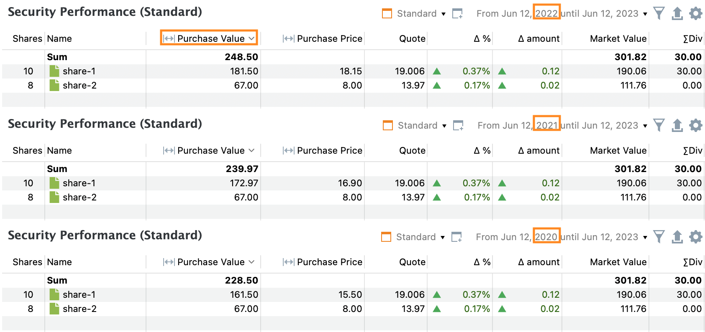
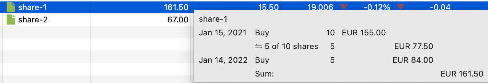

某项证券的**成本**，是在给定[报告期](./reporting-period.md)内取得该证券所需的总支出。每份的价格取决于买入日期相对报告期的位置。

- 若买入发生在报告期**之内**，该数值即所有买入账目（+）与卖出账目（-）之和，含费用与税款。
- 若买入发生在报告期**之前**，该数值以期初市值为基础。原始买入价*不*计入其中，等同于假设在报告期开始时买入该证券。
- 若买入发生在报告期**之后**，成本为零。该期间内没有可持有的证券。

**买价**是基于全部买入或估值得出的、假设性的每股平均买入价格。成本与买价这两个概念用于 [视图 > 报告 > 收益 > 证券](../reference/view/reports/performance/securities.md)（见图 1）。

作为参照，假设采用 [demo-portfolio-03.xml](../assets/demo-portfolio-03.xml) 中的情形。全部账目总览见[资金加权收益率](./performance/money-weighted.md)一节。

图： 多个报告期下证券的成本。{class=pp-figure}

如图 1 所示，某些证券（如 `share-1`）所报告的成本取决于所选报告期。不过我们先聚焦于 `share-2`，它的成本与买价在三个报告期内都保持不变。

从 [demo-portfolio-03.xml](../assets/demo-portfolio-03.xml) 可知，2022 年 9 月 30 日以每股 8 EUR 买入 8 份，合计 67 EUR，其中含 3 EUR 费用与税款。由于该买入日期落在每一个报告期内，实际买入数据便成为三个报告期的共同依据，由此得出成本为 67 EUR，买价为 8 EUR/份。

`share-1` 则更复杂。2021 年 1 月 15 日以合计 155 EUR（含费用与税款）买入 10 份，2022 年 1 月 14 日以 84 EUR 买入 5 份。2023 年 4 月 12 日以 105 EUR 卖出 5 份。

3 年、2 年、1 年报告期所对应的历史价格分别为每股 14.705 EUR、17.794 EUR 与 18.15 EUR。更多细节见[资金加权收益率](./performance/money-weighted.md)的图 2。

- **1 年报告期**

  两笔买入都发生在报告期开始之前。此时采用期初历史价格 18.15 EUR/份对该证券估值。

  期初时投资组合中持有 15 份，总值为 15 × 18.15 EUR = 272.25 EUR。期间内卖出 5 份，剩余 10 份价值为 (272.25 × 10/15) = 181.50 EUR，这正是该 1 年报告期的成本。

  买价为 18.15 EUR/份，与报告期开始时的历史价格一致。

- **2 年报告期**

  由于期间自 2021 年 6 月 12 日开始，第一笔买入落在期间之外，而第二笔买入与卖出账目都发生在期间之内。

  期初时已持有的 10 份按 10 × 17.794 EUR/份 = 177.94 EUR 估值。按先进先出原则卖出 5 份，剩余价值为 177.94 / 2 = 88.97 EUR。

  另买入 5 份，支出 84 EUR。因此该期间的成本合计为 88.97 + 84 = 172.97 EUR。

  买价为第一次买入估值（17.794 EUR/份）与第二次买入（16 EUR/份）的加权平均，计算方式为：(17.794 + 16) / 2 = 16.90 EUR/份。

- **3 年报告期**

  由于全部账目都发生在报告期内，故采用实际买入数据。

  首次买入 10 份估值 155 EUR。卖出后仅剩 5 份，中间成本为 155 / 2 = 77.50 EUR。

  第二次买入估值 84 EUR，最终成本为 77.50 + 84 = 161.50 EUR。将鼠标悬停在成本字段上时弹出的提示中即显示此计算过程（见图 3）。

图： 成本字段的悬停提示面板。{class=pp-figure}  

  

买价为第一次与第二次买入价格的平均，计算方式为：(15 + 16) / 2 = 15.50 EUR/份。