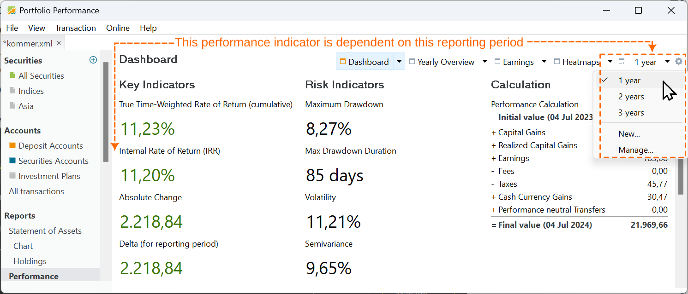
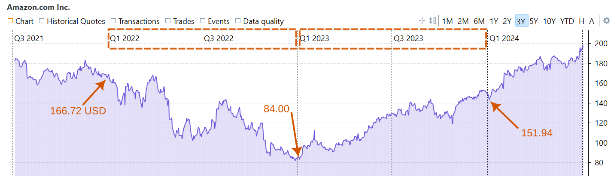
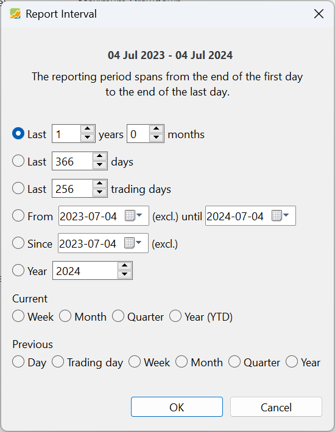

报告期是指在报告投资组合绩效时所采用的具体时间范围。例如，图 1 所示的绩效指标是在一年期间内计算的，起点为当前日期。其他报表与图表，例如涉及收益率/波动率以及证券绩效的，也都会考虑这一报告期。有一点至关重要：*每一次*绩效计算都建立在某个报告期之上，即使你并未显式定义。Portfolio Performance 默认将其设为自当前日期起的一年。

图： 用于选择报告期的下拉列表。{class= pp-figure}

报告期会显著影响绩效，而且很容易被用来支撑某种特定观点。以图 2 所示的 Amazon 股价走势为例，视所选报告期而定，你会看到巨额亏损、巨额盈利，或中等幅度的亏损。

!!! Note
    使用[基本概念 > 绩效](./performance/index.md)中的公式来计算绩效指标。若想在 PP 中核对数字，可使用 Kommer 投资组合。把 Amazon 作为[基准](../reference/view/reports/performance/performance-chart.md)加入绩效图表，并设置相应的报告期，例如 2022 年。别忘了把投资组合货币切换为 USD，这样绩效计算才以 USD 进行。

- 2022 年：`TTWROR = IRR = (84/166.72)-1 = -49.62%`
- 2023 年：`TTWROR = IRR = (151.94/84)-1 = +80.88%`
- 2022–2023 年：`TTWROR = IRR = (151.94/166.72)-1 = -8.87% 或 -4.53% p.a.`

图： Amazon 以美元计价的历史价格（期间为 2022—2023 年）。{class= pp-figure}

你可以用窗口右上角的报告期:material-triangle-small-down: 下拉框来设置报告期（见图 1）。可选项为：`1 年`、`2 年`、`3 年`、`新建...` 和 `管理...`。通过最后一项，你可以删除或重新排序可用期间。

1 年、2 年、3 年期间总是从当天算起，从当前日的收盘时刻延伸到 1 年、2 年或 3 年前同一时刻的收盘。举例来说，若今天是 2024 年 7 月 4 日，则 1 年报告期从 2023 年 7 月 4 日的收盘时刻延伸到 2024 年 7 月 4 日的收盘时刻。该期间的期初市值（MVB）反映的是投资组合在 2023 年 7 月 4 日结束时的状况，而 MVE 则代表其在 2024 年 7 月 4 日结束时的状况（例如见图 3）。关于 [IRR 计算公式](./performance/money-weighted.md)，在首个日期（例如 2023 年 7 月 4 日）发生的账目不应计入公式，因为它们已体现在该期间的 MVB 中。反之，期间最后一天的账目应计入公式，因为它们会影响 MVE，即便影响时间极短。不过在上述例子中，由于 `2022 年`期间是从 2021 年 12 月 31 日延伸到 2022 年 12 月 31 日，因此 2022 年 1 月 1 日发生的买入应视为现金流入。

用 `新建` 子菜单可创建自定义期间。图 3 中的选项含义相当直观。你无法为自定义期间命名，因为它们由 PP 预定义并命名，例如 `最近 10 个交易日` 或 2023 年对应的 `2023`。

图： 可用于报告的自定义期间（当前日期为 2024 年 7 月 4 日）。{class=pp-figure}

- `最近 x 年 y 个月`：从当前日期往前推 x 年 y 个月。标准的 `1` 年、`2 年`、`3 年` 期间都可以用此选项重新构造。不过借助这种写法，你可以创建诸如 `1.5 年`这样的自定义期间。
- `最近 x 天`：这里"天"指自然日。注意图 3 中"最近 x 天"已预先填好。Portfolio Performance 识别出当前年份 2024 是含 2 月 29 日的闰年，因而自动将天数设为 366。
- `最近 x 个交易日`："交易日"指金融市场正常开市的常规营业日。周末及[所选日历](../reference/help/preferences.md#calendar)中列出的日期会被排除。可使用的日历可在 `帮助 > 首选项 > 日历` 菜单中指定。2024 年有 256 个交易日吗？图 3 中选中的是 `默认` 日历，其中包含七个节假日：元旦、复活节星期一、平安夜，以及另外四个。在所选期间内，共有 262 个非周末日。其中六个（不含 2023 年的平安夜）落在工作日。因此该年共有 256 个交易日。
- `自 xxxx（不含）至 yyy`：两个日期之间的期间，其中首日不计入（自该日结束时开始）。
- `自 xxxx（不含）`：自给定日期（不含）至今天（含）。
- `年份 xxxx`：该年总是从 xxxx 年 12 月 31 日起至 xxxx+1 年 12 月 31 日止。
- `当前`：`周`、`月`、`季` 或 `年`。一周从周日或周一（傍晚）起至下一个周日或周一（傍晚）止，具体取决于[设置](../reference/help/preferences.md#language)中指定的国家。一季包含三个月，例如 1 月至 3 月、4 月至 6 月，依此类推。缩写 `YTD` 代表*年初至今*，指自本年初至今日的期间。
- `前一`：`日`、`交易日`、`周`、`月`、`季` 和 `年`。`前一日`与`最近 1 天`并不相同。以 7 月 4 日为例，前一日是 7 月 3 日，从 7 月 2 日傍晚到 7 月 3 日傍晚；而"最近 1 天"期间则是 7 月 4 日（当天）。前一交易日与前一日类似，但排除周末与节假日。前一月从上月的第一天起至本月的最后一天止。第一季度从 1 月 1 日起至 3 月 31 日止。前一年从上年 1 月 1 日起至上年 12 月 31 日止。