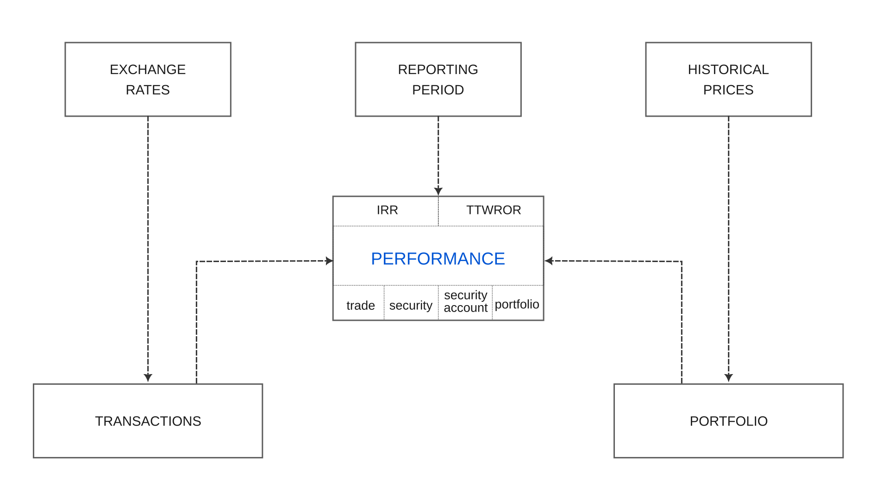
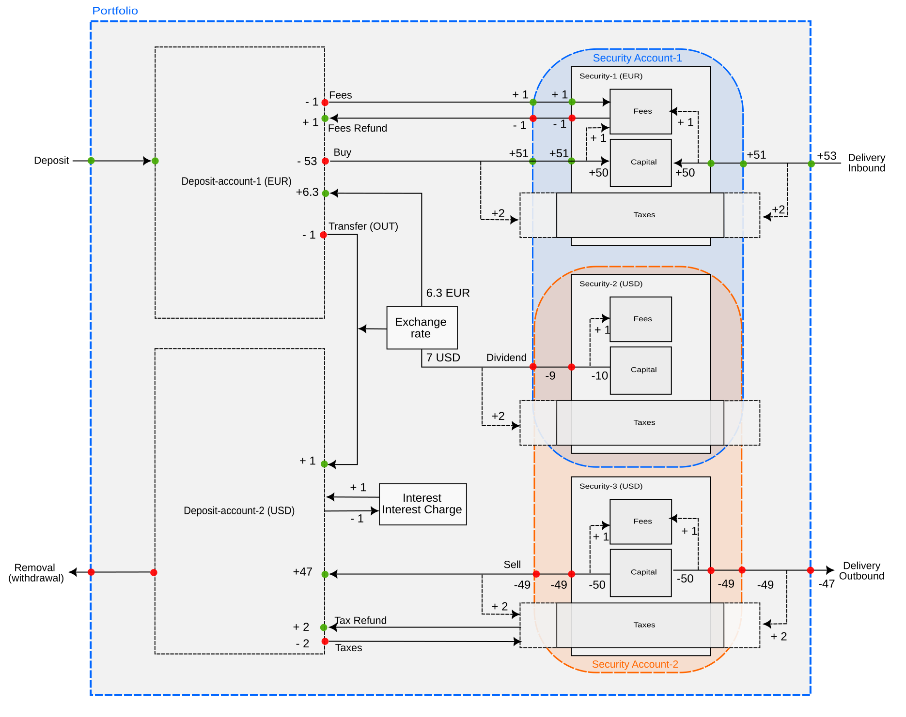

PortfolioPerformance (PP) 这一名称很好地体现了它的用途：从绩效的角度管理投资组合。这一侧重点与许多券商的自有应用不同，后者主要协助执行订单的技术性操作。下文将概述主要组件（见图 1）。点击各链接可获得更详细的信息。另有一篇单独的文本，给出了使用简单投资组合的[示例](system-overview-example.md)。

## 组件 {#components}

图： 包含各组件及其关系的系统概览。{class=pp-figure}

绩效是一个多层面的概念。它不仅有多种计算方法，例如[资金加权 (IRR)](../performance/money-weighted.md)与[时间加权 (TTWROR)](../performance/time-weighted.md)收益率，而且可以在不同层面计算绩效：[整个投资组合](../../reference/view/reports/performance/index.md)、单个证券账户或现金账户、[单项证券](../../reference/view/reports/performance/securities.md)，或某一笔[头寸](../../reference/view/reports/performance/trades.md)。在其最简单的形式下，即没有任何账目时，投资组合的绩效可用下列公式表示（更详细的信息请参见前文提供的链接）：

$$\mathrm{r = \frac{(MVE - MVB)}{MVB} \quad (Eq  1)}$$

其中 MVE = 投资组合在报告期末的市值，MVB = 投资组合在期初的市值。

绩效直接受[报告期](../reporting-period.md)影响，其默认值是自今天起一年。报告期决定了投资组合、账户或证券在期初与期末的数值（例如绩效公式中的 MVB 与 MVE）。在资金加权收益率 (IRR) 的情况下，它还决定了一笔现金流在报告期末之前还有多长时间可用于产生盈利或亏损。

[汇率](../../reference/view/general-data/currencies.md)的影响要间接一些，每当账目涉及货币换算时就会发挥作用。这包括不同币种现金账户之间的转账，以及以多种货币进行的买入、卖出、股息等账目。例如，买入以 USD 报价的证券时，你可能需要按某个汇率把欧元换成 USD。卖出这些证券时，你又可能需要把 USD 换回欧元。从买入时到卖出时汇率的波动可能带来盈利或亏损，因为 USD 以欧元计的价值可能已经改变。

证券的[历史价格](../../how-to/downloading-historical-prices/index.md)对市值，进而对投资组合、证券账户、单项证券和头寸的绩效有显著影响。显而易见，若某项证券在头寸结束时的价格高于开始时的价格，这笔头寸就是盈利的。这一价格上涨形成资本利得，直接计入投资组合的整体绩效与价值。

最后但同样重要的是，绩效直接取决于投资组合及其账目。报告期内若*没有*任何账目，基本绩效公式可简化为 IRR = TTWROR = (MVE/MVB) - 1。若 MVE 大于 MVB，即取得盈利（此时为账面浮盈），绩效为正；反之，若 MVE 小于 MVB，说明报告期末的投资组合价值低于期初，绩效即为负。

## 账目 {#transactions}

当报告期内发生[账目](../../reference/transaction/index.md)时，事情就变得复杂起来。账目共有 13 种类型，每一种都会在投资组合、账户或证券层面产生现金流入与流出。图 2 展示了四个主要组成部分之间的全部账目类型：投资组合（以蓝色虚线表示）、EUR 与 USD 两种币种的现金账户、三项证券（其中两项以 USD 报价），并归入两个证券账户（橙色与蓝色虚线）。Security-2 (USD) 同时存在于两个账户中。

账目以箭头表示。它们产生现金流出（红色圆形）或现金流入（绿色圆形）。圆形旁的数字表示现金流的大小，其依据是一个假设示例：以每股 10 EUR/USD 买入或卖出 5 份，形成 50 EUR/USD 的资金流入。费用与税款分别固定为 1 和 2 EUR。每份派发 2 USD 股息；采用的汇率为 0.9 EUR/USD。

图： 全部账目类型及其在投资组合、账户和证券层面所对应现金流的概览。 {class=pp-figure}

由此可见，投资组合层面**只有四种账目类型**会产生现金流：存款、取款、证券转入和证券转出。因此，只有这些账目会影响仪表板（`视图 > 报告 > 收益`）上的绩效指标，而该指标是投资组合层面的绩效指标。

一笔[*存款*](../../reference/transaction/deposit-withdrawal.md)账目会产生两笔现金流入：一笔在投资组合层面，一笔在现金账户层面。这笔账目之所以形成流入，是因为资金进入了现金账户，因而也进入了投资组合。另一方面，一笔[*取款*](../../reference/transaction/deposit-withdrawal.md)账目会产生两笔现金流出，使资金从现金账户和投资组合中消失。

一笔[*证券转入*](../../reference/transaction/delivery.md)账目会增加某项证券的份额，从而增加该证券的本金（份额数 x 历史价格）**以及**证券账户的数值。反之，一笔[*证券转出*](../../reference/transaction/delivery.md)账目会通过从证券中移除份额来减少本金，形成一笔现金流出。

需要特别关注[*费用*与*税款*](../../reference/transaction/fees-taxes.md)。以每股 10 EUR 转入 5 份证券，会使本金增加 50 EUR，但需要 53 EUR 的资金流入投资组合。然而，流入该证券的现金为 51 EUR，因为 1 EUR 的费用要到证券边界的现金流处才被扣除。要确定某项证券的现金流入或流出，始终应把费用计入。费用被视为该笔账目内在的组成部分，而税款则不被视为某项证券内在的组成部分。税款的征收方式各国差异很大，某项证券的绩效不应取决于此。证券层面默认不计税款。就证券账户层面而言，Portfolio Performance 提供两种可能：税前或税后（默认计算）的账户绩效；参见菜单 `视图 > 报告 > 图表 > 配置图表 > 添加数据序列...`。图 2 所示为默认的**税后**计算。当越过证券账户的边界（第二个绿色圆形）时，税款已经计入证券的税款组成部分。因此证券账户的现金流入为 51 EUR。采用**税前**计算时，证券账户的现金流入为 53 EUR，因为 2 EUR 的税款要越过证券账户边界之后才被计入税款项目。

所有其他账目都属于投资组合内部，它们不影响投资组合的绩效。例如，*转账账目*只是两个现金账户之间的资金流动，因此对投资组合的绩效没有影响，除非像图 2 的示例那样涉及货币换算。

假设你在报告期一开始以 1.1 EUR/USD 的换算率转入 100 EUR，得到 90.91 USD 的存款。到报告期末，汇率变为 0.9 EUR/USD。由于绩效计算是以投资组合的货币（例如 EUR）进行的，这 90.91 USD 在期末按 81.82 EUR 估值，因汇兑损失而产生约 18 EUR 的亏损。

一笔[*买入*](../../reference/transaction/buy-sell.md)账目与证券转入非常相似，只是其现金流来自投资组合内部而非外部。从现金账户的角度看，这表现为一笔现金流出。证券与证券账户则获得一笔现金流入。关于费用与税款的讨论，请参阅前文。

一笔*卖出*账目会形成流入现金账户的现金流入（47 USD），因为 50 USD 的卖出本金被税款与费用冲减了。

!!! Note
    就绩效而言，买入/卖出账目与证券转入/转出账目可能产生显著不同的结果。只有当买入账目在同一天、且以相同金额配有相应的存款账目时，买入与证券转入在绩效上才没有差别。然而，当买入账目没有相应的存款账目配合时，相关账户的现金余额就会减少（甚至可能变为负数），这可能对该账户期末的市值（MVE）产生负面影响。

一笔[*股息*](../../reference/transaction/dividend.md)账目可以看作一种卖出账目。在图 2 中，security-2 (USD) 的本金（5 份）将为你带来 10 USD 的股息（总额）（5 份 x 2 USD/份）。扣除费用后，证券与证券账户的现金流出为 9 USD。再扣除税款并把剩余的 7 USD 换算为 EUR，deposit-account-1 (EUR) 收到 +6.3 EUR 的现金流入。

单独记录的*费用*、*费用退款*、*税款*和*退税款*账目遵循同样的规则。因此，无论你是把税款与费用并入一笔买入、卖出或证券转入/转出账目，还是把它们拆分成单独账目，结果都没有区别。

*利息*与*利息支出*账目则是一个特殊情况。虽然它们确实会增加或减少现金账户的现金余额，但**不**产生任何现金流入或流出。正如证券的本金会因报价变化而增减（形成资本利得或损失）一样，现金账户的余额也会因利息而变动。
