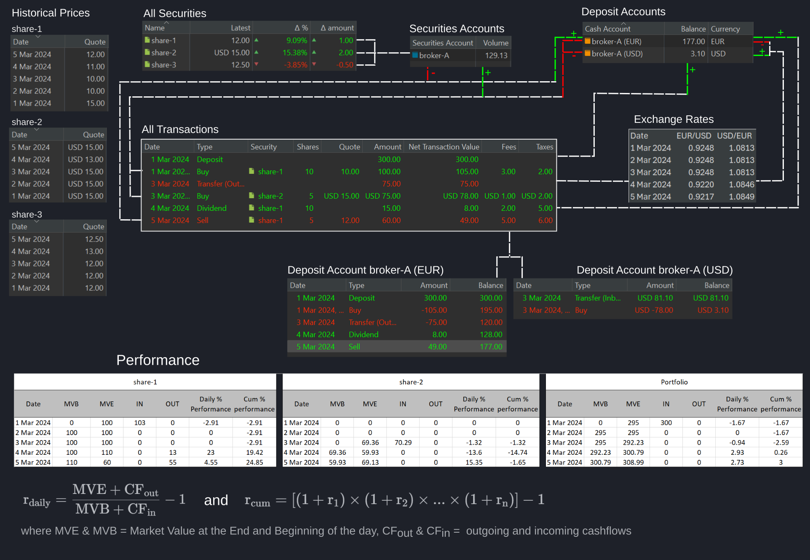

PortfolioPerformance (PP) 这一名称很好地体现了它的用途：从绩效的角度管理投资组合。这一侧重点与许多券商的自有应用不同，后者主要协助执行订单的技术性操作。下文将概述主要组件。点击各链接可获得更详细的信息。

该投资组合有一个[证券账户](../../reference/view/accounts/security-account.md)（broker-A）和两个[现金账户](../../reference/view/accounts/index.md)（分别为 EUR 和 USD）。现金账户的余额为 2024 年 3 月 5 日的期末余额。三项份额及其历史价格已经添加（见[全部证券](../../reference/view/securities/all-securities.md)）。只有 share-1 和 share-2 存在相关账目，因而参与绩效计算。[历史价格](../../how-to/downloading-historical-prices/index.md)是[证券主数据](../../reference/file/new.md#historical-quotes)的一部分。汇率在 [`视图 > 常规数据 > 货币`](../../reference/view/general-data/currencies.md) 中提供。

图： Portfolio Performance 的组件及其相互关系。 {class=pp-figure}

系统的核心是账目（[全部账目](../../reference/view/accounts/all-transactions.md)）。本示例共涉及六笔账目。

1. 2024 年 3 月 1 日，为购买股票，向 broker-A 的 (EUR) 现金账户存入 300 EUR。
2. 同日稍晚，以每股 10 EUR 买入 10 份 share-1。扣除 5 EUR 的费用与税款后，105 EUR 贷记至 broker-A (EUR) 现金账户，余额为 195 EUR。
3. 3 月 3 日，按 0.9248 USD/EUR 的汇率将 75 EUR 换为 USD，得到 81.10 USD。broker-A (EUR) 账户余额降至 120 EUR，而 broker-A (USD) 持有 81.10 USD。
4. 使用该 USD 现金账户，以每股 15 USD 买入 5 份 share-2，净额为 78 USD。broker-A (USD) 的余额降至 3.10 USD。
5. 3 月 4 日，每份派发 1.5 EUR 的股息。扣除 7 EUR 的费用与税款后，broker-A (EUR) 的余额增加 15 EUR，达到 128 EUR。
6. 3 月 5 日，以每股 12 EUR 卖出 5 份 share-1，净额为 60 EUR。扣除 11 EUR 的费用与税款后，broker-A (EUR) 的余额增至 177 EUR。

现金账户中的资金流动脉络清晰（如上所述）。关于 broker-A 证券账户的最终余额（129.13 EUR），3 月 5 日该账户持有 5 份 share-1，估值 60 EUR，以及 5 份 share-2，估值 75 USD。由于该证券账户的基准货币为 EUR，USD 价值按 0.9217 USD/EUR 的汇率换算为 EUR，得到 69.13 EUR。这样合计为 129.13 EUR，即证券账户的期末余额。

绩效按日计算。要计算它，你需要该资产当日的期初市值 (MVB) 与期末市值 (MVE)，以及流入与流出现金流的净额合计。有了这些数值，就可以用图 1 中的公式计算当日绩效（另见[参考 > 视图 > 报告 > 收益](../../reference/view/reports/performance/index.md)）。这些每日绩效随后可用于确定累计绩效。让我们分析并比较 share-1、share-2 以及整体投资组合在各日的绩效。

- **3 月 1 日**
    * share-1：由于股份是在当天买入的，当日期初市值 (MVB) 为零。MVE 为 100 EUR，即 10 份按每股 10 EUR 的收盘价计。买入该股票需要 103 EUR 的现金净流入（用于支付本金和费用）。**不**考虑税款。没有现金流出。当日绩效 = [100/(0 + 103)] - 1 = -0.0291，即 -2.91%。
    * share-2：各项数值均为零；绩效也是零（严格来说应为未定义，因为除数为零）。
    * 投资组合：投资组合包含全部证券与现金账户。投资组合的 MVE 是 share-1 的市值（100 EUR）加上现金账户中的余额（195 EUR），合计 295 EUR。因此当日绩效为 [295/(0+300)] - 1 = -0.0167，即 -1.67%。
- **3 月 2 日**：没有账目，历史价格保持稳定。当日绩效为零，全部资产的累计绩效也维持在同一水平。
- **3 月 3 日**
    * share-1：share-1 没有变化。
    * share-2：share-2 的 MVE 为 76 USD（5 x 15 USD/份），即 75 x 0.9248 = 69.36 EUR。现金流入总额为 MVE + 费用 = 76 USD。因此当日绩效为 [75/(0 + 76)] - 1 = -0.0132，即 -1.32%。累计绩效 = [(1+0) x (1+0) x (1 -0.0132)] -1 = -1.32%。 
    * 投资组合：投资组合的 MVE 是两份份额 MVE 之和，加上现金账户中的余额：100 + 69.36 + 120 + 2.87（3.10 USD x 0.9248）= 292.23 EUR。当日绩效为 [292.23/(295+0)] - 1 = -0.0094，即 -0.094%。累计绩效 = [(1 - 0.0167) x (1 + 0) x (1 -0.0094)] -1 = -2.59%。
- **3 月 4 日**
    * share-1：share-1 的资本利得与股息对当日和累计绩效都产生了正面影响。share-1 的当日绩效为 ((110 + 13)/100) -1 = 0.13，即 13%。累计绩效变为：[(1-0.0291)x(1+0)x(1+0)x(1+0.23)] - 1= 19.42%。
    * share-2：MVE 降至 5 x 13 USD = 65 USD，即 65 x 0.9220 = 59.93 EUR。当日绩效为 (59.93/69.36) - 1 = -13.6%。累计绩效 = [(1+0) x (1+0) x (1 -0.0132) x (1-0.1360)] -1 = -14.74%。 
    * 投资组合：投资组合绩效也转为正数。MVE = 110 (share-1) + 59.93 (share-2) + 128 (EUR 现金账户) + (76 USD  x 0.9220)，即 300.79 EUR。因此当日绩效为 (300.79/292.23) - 1 = 0.0293，即 2.93%。累计绩效为 [(1-0.0167)x(1+0)x(1-0.0094)x(1+0.0293)] - 1= 0.26%。
- **3 月 5 日**
    * share-1：还剩 5 份 share-1，因此 share-1 的 MVE 为 5 x 12 = 60 EUR。但卖出了 5 份：5 x 12 减去费用 = 55 EUR。当日绩效为 [(60 + 55)/110] - 1 = 4.55%。share-1 的累计绩效为 [(1-0.0291)x(1+0)x(1+0)x(1+0.23)x (1+0.0455)] - 1= 24.85%。
    * Share-2：同样因资本利得而获利。MVE 变为 5 x 15 = 75，即 69.13 EUR。当日绩效为 (69.13/59.93) - 1 = 15.35%。share-1 的累计绩效为 [(1+0)x(1+0)x(1-0.0132)x(1-0.1360)x(1+0.1535)] - 1= -1.65%；略为负值，原因是 3 月 4 日出现了资本损失。
    * 投资组合：投资组合的 MVE = 60 (share-1) + 69.13 (share-2) + 177 (EUR 现金账户) + (3.10 USD x 0.9217 = 2.86)，即 308.99 EUR。因此当日绩效为 (308.99/300.79) - 1 = 0.0273，即 2.73%。累计绩效为 [(1-0.0167)x(1+0)x(1-0.0094)x(1+0.0293)x(1+0.0273)] - 1 = 3.00%。
