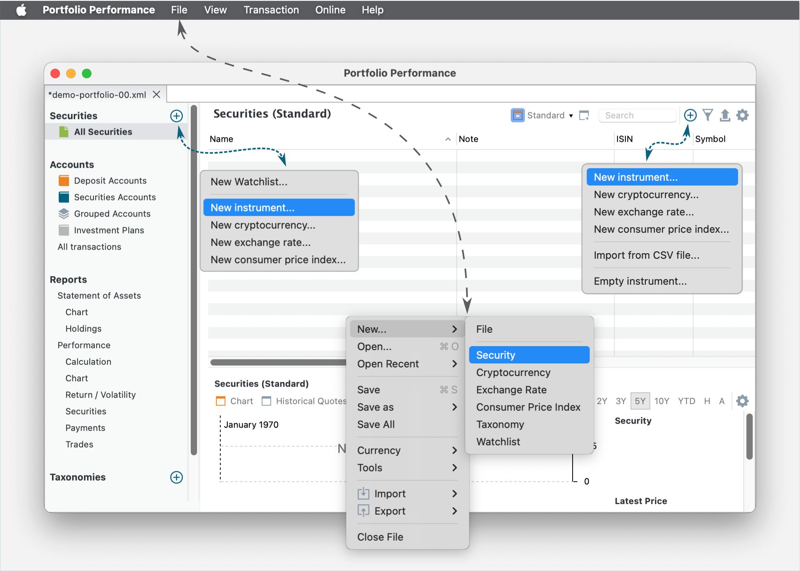
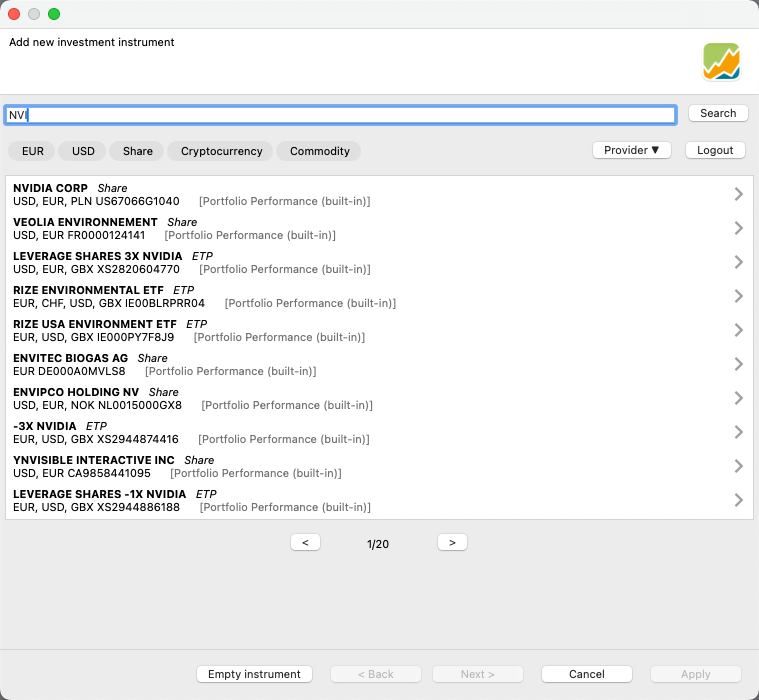
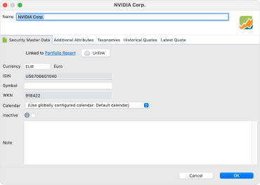

刚完成*创建投资组合*这一步后，你的投资组合仍然是空的。你可以到左侧边栏选择 `证券 > 全部证券` 来确认这一点。该列表显示你正在监控的**全部**证券，而不只是你已买入的那些。此阶段该列表还是空的（见图 1）。

!!! note

    证券是一种具有价值、可在各方之间交易的金融工具。证券大致可分为：债务证券（例如银行券、债券与债券凭证）、权益证券（例如普通股）、衍生品（例如远期、期货、期权与互换）[\[来源：维基百科\]](<https://en.wikipedia.org/wiki/Security_ (finance)>)。

图： 创建新投资组合后的主界面。{class=pp-figure}

:octicons-plus-circle-16:{.green} `添加新投资工具` 按钮（左右各一；见图 1）让你可以开始向投资组合中添加证券。如图 1 所示，你可以添加新的金融工具（股票、债券……）、加密货币与汇率。你也可以从 CSV 文件导入证券，或创建一个新的空证券。最后这一选项可以让你跳过创建向导，并立即显示[证券主数据](../reference/file/new.md#security-master-data)对话框。你也可以使用 `文件 > 新建` 菜单（见图 1）。

**新建工具创建向导**

假设你打算买入 NVIDIA 的份额。在进行买入*之前*，你必须先把该只股票加入证券列表。为此，请在 `文件` 菜单中选择 `新建 > 证券`，或点击任一 :octicons-plus-circle-16:{.green} `新建工具...` 按钮。此操作会打开如下窗口（参见图 2）。

图： 搜索新证券并将其加入全部证券列表。{class=pp-figure}

你可以在搜索框中输入证券名称（或其一部分），例如 *NVI*。借助 `EUR`、`USD`、`股票`、`加密货币`、`大宗商品` 和/或 `提供方` 这些按钮，你可以把搜索限定在特定类别中。点击 `搜索` 按钮后，上方列表会填充出可能的目标金融工具（见图 2）。如图 2 所示，历史价格由内置的 Portfolio Performance 数据源或 Yahoo 等来源提供，覆盖众多股票市场。下一个按钮可让你查看实际的历史价格。

!!! Note
    大多数数据源都需要额外信息，例如用户凭据。有关从各类提供方下载历史价格的细节，包括 [Portfolio Performance（内置）](../how-to/downloading-historical-prices/portfolioperformance.md)、[Yahoo](../how-to/downloading-historical-prices/yahoo-finance.md)、[Morningstar](../how-to/downloading-historical-prices/morningstar.md) 等许多来源，可参见[操作指南 > 下载历史价格](../how-to/downloading-historical-prices/index.md)一节。

选定合适的证券（与股票市场）后，点击 `应用` 按钮进入下一步。某些详细信息，例如名称、代码与历史报价，会根据所选数据源预先填入。你可以按需修改全部这些信息，包括名称在内。请注意，图 3 中 NVIDIA 股票的货币被设为 EUR，这未必适用于你的情况。

图： 输入所选证券信息的面板。{class=pp-figure}

在某些情况下，从一个空的金融工具开始、手动输入信息或许更直接。虽然只有名称是必填项，但仍建议设置 `货币`、`证券代码` 与 `历史报价馈送` 等附加信息。

有关上述全部属性的更多信息，可参见[参考手册 > 文件 > 新建](../reference/file/new.md)。如何找到为你的证券导入历史价格的正确设置，详见[操作指南一节](../how-to/downloading-historical-prices/index.md)。