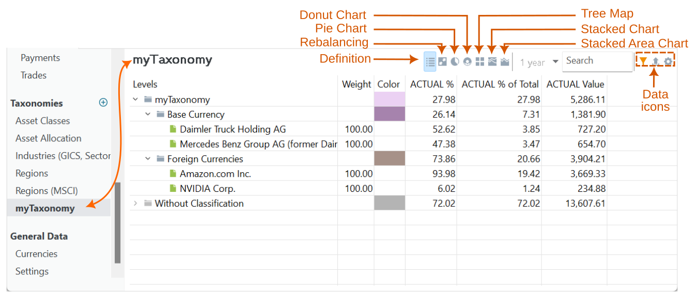
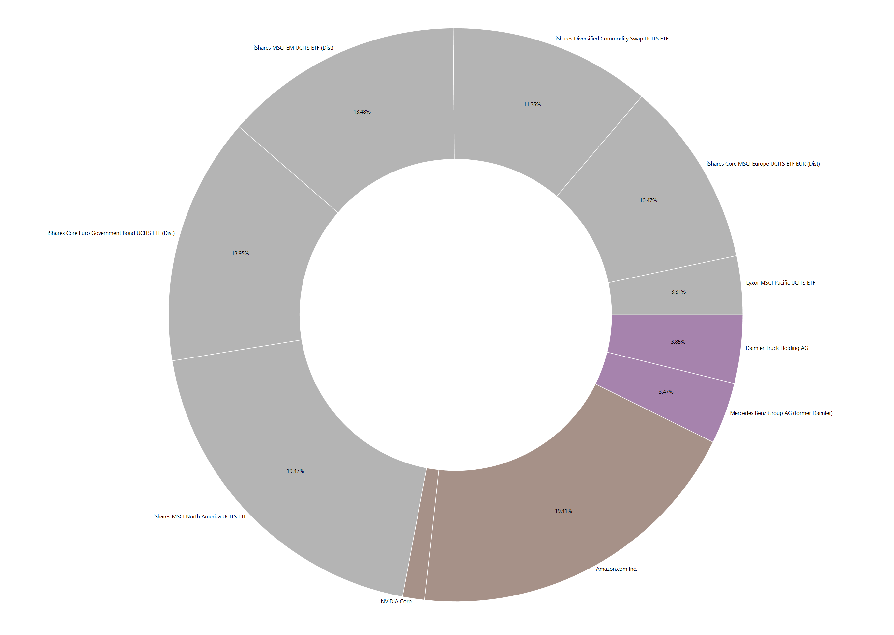
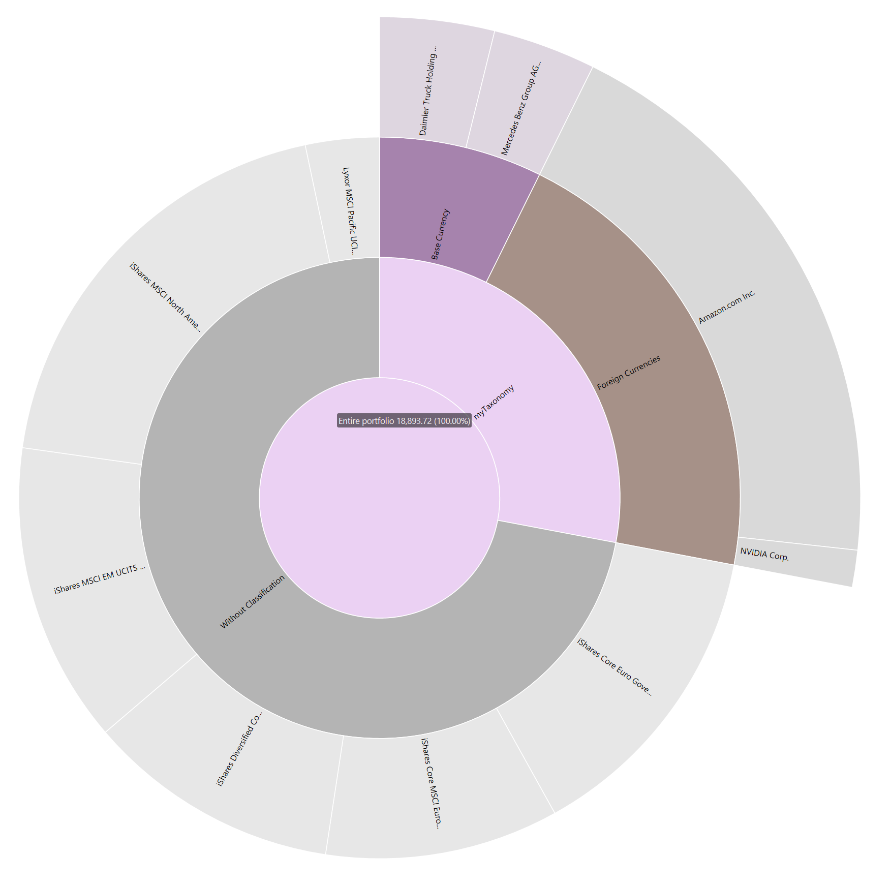
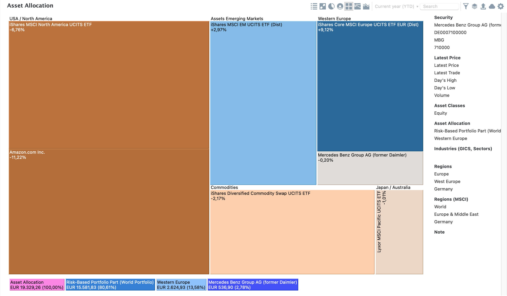
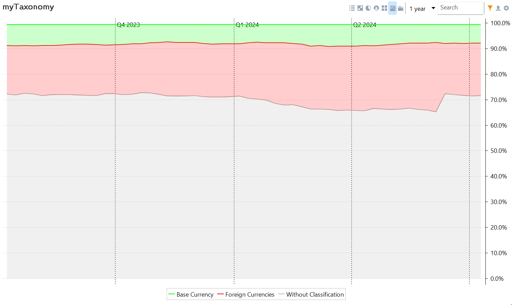
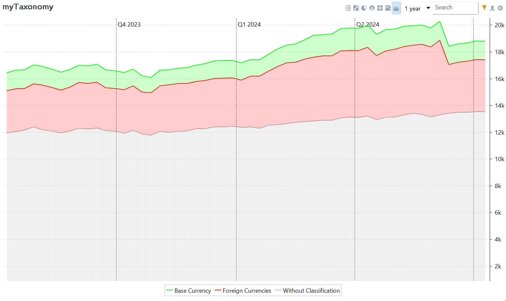

投资的一条黄金法则是：在不同行业、类型、地区……之间分散你的投资组合。这一策略通过把投资分散到各个领域来降低风险。

借助类别，你可以把分散化程度可视化并加以度量。类别是一种对投资组合内各项投资进行归类的工具。已有若干预定义且广为人知的类别体系，例如由 MSCI 制定的全球行业分类标准（GICS）。你也可以创建自己的自定义类别；更多信息参见[参考 > 视图 > 类别](../reference/view/taxonomies/index.md)。

图： 含若干预定义类别与一个自定义类别的类别视图。 {class=pp-figure}

图 1 中，若干预定义类别（资产类别、资产配置等）与一个自定义类别已加入类别视图。主窗格显示自定义类别 `myTaxonomy` 的定义。它把证券归入基准货币（EUR）或外币组。Daimler 与 Mercedes 以 EUR 计价，Amazon 与 Nvidia 则以 USD 计价。请注意，大多数证券（72.02%）尚未归类，停留在一个标为 `未分类` 的组中。

要向类别视图添加一个类别，请选择 `文件` 菜单并选 `新建 > 类别`，或使用侧边栏。选定某个现有类别，或创建一个新类别。使用右键菜单可添加新的分类项（category）；更多信息参见[参考 > 视图 > 类别 > 管理类别](../reference/view/taxonomies/managing-taxonomies.md)。

把某个证券归入类别有多种方式，最简单的就是从 `未分类` 列表中把它拖到目标类别，例如 `基准货币` 或 `外币`。

选择顶部的某个图表图标，即可把该类别可视化，并直观感受各类别之间的比例关系。点击下方的选项卡，可查看每种可用图表类型的示例。

=== "圆环图"

    

=== "饼图"

    

=== "树状图"

    

=== "堆叠柱状图"

    

=== "堆叠面积图"

    