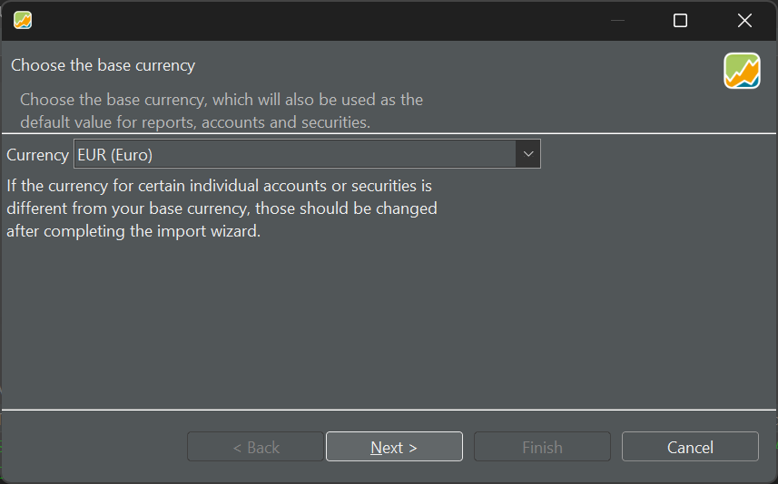
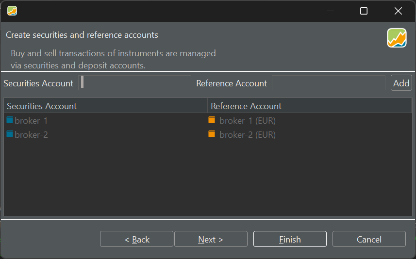
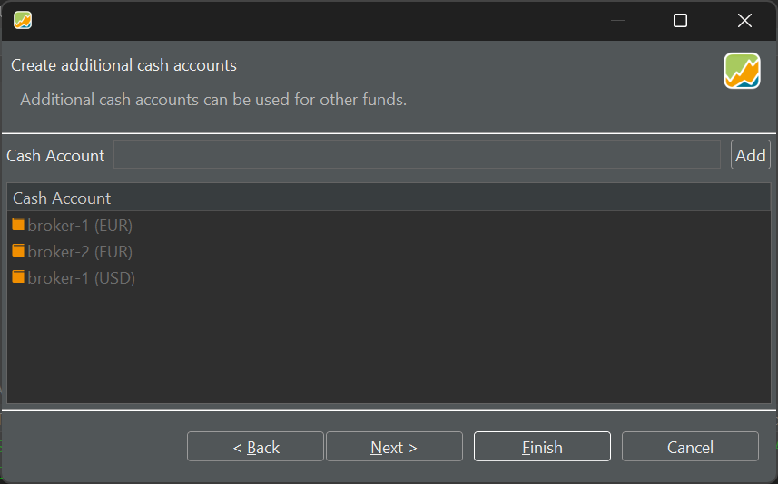
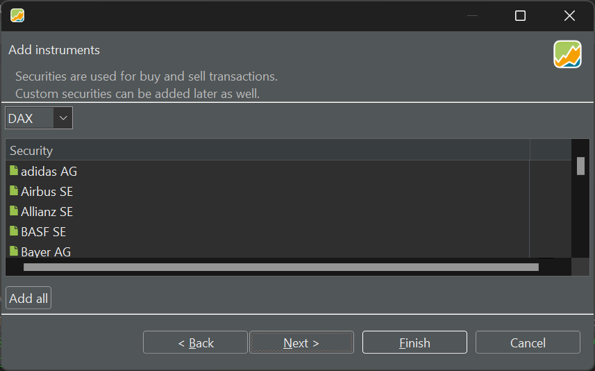
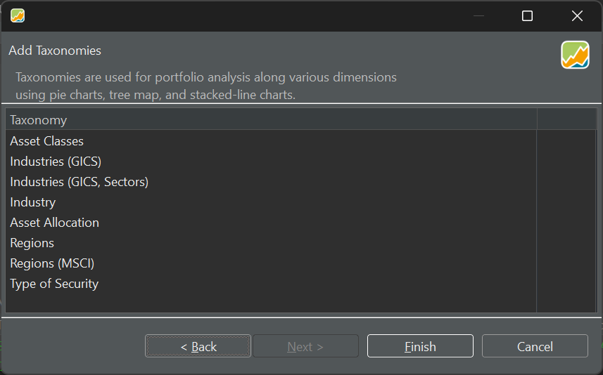

# 创建你的投资组合 {#creating-your-portfolio}

你可以借助一个向导快速创建 Portfolio Performance 文件，向导会一步步引导你完成设置。共分五个步骤，但只有前两个是必做的。从菜单 `文件 > 新建 > 文件` 开始，即可创建新的投资组合文件。

- **步骤 1**
    
    首先，你需要选择投资组合的默认货币（见图 1）。你随时都可以更改单个证券的货币。Portfolio Performance 几乎支持所有可能的货币：从 AED（阿联酋迪拉姆）到 ZWL（津巴布韦元）。

    图： 选择投资组合的默认货币。{class=pp-figure}

    

- **步骤 2**

    你的投资组合必须至少包含一个证券[账户](../reference/view/accounts/index.md)和一个关联（现金）账户。

    图： 向投资组合添加证券账户与关联账户。{class=pp-figure}

    

    一旦创建了至少一个带有关联账户的证券账户，`完成` 按钮即可使用。若你还不清楚后续步骤的内容，不必担心。

    !!! note
        如果你已有一个现成的投资组合，Portfolio Performance 支持导入 CSV 文件，从而快速添加证券、买卖账目与各类收入。关于导入投资组合与股息，请见[此教程](https://forum.portfolio-performance.info/t/import-csv-file/17123)。

- **步骤 3**

    有时你需要不止一个现金账户。你可以把这类额外的现金账户（例如不同货币的账户）加入投资组合。

    图： 向投资组合添加额外的现金账户。{class=pp-figure}

    

- **步骤 4**

    在创建向导中，你还可以把想要在该投资组合中追踪的证券加进来。这些证券取自 DAX（Deutscher Aktienindex）、tecDax、SDAX 与 MDAX 等德国指数跟踪标的。你也可以通过 `Indizes` 把指数本身或其他标的（例如 NASDAQ）加入其中。当然，你也可以之后再添加证券，那时可选范围要大得多。

    图： 向投资组合添加金融工具。{class=pp-figure}

    

- **步骤 5**

    资产类别、地区等分类（Taxonomies）用于对你的证券进行归类。此项分类日后可用于绩效分析（例如：显示所有来自 xxx 地区的证券的绩效）。

    图： 向投资组合添加类别。{class=pp-figure}

    

- **完成**

    向导结束后，会生成一个 `unnamed.xml` 文件。你投资组合的全部数据都保存在这个 XML 文件（eXtensible Markup Language）中。更多关于[可用文件格式](../reference/file/save.md)的信息见此。当然，你应当以不同的名称与位置保存它。
