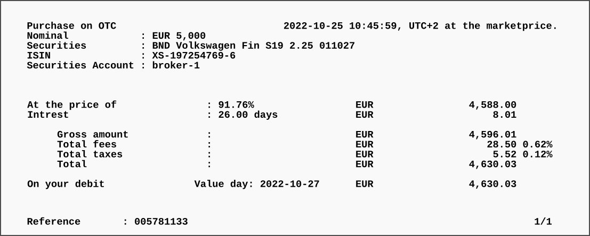
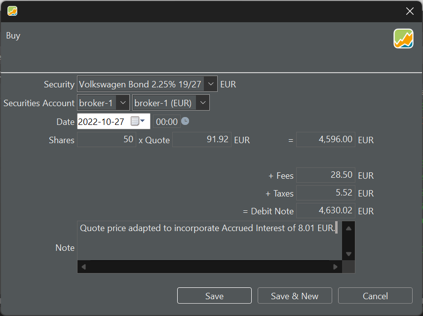
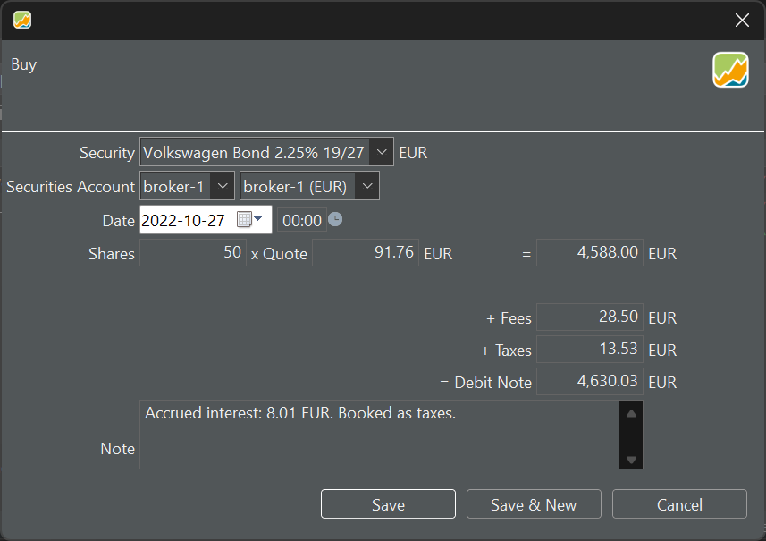
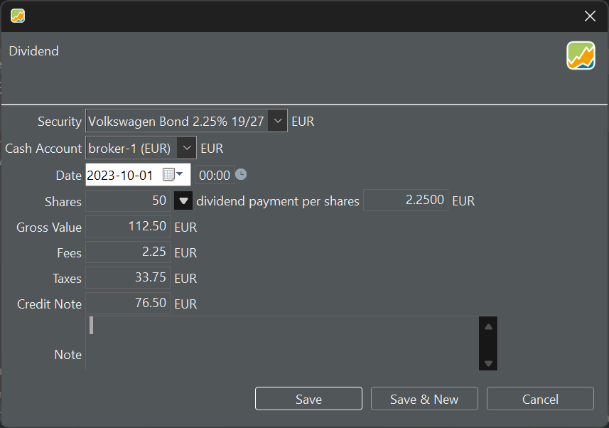

债券是一种代表债务义务的金融工具。当某个实体（例如政府或公司）发行债券时，他们是在向投资者借钱。作为回报，他们承诺在约定期限内偿还本金，并定期支付利息 [[1](https://www.investopedia.com/articles/bonds/08/bond-market-basics.asp)]。Portfolio Performance 对债券的支持不算完善，但借助[德文论坛](https://forum.portfolio-performance.info/t/verbuchung-von-anleihen/1537/43)中提到的几种简单变通办法，你仍可以有效地管理债券。

# 添加债券证券

假设你买入了一只大众汽车债券。你收到了如图 1 所示的如下银行通知。

图： 买入债券的银行通知。{pp-figure}

在添加买入账目之前，你必须先在证券中[创建该证券](../adding-securities.md)。在 Portfolio Performance 中搜索该债券的 ISIN 不会有任何结果，按名称搜索则返回可交易的 Volkswagen 股票。因此，你需要创建一个空的金融工具并手动输入债券信息。债券的历史价格并非特别关键，因为债券最终会在到期时按 100% 兑付。不过——如有需要——你确实可以从例如 [ariva.de 网站](https://www.ariva.de/XS1972547696/kurse/historische-kurse?go=1&boerse_id=1&month=&clean_bezug=1)[以表格形式下载](../../how-to/downloading-historical-prices/table-website.md)它们。需要注意的一点是，历史记录中的债券价格通常以百分比表示，取值范围从 0 到 100%，而不是像股票那样以某种具体货币（如 EUR）表示。

# 记录买入账目

由于历史价格以 0 到 100 之间的数字表示，你也可以用这种格式表示买入价格。到期时，该债券的价值为 5000 EUR，价格为 100%。就`份额数`与`报价`而言，这意味着你将获得 50 份 x 100 EUR 的价值。然而，你是以 91.76% 的价格买入该证券的（见图 1 中的银行通知）。总价值变为 50 x 91.76 EUR = 4588 EUR。费用与税款照常登记即可。

图 1 所示的债券于 2027 年 10 月 1 日到期，年利率 2.25%，每年 10 月 1 日付息一次。由于你是在 10 月 27 日（起息日）取得该债券的，因此已经累计了 26 天的应计利息。按 2.25% 的利率计算，这相当于 5000 EUR * 2.25% * 26/365，即 8.01 EUR。你必须在购买日向卖方支付这笔应计利息，但会在 2023 年 10 月 1 日的首次付息时把它收回。

要正确处理这笔应计利息，有几个可选方案（若干变体见论坛中的[讨论](https://forum.portfolio-performance.info/t/verbuchung-von-anleihen/1537/43)）。

1. 调整买入价格。在图 1 的示例中，买入价格变为 4596 EUR（=4588 + 8.01）。报价变为每股 91.92 EUR，即 91.92%（=4596/50）。这种方法的缺点是价格走势与绩效计算都不正确。

    图： 通过调整报价以纳入应计利息的变通办法。

    {pp-figure}

2. 为精确记录买入价格，你可以把应计利息记为一笔额外的`税款`（见图 3）。这样报价是正确的，并且会从现金账户中扣除正确的金额。这笔"虚假的"税款可以在首次付息时用一笔 `退税款` 账目加以冲正。

    图： 把应计利息计入税款的变通办法。{pp-figure}

    

3. 记录该债券证券的买入账目时不包含应计利息。为处理这笔应计利息，你把正确的金额（8.01 EUR）从与该证券关联的现金账户转入另一个独立的现金账户。首次付息时，再把该应计利息金额转回与该证券关联的原现金账户。
 
# 记录利息支付 {#recording-the-interest-payment}

`账目 > 利息` 选项专为记录现金账户上的利息支付而设计。虽然它也可以用来记录债券的利息支付，但它无法指明利息来自哪只证券。其结果是，现金账户会把全部利息支付汇总在一起，无法把某笔利息支付归属于某只特定证券的绩效。

一种更好、尽管略显反直觉的做法，是把该账目记录为 `账目 > 股息`。股息与某只特定证券（本例中为一只债券）绑定，从而确保该债券的绩效计算准确。根据你先前为买入所选择的记录方式，可以进行以下三笔账目。

1. 把应计利息全额记为股息（见图 4）。购买日应付给卖方的应计利息（8.01 EUR）已经计入所记录的买入价格之中。

    图： 5000 EUR 按 2.25% 支付的利息。

    

2. 利息支付（112.50 EUR）要减去购买日已记为税款的金额（8.01 EUR）。用一笔 `账目 > 退税款` 账目退还该金额。
3. 利息支付要减去已转入独立账户的金额。随后，再把该应计利息金额转回与该证券关联的原现金账户。

