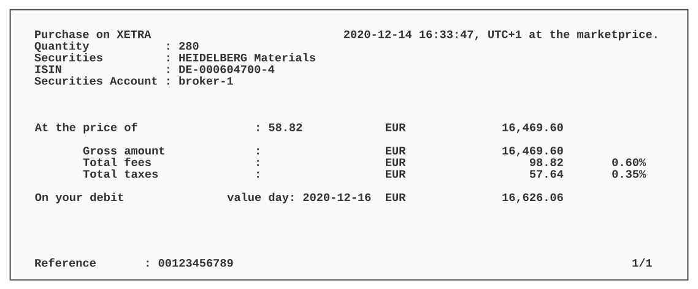
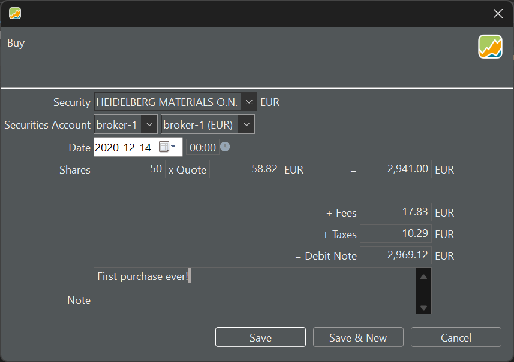
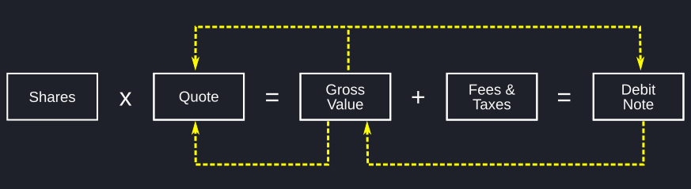
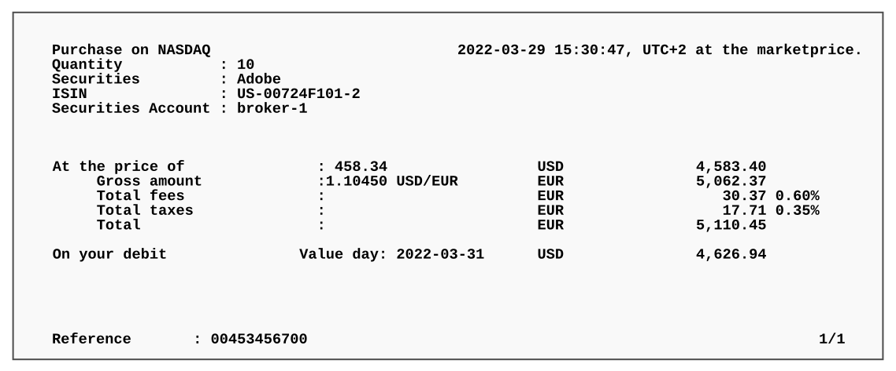
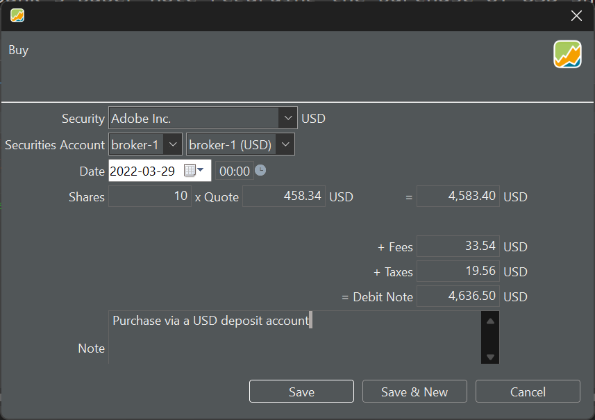
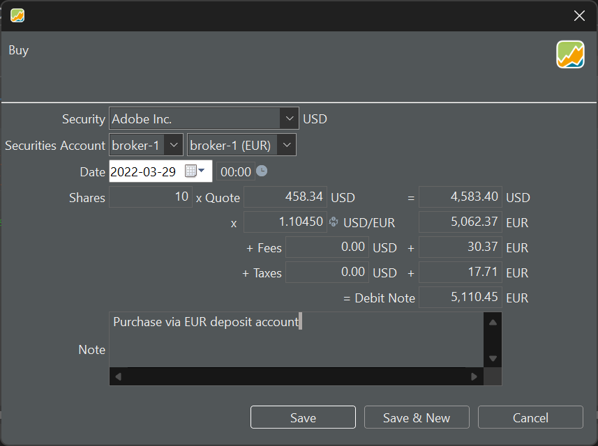

当你收到银行或券商发来的账目明细通知（如图 1 所示）时，你需要在 PP 中记录这笔账目。如果它是以纸质形式送达的，你就必须手动录入。否则，你可以尝试[导入](../../reference/file/import/csv-import.md)该笔账目。

# 单币种账目 {#transaction-with-one-currency}

图 1 中的账目只涉及一种货币。证券与现金账户使用相同货币（EUR），无需进行货币换算。

图： 银行就你的买入账目出具的纸质通知。

{.pp-figure}

有了这份通知，你就可以把账目详情录入 PP。图 2 显示了用于录入信息的输入面板。该证券（Heidelberg Materials）以 EUR 计价，这笔账目通过 `broker-1` 证券账户与 `broker-1 (EUR)` 现金账户处理。[卖出账目](sell.md)的示例则涉及更复杂的设置：证券以 USD 计价，但账目通过 EUR 的现金账户处理。

图： 通过现金账户（EUR）买入一份证券（EUR）。

{.pp-figure}

- **证券**：你可以在下拉框中选择证券。如果在发起账目前已选定某只证券，该信息会被预先填入。请注意，货币会自动填好，因为每只证券都有一个参考货币，它在[创建证券](../../getting-started/adding-securities.md)时设定。全部可用证券的列表可在侧边栏 `证券 > 全部证券` 下找到
- **证券账户**：从下拉菜单中选择；若你本就是从某个证券账户开始的，保持其预填值即可。
- **现金账户**：从下拉菜单中选择，或保留与该证券相关联的[账户](../../reference/view/accounts/index.md)的预填值。如果所选现金账户的货币与证券货币不同，你就需要换算总额、费用与税款，这需要一个汇率。参见[卖出账目](sell.md)的示例。
- **账目日期**：你可以从日历中选取该日期，也可手动输入（格式 = YYYY-MM-DD）。在右侧（00:00）可输入账目时间。采用 12 小时制还是 24 小时制，由菜单设置 `帮助 > 首选项 > 语言 > 国家` 决定。例如，英国使用 12 小时制（含上午与下午），而比利时使用 24 小时制。
- **份额**：你买入或卖出的证券数量。可以是小数。
- **买价**：你为每一份证券支付的价格。如果该证券包含历史价格（见[添加证券](../../getting-started/adding-securities.md)），给定日期的正确价格会被自动填入。不过，这一历史价格可能与你的银行提供的数值不一致，因为它基于日终价格，而银行使用的是实时信息。

以上六个字段是完成该笔账目的*必填*项。其中大多数会根据所选证券预填。下列字段则属于计算所得或可选。

- **总价值** ：这是份额数乘以买价的结果。如果之后你修改了总价值，买价也会相应调整，以维持 `份额数 * 买价` 这一等式。

- **费用** 与 **税款** ：一笔买入账目通常会产生费用与税款。这些金额可能以证券和/或现金账户的货币计价（示例见[卖出](sell.md)）。

- **借记金额** ：这是你因这笔买入账目而需要支付的金额。计算方式为 `份额数 * 买价 + 费用 + 税款`。这一金额的其他名称是"价值"或"净额"。

- **备注** ：你可以为每笔账目添加一条文字备注。

录入上述信息的典型流程可能是 `份额数 * 买价（价格） >> 总价值 + 费用 + 税款 >> 借记金额`。如果事后再作修改，会有若干微妙之处（见图 3）。

图： 份额数与借记金额之间的计算流程。

{.pp-figure}

- 事后修改*借记金额*会改变总价值，进而使买价随之调整。份额数保持不变。
- 事后修改*总价值*会改变借记金额与买价。费用、税款与份额数不受影响。

# 双币种账目 {#transaction-with-two-currencies}

如果你想以外币买入股份，有两种选择。要么你在某个现金账户中持有该外币的所需金额；要么你需要先[存入](deposit.md#making-a-deposit)一笔该货币，或先把另一种货币[换算](deposit.md#transfer-between-two-currencies)成该外币。

图 4 显示了银行就买入 USD 股份出具的纸质通知。由于费用与税款须以 EUR 结算（因为这是一家欧洲银行），且投资组合用于报告的基准货币也是 EUR，USD 的总金额也会被换算为 EUR。

图： 以某种外币买入股份的纸质通知。{class="pp-figure"}

从这份通知中并不太清楚用的是哪个现金账户（EUR 还是 USD）。不过在 Portfolio Performance 中记录这笔账目相当直接。图 5 显示的是使用 USD 现金账户完成的这笔账目。图 6 稍复杂一些，因为用的是 EUR 现金账户，因此需要进行换算（EUR --> USD）。

图： 使用 USD 现金账户买入一只 USD 证券的买入账目。{class="pp-figure"}

图： 使用 EUR 现金账户买入一只 USD 证券的买入账目。{class="pp-figure"}

买价与 USD/EUR 汇率会根据你输入的日期自动填入。但请注意，实时价格无法获取。Portfolio Performance 的录入表单还提供了额外选项，可以用外币记录费用与税款。

请记住：良好的做法要求事先存入一笔款项，或者用 USD（对应图 5 的账目），或者用 EUR（图 6）。否则账户余额将变为负数。

