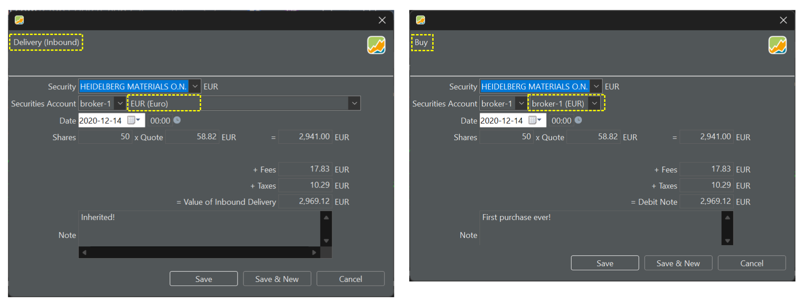
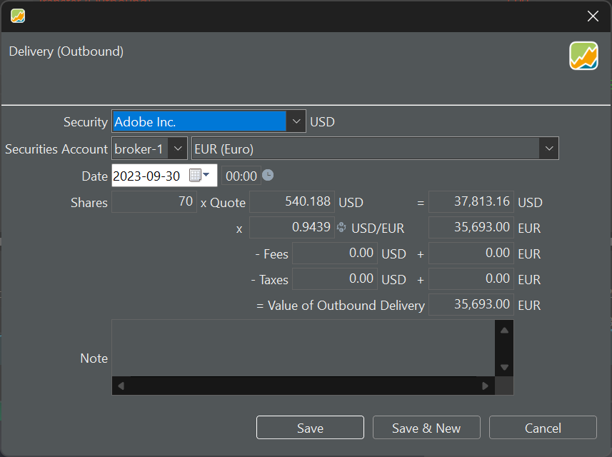

证券转入（Inbound）账目与买入账目类似，但它不涉及现金账户的减少。就好像这些证券凭空获得，此前没有任何现金交易。例如，当你继承某些证券时，就属于这种情况。如果你是在晚于原始买入的某个时点才建立投资组合，既不愿意也无法登记全部历史账目，也需要使用证券转入（Inbound）账目（见[管理你的投资组合](index.md)中的第三种选择）。图 1 对比了针对同一次取得行为的买入账目与证券转入账目。

图： 证券转入（Inbound）与买入账目的对比。{pp-figure}

你可以从下拉菜单中选择相应货币，从而以外币记录账目。此外，用与证券默认货币不同的货币记录账目也是可行的，程序会给出一个建议汇率。

证券转出（Outbound）账目与卖出账目类似，但——同样——它不影响现金账户。通常应随证券转出而回流的现金，仿佛凭空消失，未记入任何现金账户。图 2 展示了一笔涉及 Adobe 股票（USD）但以 EUR 记录的证券转出（Outbound）账目。
 
图： 以 EUR 货币记录的 USD 证券转出（Outbound）。{pp-figure}

虽然证券转出的价值、费用与税款未记入现金账户，它们仍可能影响绩效计算。