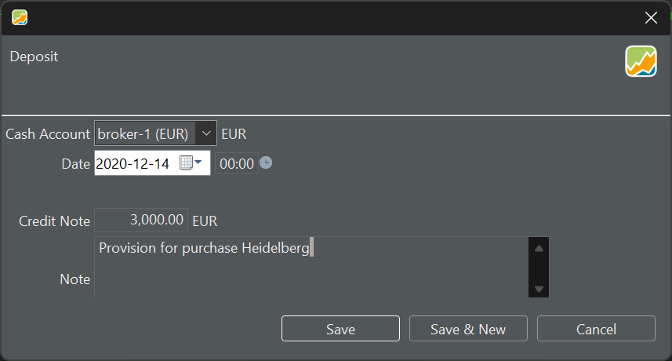
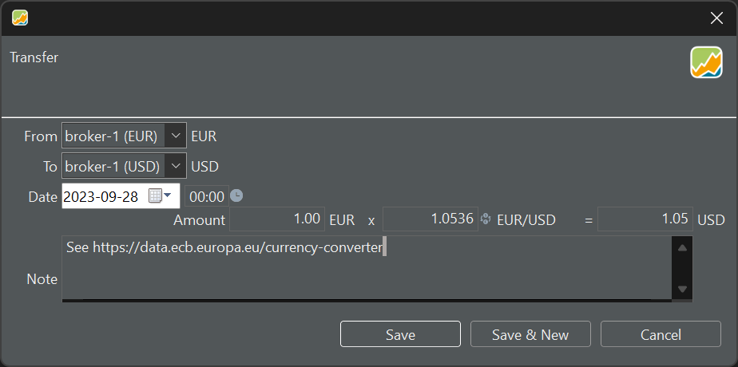

要以某种特定货币发起一笔存款，请转到 `账目 > 存款` 菜单。请确保所选账户与该存款使用相同货币。若要在账户之间转账——无论同币种还是不同币种（可使用[欧洲中央银行](https://data.ecb.europa.eu/currency-converter)提供的汇率）——请使用 `账目 > 账户间转账` 命令。

# 记录存款 {#making-a-deposit}

记录一笔存款是一个直观的过程（见图 1）。填入现金账户、账目日期、金额，并可选择填写附注。

图： 为海德堡的买入账目预存资金。{class="pp-figure"}

请注意，一笔存款会影响某些绩效指标。另外请注意，每买入一份证券都对应着现金账户的一笔减少。如果账户余额不足，现金账户的余额可能变为负数。

# 在两种货币之间转账 {#transfer-between-two-currencies}

你可以在两个账户之间转账，无论二者是否使用相同货币。当两个账户使用不同货币时（见图 2），Portfolio Performance 会依据[欧洲中央银行网站](https://data.ecb.europa.eu/currency-converter)自动建议一个汇率。

图： 从 EUR 换算为 USD。{class="pp-figure"}

