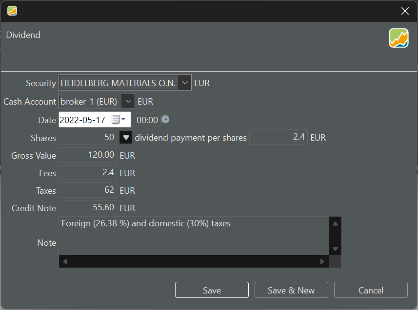

## 股息账目 {#dividend-transaction}
记录一笔股息与记录买入或卖出账目类似，只是 `买价` 被替换为 `每股股息`（见图 1）。份额数会根据你输入的日期自动确定。

图： 记录一笔股息（同一货币）。{class=pp-figure}

程序没有专门用于记录"股息再投资计划"（DRIP）的功能。一种变通办法是按全额记录所有股息，然后按约定数量再执行一笔买入。更多信息见[股息再投资](../../how-to/handling-choice-dividend.md)。