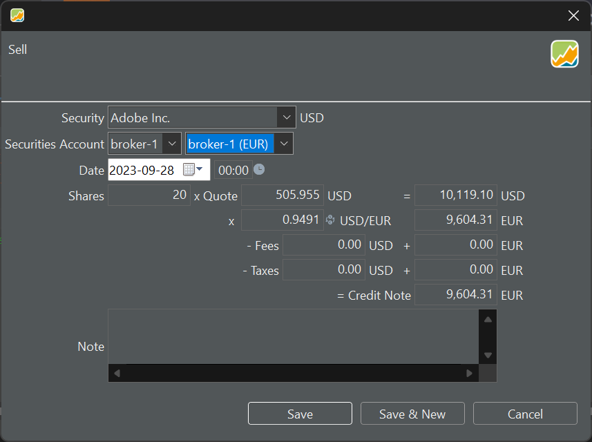
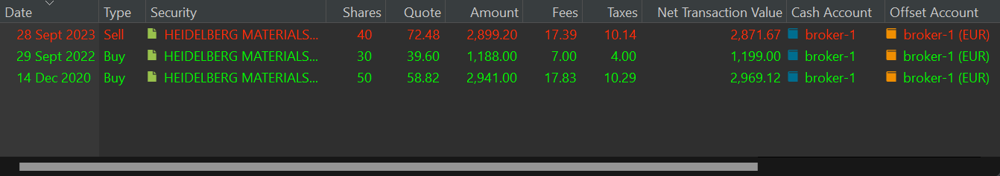

卖出账目与买入账目非常相似。在这里你同样可以把账目结果记录在一个使用相同货币或不同货币的账户中。在后一种情形下（见图 1），一旦选择了外币账户（例如 USD），就会出现三个新字段：汇率（XR）、USD 费用与 USD 税款。

# 卖出单次买入的证券 {#selling-a-single-buy-security}

在演示投资组合中，我们只买入过一次 Adobe 股票（10 份）。这些股份的价格当然都相同，因此在部分卖出的情况下，具体卖出哪几份并不重要。

图： 通过 EUR 现金账户卖出一只 USD 证券。{class=pp-figure}

在图 1 中，该股份以 USD 计价，因此总价值也以 USD 计算。然而，由于你打算把这笔账目记入一个 EUR 账户，这个 USD 数值就需要换算。一旦你选择了货币不同的现金账户，汇率字段（例如 0.9491）就会自动填入该特定日期与货币对应的正确汇率。这一信息取自欧洲中央银行（ECB）网站。你也可以通过菜单 `视图 > 货币 > 货币转换器` 查询该汇率。

事后更改日期会相应调整汇率（XR），即使你已手动填入 XR也是如此。因此，先设定账目日期被视为良好的做法。

你可以灵活地以两种货币分别记录费用与税款。外币费用与税款会使用上述同一汇率自动换算。由于不存在以本地货币计的小计，贷记金额并不是上面各数字的简单相加。

计算流程与买入页面中的[图 3](buy.md)保持一致。例如，修改贷记金额会接着调整以 EUR 计的总价值，后者又影响以 USD 计的总价值（XR 保持不变），最后再影响买价。

# 卖出多次买入的证券 {#selling-a-multiple-buy-security}

在你的投资组合中，有些股票曾以不同价格多次买入（示例见图 2）。当你部分卖出该股票时会发生什么？

图： 同一只证券上的多笔账目。{class=pp-figure}

这些股份来自你第一次买入的批次、第二次买入的批次，还是两者兼有？对实际卖出而言，这无关紧要。在图 2 的示例中，以 72.48 EUR 的价格卖出了 40 份。但剩余的股份如何估值？Portfolio Performance 遵循**先进先出（FIFO）**原则。因此，卖出的 40 份全部来自第一次买入。剩下的是第一批的 10 份与第二批的 30 份。另一种可能是 LIFO（后进先出）。在那种情况下，剩下的是第一批的 10 份，第二批一份不剩。这会造成差异吗？在这个具体例子中，按 FIFO 方法该股票的估值更低。

`FIFO`：剩余 40 份的平均价格 = ((10 * 58.82) + (30 * 39.60)) / 40 = 44.05 EUR

`LIFO`：剩余 40 份的平均价格 = ((40 * 58.82) + (00 * 39.60)) / 40 = 58.82 EUR

