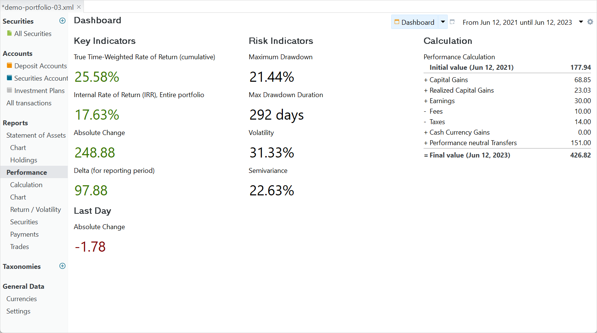

要评估你投资组合的绩效，先从查看仪表板入手。整个投资组合的关键绩效与风险指标汇总在一个仪表板中，可通过菜单 `视图 > 报告 > 收益` 或侧边栏进入（见图 1）。[参考手册](../reference/view/reports/performance/index.md)中 `视图 > 收益` 一节对该仪表板有全面的说明。一如既往，绿色数值表示盈利，红色表示亏损。

图： 关键绩效指标仪表板——2 年报告期。{class=pp-figure}

为便于对照正文与图 1，请下载 [demo-portfolio-03 文件](../assets/demo-portfolio-03.xml)。选择 2 年报告期（右上角），从 `2021-06-12` &rarr; `2023-06-12`。这意味着截至 2021 年 6 月 12 日，你的投资组合中已持有部分股票。我们先从考察计算组件（在右侧）开始。

- **期初值** 指投资组合在报告期开始时的市值（MVB），例如 177.94 EUR。那一天，你的投资组合持有 10 份 `share-1`，每份价值 17.79 EUR，合计 177.94 EUR（在演示投资组合中，[全部账目总览](../concepts/performance/images/info-irr-example-transactions.png)见此处）。请注意，这里取的是该股票当天的历史价格，而非原始买入价。
- **期末值** 指投资组合在报告期结束时的市值；例如 426.82 EUR。要核对期末值，请转到 `侧边栏 > 报告 > 收益 > 计算`，点击 `期末资产` 标题选项卡。现金账户显示来自存款、买入、股息与卖出账目的 125 EUR。`share-1` 的价值为 190.06 EUR（剩余 10 份 x 19.06），`share-2` 为 111.76（8 份 x 13.97）。两者合计 426.62 EUR，即代表你的投资组合在 2023 年 6 月 12 日的 `期末（市值）`。
- **绩效中性转账** 指不影响投资组合绩效的存款或取款。例如，84 EUR 的存款（追加 `share-1`）与 67 EUR 的存款（`share-2`）都通过买入这两种证券而被中性化。请注意，`share-1` 最初的存款与买入（155 EUR）未计入其中，因为它落在报告期之外。
- **资本利得** 反映你的股票在报告期开始与结束之间市值的增加（或减少）。由于存在追加的买入与卖出，确定 `share-1` 的买入价值略显复杂。Portfolio Performance 遵循先进先出（FIFO）原则。剩余的 10 份中，5 份来自第一次买入，5 份来自第二次买入。第一次买入当天的历史报价为每股 17.794 EUR，第二次买入当天为 15.962，平均价格为 (17.794 + 15.962)/2 = 16.878 EUR。最终市值为 19.006 EUR，由此得到资本利得 10 x (19.006-16.878) = 21.28 EUR。`share-2` 的价值从 8 EUR（2022-09-30）上升到 13.97（2023-06-12），资本利得为 8 x 5.97 = 47.76 EUR。两者相加，总资本利得为 69.04 EUR。
- **已实现资本利得** 源自卖出股票。在 `2023-04-12`，你以每股 22.40 EUR 卖出 5 份 `share-1`。按先进先出原则，买入价为每股 17.794 EUR，由此产生已实现资本利得 5 x (22.40 - 17.794) = 23.03 EUR。
- **收入** 来自股息支付（15 x 2 = 30 EUR），而**费用**与**税款**涵盖报告期内发生的全部费用与税款。请记住，买入 `share-1` 时也支付了费用与税款，但那发生在报告期之外。

仪表板的第一列列出各项关键绩效指标。我们先从更易理解的 `总收益变化` 与 `差额` 说起。

- **总收益变化** 即期末值与期初值之差；例如 426.82 - 177.94 = 248.88 EUR。在此情形下，你取得了盈利：投资组合比期初时更值钱。请注意，该盈利包含了你为买入更多股份而投入的资金或外部现金流入。
- **差额（针对该报告期）** 等于 `总收益变化` 减去 `绩效中性转账`，结果为 97.88 EUR。你可能会想当然地认为差额应等于各分项计算之和（资本利得 + 已实现资本利得 + …）。但你或许已注意到，计算面板中的数字并不相加吻合；例如期末值 ≠ 期初值 + …。否则你会把某些要素重复计算一次。例如，股息与卖出的结果被记入现金账户，因此已同时计入已实现资本利得与收入，也计入了绩效中性转账。
- **内部收益率 (IRR)** 为 17.63%。这是把期初市值 177.94 EUR 与其后各笔 151 EUR 的现金流，折算至期末市值 426.82 EUR 所需的年化利率。因此，IRR 是一个百分比，用以体现你的投资组合表现如何，同时考虑你投入或取出资金的时间与数额（[更多信息](../concepts/performance/money-weighted.md)）。
- **累计时间加权收益率 (TTWROR)** 为 25.58%。它反映你的投资组合从 177.94 EUR 增长到 426.82 EUR 的增长率，不含外部现金流。TTWROR 衡量的是投资的增长，不受你投入或取出资金的时间与规模的影响（[更多信息](../concepts/performance/time-weighted.md)）。
- **最后一日** 指投资组合市值在今天与今天之前上一个交易日之间的绝对变化量。因此，图 1 中的数值很可能与你在 demo-portfolio-03 文件中看到的数值不同。