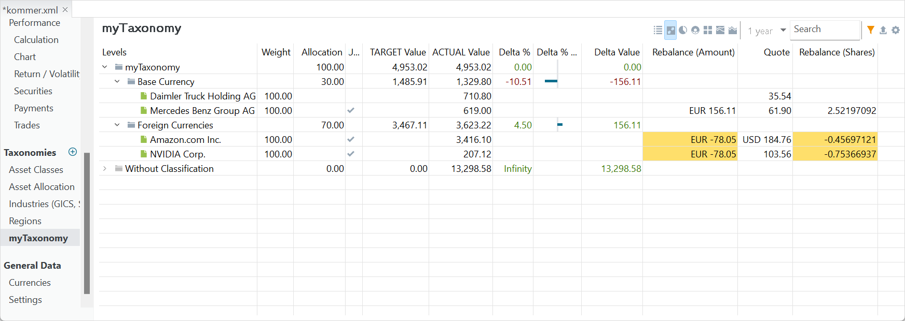

通过明确策略与目标，投资者可以避免对市场波动的情绪化反应，始终专注于自己的长期计划。你可以利用[类别](../reference/view/taxonomies/index.md)（另见本"快速上手"章的上一节）与[再平衡](../reference/view/taxonomies/using-taxonomies.md#rebalancing-view)来达成这一点。

再平衡是一种策略，把已经偏离目标资产配置的投资组合重新拉回正轨[(维基百科)](https://en.wikipedia.org/wiki/Rebalancing_investments)。该目标可在某个类别的再平衡视图中设定（见图 1）。

图： 再平衡视图。 {class=pp-figure}

第一步是为每个类别设定配置目标。例如在图 1 中，外币类别的目标配置（颇反直觉地）被设为 70%，其余 30% 留给基准货币类别。你可以通过双击单元格输入或修改配置百分比，目标值会立即随之调整。

`调整（金额）` 与 `调整（份额）` 两列显示，为达到目标值，你需要卖出（负数）或买入（正数）的金额与份额数。当然，你未必总能买入或卖出零股。

请注意，各类别的配置百分比之和不必等于 100%，尽管这样更可取。如果合计不等于 100%，颜色标记会提醒你注意其中的出入。