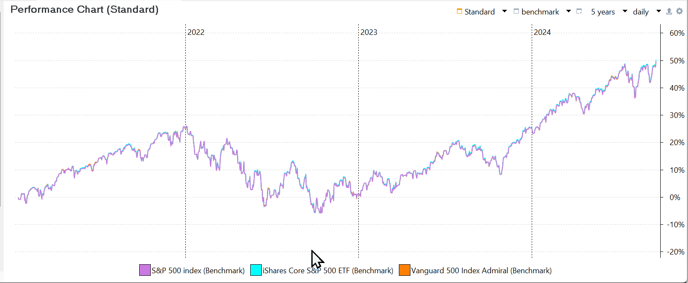
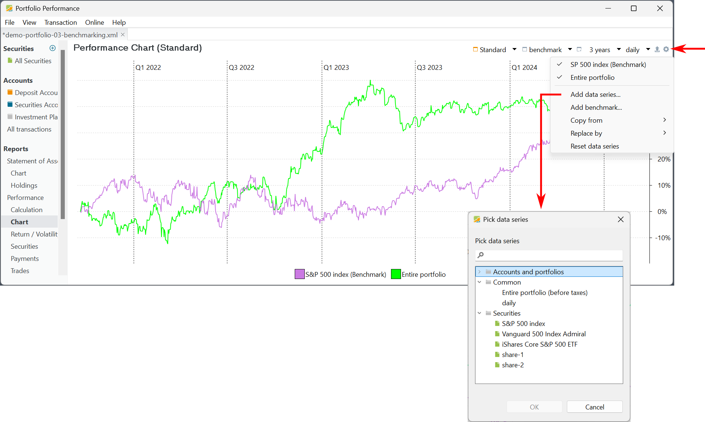
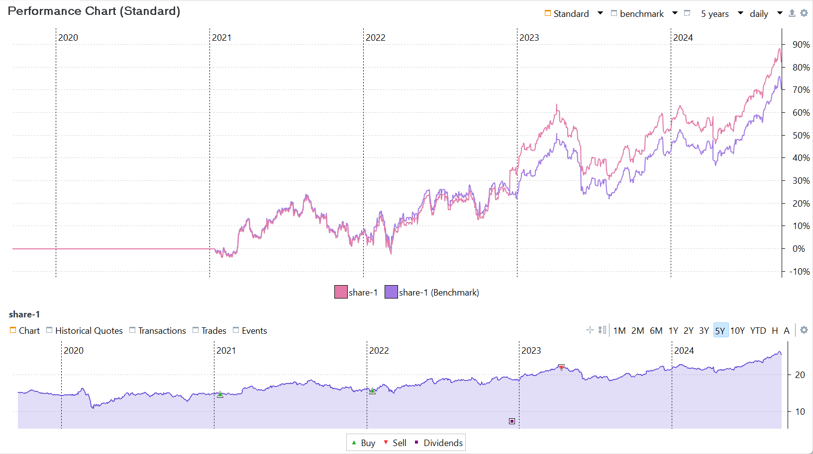
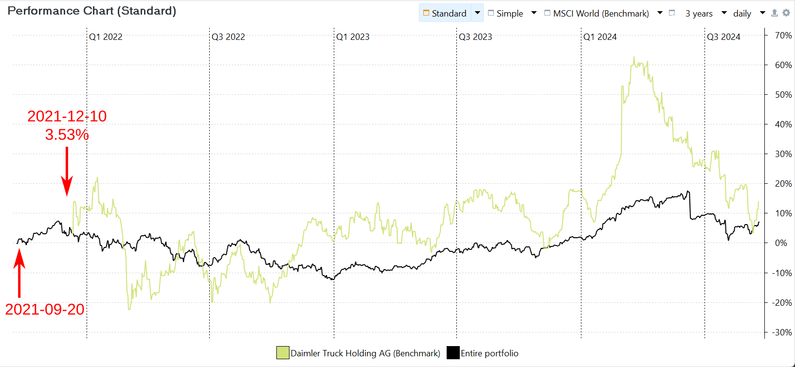
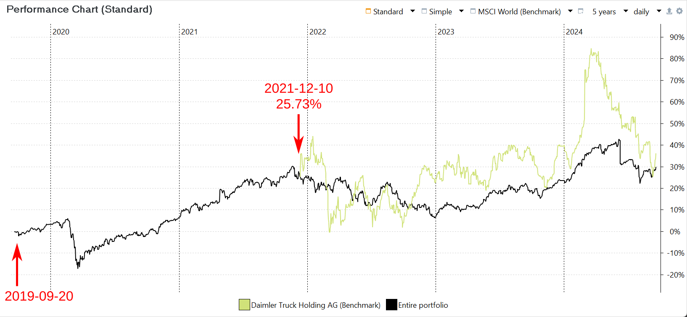
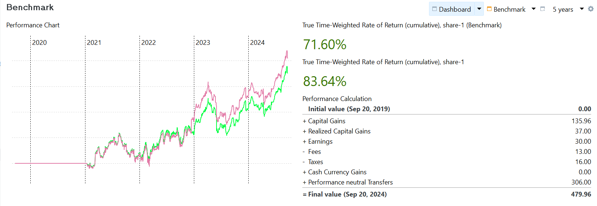

将投资组合的绩效与金融指数作比较，是投资管理中的常见做法。这一过程是把你的投资组合或单只证券的收益率，与某个选定基准指数的收益率作对比。

股票指数是衡量一个假想投资持仓组合的指标，代表金融市场的某个板块。例如，[Standard & Poor's
500](https://www.spglobal.com/spdji/en/indices/equity/sp-500/#overview) 指数衡量的是在美国证券交易所上市的 500 家大公司的表现。它是一个市值加权指数，这意味着指数中每家公司的影响力与其市值成正比。2024 年 3 月 8 日，S&P 500 指数为 5,123.69 USD。

## 查找指数 {#finding-an-index}

在 [investing.com](https://www.investing.com/indices/major-indices)、[Yahoo Finance](https://finance.yahoo.com/world-indices/) 等多个金融网站上都能找到主要指数的列表。要用某个指数为你的投资组合设定基准，你需要把它作为证券添加进来。

对于 Yahoo Finance 上列出的指数，只需[添加新证券](../getting-started/adding-securities.md)并搜索其代码符号即可，例如 ^GSPC。若你想使用 investing.com 的数据，则必须下载历史价格。选择正确的时间段并点击下载按钮，即可获得 CSV 文件（这需要免费注册）。新建一个空白的工具。关于如何导入这些历史价格，详见[文件 > 导入](../reference/file/import/csv-import.md#importing-a-csv-file)与[操作指南 > 下载历史价格](./downloading-historical-prices/csv-file.md#investingcom)一节。若要把今后的每日价格追加进去，可以使用上月每日更新的表格。将历史报价的提供方设为 `网页表格`，并使用如下馈送 URL：`https://www.investing.com/indices/us-spx-500-historical-data`。该报价馈送不会覆盖已有价格，而会追加新价格。

有大量共同基金或 ETF 复制某一指数。例如，[Vanguard 500 Index Fund Admiral](https://investor.vanguard.com/investment-products/mutual-funds/profile/vfiax#portfolio-composition) 与 [iShares Core S&P 500 ETF](https://www.ishares.com/us/products/239726/ishares-core-sp-500-etf) 都相当紧密地复制了 S&P 500。因此，你也可以用这些基金中的任一个作为基准。

图： S&P 500 指数与两只复制型基金的比较。{class=pp-figure}

如图 1 所示，iShares Core S&P 500 ETF 与 Vanguard 指数都紧密跟随 S&P 指数，以至于各自曲线相互重叠、几乎难以区分。尽管这三个基准的历史价格都可追溯至 2014 年，但它们的初始绩效在报告期开始处均被设为零。

## 显示基准 {#displaying-the-benchmark}

要显示与图 1 类似的图表，请按以下步骤操作：

1. 进入菜单 `视图 > 报告 > 收益 > 图表`。
2. 使用位于屏幕右上角的 `配置图表` 图标（齿轮图标）。
3. 在配置选项中，你可以添加或移除 `时间序列`与`基准`——它们是按固定时间间隔记录的数据点序列，例如市值或历史价格。
4. 证券要能作为时间序列使用，必须有市值——也就是说它必须已被买入。基准只需要历史价格。由于我们并未买入任何 iShares 或 Vanguard 的份额，因此需要使用基准选项。

请注意，各证券的历史价格差异很大：S&P 指数约为 5000 USD，而 iShares ETF 与 Vanguard 指数基金均约为 500 USD。尽管存在这种差异，曲线仍然重叠，这说明图中的纵轴表示绩效（以 % 而非 USD 计）。这确实是一张绩效图表。

## 与基准比较 {#comparing-to-the-benchmark}

你自然会希望把投资组合或单只证券的绩效与某个基准作比较。你也可能想通过与某只证券未经调整的历史价格对比，来评估自己的买卖记录。

### 与整个投资组合比较 {#comparing-with-the-entire-portfolio}

`配置图表`菜单中的 `添加数据序列`选项（齿轮图标）会打开 `选择数据序列...`窗口（见图 2）。在该窗口中，你可以为账户、证券或整个投资组合（税前或税后）添加时间序列。`选择数据序列`窗口见图 2。请注意，`全部投资组合`（税后）与 `S&P 500（基准）`已经包含在图表中。选定一个数据序列进行添加，会将其从底部的列表中移除、在顶部的列表中标记为已勾选，并自然也会把它加入图表。

图： 投资组合绩效与 S&P 500 指数的比较。{class=pp-figure}

如图 2 所示，两条时间序列的绩效都从 3 年报告期起点的 0% 开始。不过，两条序列的实际起点都早于报告期的开始。

### 与单只证券比较 {#comparing-with-an-individual-security}

图 3 比较了 5 年报告期内投资组合中 `share-1`的实际头寸与 `share-1（基准）`的绩效。关于将两个指数都加入绩效图表主窗格的方法，见上文。底部信息窗格显示该证券的历史价格图表，并标出了买入、股息与卖出账目。两个窗格中的报告期均为 5 年，且起点远早于投资组合的建立日期 2021 年 1 月 15 日。请注意：

- 代表 2021 年之前 `share-1`头寸的平线，反映出零绩效，因为没有发生买入。
- 基准从 2021 年初的零绩效开始，尽管 2014 年起就有历史价格。

图： 按投资组合中实际持有的方式记录的 share-1 绩效基准（实际）与该证券的历史价格（基准）。{class=pp-figure}

开头处基准与实际头寸之间的细微差异，源于买入的费用，以及买价与当日收盘价之间的微小差别。例如，该股票在 2021 年 1 月 14 日与 15 日的历史价格分别为 15.21 与 15.05。使用时间加权收益率一节中的[公式 1（MVE+out/MVB+in）](../concepts/performance/time-weighted.md)，基准的绩效因此为 ((15.05+0)/(15.21+0))-1 = -1.05%。而 `share-1`的实际买入价为 15 EUR，费用为 3 EUR。于是该股票首日的绩效为 =(150.5+0/(0+153))-1 = -1.63%。基准只使用历史价格，而 `实际的 share-1`的绩效则同时考虑转入与转出。

最显著的偏离出现在 2022 年 12 月 15 日派息时。实际的 Share-1 头寸从这笔额外的转出中获益，当日绩效大幅上升约 9%。

!!! Note
    在前面几个例子中，历史价格都远远早于报告期的起点。但有些情形下证券的历史价格范围有限，例如在 *kommer.xml*示例项目中，为了减小文件体积；又如 Daimler Truck Holding AG，因其最近才分拆出来。

    正如用户 [@veterini](https://forum.portfolio-performance.info/t/portfolio-performance-documentation/25480/22)所指出的，报告期的起点很重要。例如图 4 与图 5 展示的是 Daimler Truck Holding AG 在 3 年与 5 年报告期下的基准。2021 年 12 月 10 日（分拆日）的起始绩效依报告期不同分别为 3.53% 与 25.73%。

    图： 报告期为 3 年时 Daimler Truck Holding AG 的基准。{class=pp-figure}

    

    两种情形下，期间的起点都早于第一个可用的历史价格。两个起始日期都远早于最早的历史价格（2021 年 12 月 10 日：分拆上市日）。由于无法计算该 Daimler 股票在此日期之前的绩效，Portfolio Performance 假定其初始绩效与投资组合的绩效相同，从而便于（事后）比较。对 3 年期而言，这一值为 3.53%；对 5 年期而言，为 25.73%。

    当报告期起点*确有*历史价格时，Portfolio Performance 对整个投资组合和该证券都假定初始绩效为 0%。从该时点起，绩效使用现有的历史价格计算。

    图： 报告期为 5 年时 Daimler Truck Holding AG 的基准。{class=pp-figure}

    

基准的整体绩效可以从图中读出。若想获取 `实际的 share-1`更精确的数值，可查看[视图 > 报告 > 证券](../reference/view/reports/performance/securities.md)下的证券表格。遗憾的是，对基准做不到这一点（它没有账目）。不过，把基准的绩效图与两个指数的 TTWROR 值作为组件展示出来是可行的。关于配置仪表板，请见[参考 > 视图 > 报告 > 收益](../reference/view/reports/performance/index.md#configuring-the-dashboard)。

图： 含绩效图表与 TTWROR 组件的仪表板。{class=pp-figure}

在图 2 中，报告期的起点*晚于* `share-1`的首次买入。那么如果你取一个更长的报告期，例如 `share-1`的首次买入落在报告期之内，会发生什么？该报告期首日的初始绩效会是多少？对基准而言，应当是该股票的历史价格。

当作为基准添加的数据序列晚于报告期起点开始时，其起始值不为 0%。
