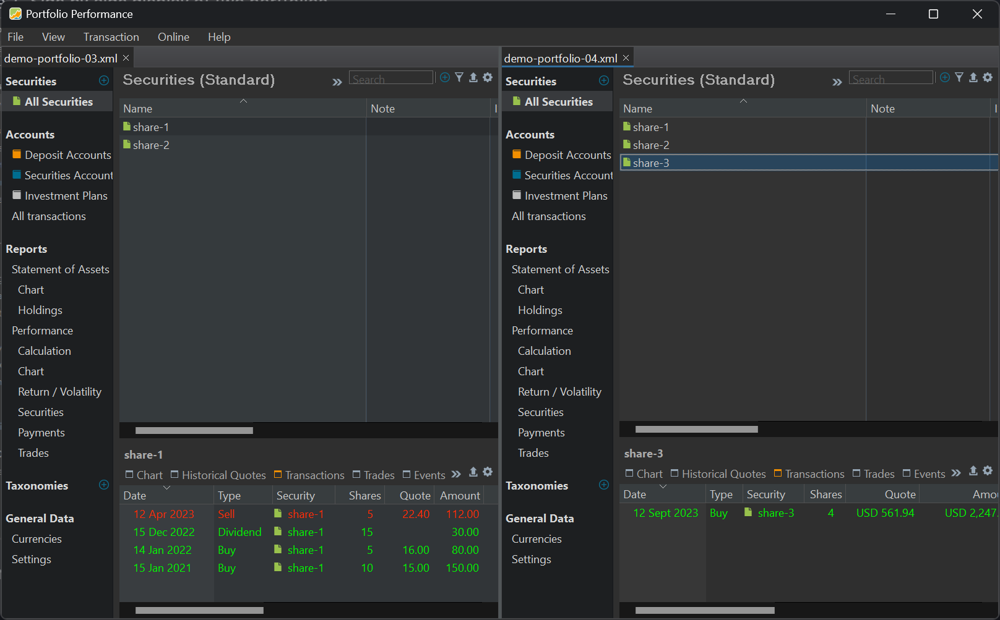
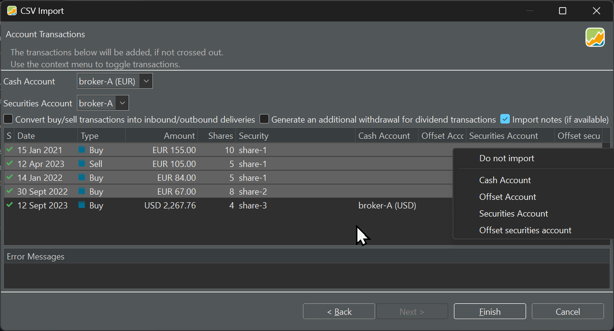

有时需要在不同的投资组合之间转移证券，这涉及在物理 XML 文件之间复制信息。难点在于，每只证券都关联着历史定价数据，以及与各个现金账户相联系的账目。

## 拖放 {#drag-drop}

打开两个或更多投资组合后，它们会显示为标签页，位于菜单栏正下方的投资组合栏中。当前活动的投资组合（通常是最后打开的那个）很容易辨认：它颜色较浅，名称后带有一个 x 标记，点击即可关闭该标签页。要在投资组合之间切换，只需在投资组合栏中选中相应的标签页。一次只能查看一个投资组合。

不过，对于在投资组合之间复制证券这类任务，必须让两个投资组合同时可见。无法从投资组合栏的标签页直接拖放或复制粘贴证券。

图： 并排显示两个投资组合。{class=pp-figure}



要**排列**投资组合使其并排显示，请在投资组合栏中选中一个，按住鼠标将其拖到新位置。有两个投资组合时，你可以让它们水平（从左到右）或垂直（从上到下）排列。在图 1 中是从左到右的排列。此过程可用于多个投资组合，从而让两个以上的投资组合同时可见。要恢复原有排列，把投资组合拖回投资组合栏即可。

要在投资组合之间**复制**证券，两个投资组合都需可见。然后，你可以从投资组合 A 中选中一只证券，把它拖到投资组合 B 侧栏中的 `全部证券`上，在那里放下即创建出一个副本。请注意，这样可能无意中创建出完全相同的证券（例如两个 `share-1`实例）。你也可以把证券放到关注列表上，它随后会自动加入该列表。

!!! Important
    
    当你用拖放在一个投资组合之间复制证券时，相关的账目**不会**随之一起复制。只有证券的主数据（包括历史价格信息）会转移到新的投资组合。这意味着在原投资组合中为该证券记录的任何头寸、股息或其他账目，都不会体现在新的投资组合中。在相对少见的情况下，如果你还需要这些账目，可以手动录入，或使用下述方法。

## 导出与导入 {#exporting-importing}

通过菜单 文件 > 导出 > CSV 文件，你可以创建包含所有证券、历史价格和账目的列表。更多信息见[文件 > 导出](../reference/file/export.md)。不过，连同历史价格一起复制证券，用上文所述的拖放技术要方便得多。

例如，把图 1 中的 share-3 拖到 demo-portfolio-03.xml 之后，你可以导出 demo-portfolio-04.xml 的账目，再导入 demo-portfolio-03.xml。导入类型既可用 `账户账目`，也可用 `投资组合账目`。但导出的结果包含的是该项目的**全部**账目，而不只是与 `share-3`相关的那些。

| Date | Type | Value | Transaction Currency | Gross Amount | Currency Gross Amount | Exchange Rate | Fees | Taxes | Shares | ISIN | WKN | Ticker Symbol | Security Name | Note |
| --- | --- | --- | --- | --- | --- | --- | --- | --- | --- | --- | --- | --- | --- | --- |
| 2021-01-15T00:00 | Buy | 155 | EUR |  |  |  | 3 | 2 | 10 |  |  | DTE.DE | share-1 | 2 |
| 2023-04-12T00:00 | Sell | -105 | EUR |  |  |  | 5 | 2 | 5 |  |  | DTE.DE | share-1 | 8 |
| 2022-01-14T00:00 | Buy | 84 | EUR |  |  |  | 3 | 1 | 5 |  |  | DTE.DE | share-1 | 4 |
| 2022-09-30T00:00 | Buy | 67 | EUR |  |  |  | 2 | 1 | 8 |  |  | TMV.DE | share-2 | 6 |
| 2023-09-12T00:00 | Buy | 2,267.76 | USD |  |  |  | 14 | 6 | 4 |  |  | ADBE | share-3 | 10-copy |

其实从上表中你只需要最后一行。请注意，share-3 的买入是以 USD 计价的。由于主现金账户设为 EUR，除非你通过上下文菜单把该笔账目的现金账户改为 USD，否则会报错。

如图 2 所示，全部账目都会被导入（左侧为绿色对勾）。你可以用上下文菜单 `不导入`排除前四条（见图 2）。或者，你也可以在导入前就从原 CSV 文件中删除不需要的账目。

图： 导入账目时更改现金账户并排除部分账目。{class=pp-figure}



筛选出所需账目更高效的办法，是从 `全部账目`视图入手。这份列表可能很长，但你可以用搜索功能加以精简。例如，输入 `share-3`会把账目筛选为只显示与名为 `share-3`的证券相关的记录。或者，你也可以利用[视图 > 账户 > 全部账目](../reference/view/accounts/all-transactions.md)下提供的筛选功能。你还可以通过逐条选中账目进一步缩小范围（见下一个主题）。

一旦筛选好列表，你可以把它导出为 CSV 或 JSON 文件。点击导出数据按钮（位于右上角，带向上箭头图标），即可导出全部显示的账目，或仅导出所选中的账目。

## 复制与粘贴 {#copy-and-paste}

有时手动复制粘贴所需账目反而更简单，尽管导入数据时仍然需要 CSV 文件格式。

1. 在主窗格中选中目标证券。切换到信息窗格中的账目标签页（参见图 1）。信息窗格中只会出现与所选证券相关的账目。在主窗格中选中多只证券并不会显示全部账目，而只显示与"当前活动"证券相关的账目。
2. 要选中全部账目，把鼠标移到首行上方，点击并按住 SHIFT（Windows），然后点击最后一行。这样会选中首行与末行之间的所有行。
3. 若要选中不连续的行，点击第一行，按住 CTRL（Windows），再依次点击其余各行。
4. 选中所有需要的行后，按 CTRL+C（Windows），把内容复制到剪贴板。
5. 切换到电子表格或文本编辑器并粘贴内容。Portfolio Performance 使用 TAB 码作为列表分隔符。
6. 遗憾的是，表头不会随数据一起被复制。因此，你可以在导入过程中映射各字段（可以使用[模板](../reference/file/import/csv-import.md)），或者手动把它们补到粘贴的内容里。
7. 你仍需把文件保存为 CSV 扩展名，然后再导入。

该技术在 `全部账目`视图中同样适用（见上一个主题）。


## 在 XML 之间复制 {#copy-between-xml}

理论上，也可以在两个 XML 文件之间复制账目代码。然而，XML 代码为速度做了优化，这会损害可读性。例如一笔买入账目由以下代码片段表示：
```
<account-transaction>
    <uuid>0e6a94e5-da57-44d4-aeb1-37dc792d40ef</uuid>
    <date>2024-03-14T00:00</date>
    <currencyCode>EUR</currencyCode>
    <amount>19800</amount>
    <security reference="../../../../../securities/security[2]"/>
    <crossEntry class="buysell">
        <portfolio>
            <uuid>c1c03e7d-c320-4167-8737-2f35cfb1a2e0</uuid>
            <name>broker-1</name>
            <isRetired>false</isRetired>
            <referenceAccount reference="../../../../.."/>
            <transactions>
                <portfolio-transaction>
                    <uuid>75c79e11-4c3d-4b39-bf91-08ab04fe0088</uuid>
                    <date>2024-03-14T00:00</date>
                    <currencyCode>EUR</currencyCode>
                    <amount>19800</amount>
                    <security reference="../../../../../../../../../securities/security[2]"/>
                    <crossEntry class="buysell" reference="../../../.."/>
                    <shares>9900000000</shares>
                    <updatedAt>2024-03-14T10:06:25.707240300Z</updatedAt>
                    <type>BUY</type>
                </portfolio-transaction>
            </transactions>
            <attributes>
                <map/>
            </attributes>
            <updatedAt>2024-03-13T18:11:15.593620500Z</updatedAt>
        </portfolio>
        <portfolioTransaction reference="../portfolio/transactions/portfolio-transaction"/>
        <account reference="../../../.."/>
        <accountTransaction reference="../.."/>
    </crossEntry>
    <shares>0</shares>
    <updatedAt>2024-03-14T10:06:25.707240300Z</updatedAt>
    <type>BUY</type>
</account-transaction>

```
实践中，一个含少量账目和历史价格的中等规模项目，其 XML 代码往往变得过于庞大和复杂，让人难以有把握地操作。此外，像 `<security reference="../../../../../../../../../securities/security[2]"/>` 这样的相对引用——它们是优化的产物——要求源 XML 与目标 XML 在证券列表方面具有完全相同的结构。而且，这种方法——当然——不适用于以二进制编码的投资组合。
