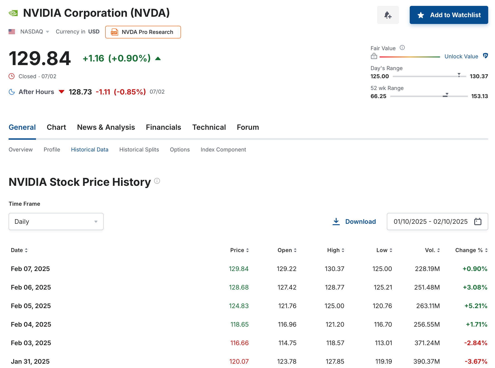
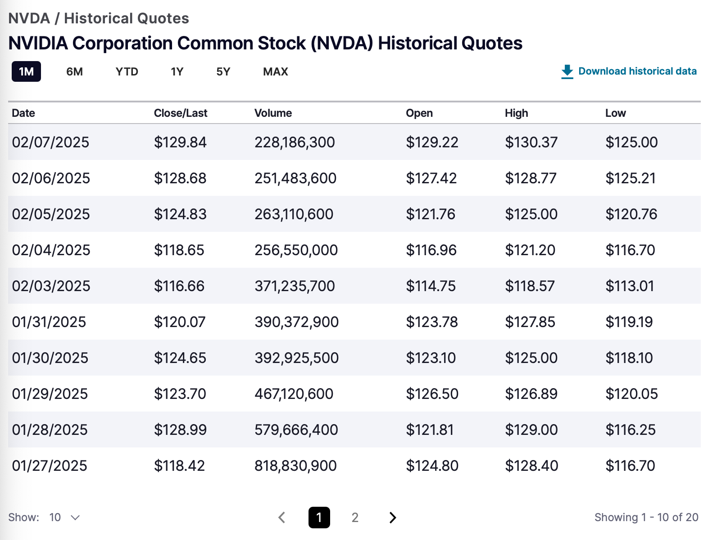

在 PP 中，通过菜单 [`文件 > 导入 > CSV 文件`](../../reference/file/import/csv-import.md#1-historical-quotes-import)从 CSV 文件导入历史价格是一个直接了当的过程。当然，为此你需要一个包含相关报价的文件。

CSV 文件即逗号分隔值文件，是一种存储表格数据的文本文件。文件中的每一行代表一条记录，每一列代表一个字段。例如，典型的历史报价 CSV 文件包含两列（日期和报价）和若干行，每个日期一行，并带有相应的历史报价。CSV 文件可以用电子表格软件打开和编辑，也很容易导入 PP。

每个网站下载历史数据 CSV 文件的方式可能各不相同。通常，你需要导航到目标证券，并在该网页上找到下载链接。许多网站需要（免费）注册才能下载。

需要注意的是，这种方式提供的是历史价格的一个快照。要获得明天的报价，你应当重复这一过程。实际操作中，你需要把这种方式与某种自动报价下载方法结合起来。请记住，即便你把报价提供方改为自动下载，也可以在 PP 中[保留已有的历史报价](../../reference/file/import/images/mnu-file-import-reload-quotes.png)。例如，在下面两种情形中，导入 CSV 文件之后，你都可以把报价馈送提供方设为[网页表格](./table-website.md)方式，以便每日更新历史价格。

## Investing.com {#investingcom}

Investing.com 是一个综合性金融网站，为投资者提供实时报价、金融新闻、分析和各类工具。你可以把它本地化为 30 多个国家的语言，其中包括若干欧洲语言。

图： investing.com 上用于下载 NVIDIA 历史价格的网页。{class=pp-figure}

点击搜索框（右上角）会显示你最近的搜索和热门搜索。你可以输入你感兴趣的证券名称、代码或 ISIN。页面会展示报价历史的图形概览（1 个月）。点击 `Historical Data`（图表上方中间处）可查看表格。要下载或更改时间段，需要用你的电子邮件地址注册（免费）。所有数据均可获取，但单次下载最多限于 20 年。

## Yahoo Finance {#yahoo-finance}

遗憾的是，[Yahoo Finance](https://finance.yahoo.com) 在 2024 年末改变了政策，把 CSV 数据下载置于付费墙之后。你仍然可以**查看**这些数据（并手动复制粘贴），但已无法免费下载。

## 各类股票市场 {#various-stock-markets}

大多数证券交易所都提供查看和下载上市公司历史股票数据的选项。例如，在 [NASDAQ 网站](https://www.nasdaq.com/market-activity/stocks/nvda)上搜索 **NVDA** 代码，会显示过去一天的**历史价格图表**。要访问并下载**表格形式的历史价格**：

1. 按需调整时间段。  
2. 从左侧边栏选择 **"Historical Quotes"**。  
3. 点击 **"Download historical data"**。

图： nasdaq.com 上用于下载 NVIDIA 历史价格的网页。{class=pp-figure}

