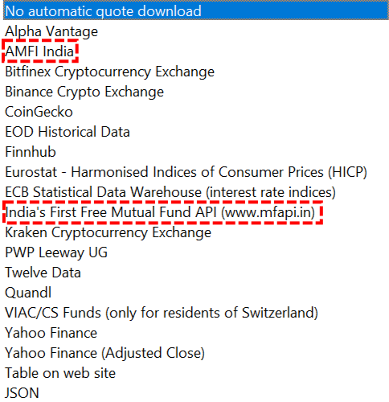
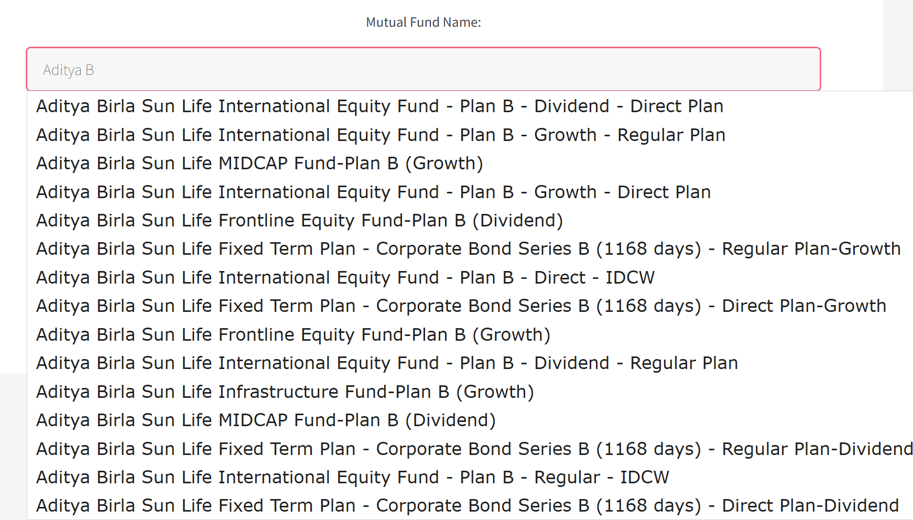
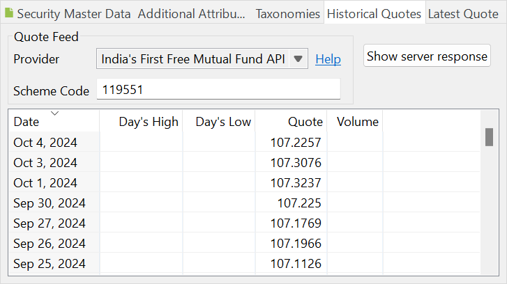
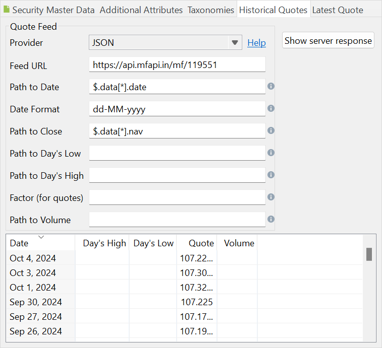

图： 印度的报价馈送提供方。 {class= align-right style="width:50%"}




你打算投资于印度证券，最好是以印度卢比（INR）计价的 ETF。通过以下两个可用的数据馈送，历史报价的获取会更容易（见图 1）：

- AMFI India：[印度共同基金协会](https://www.amfiindia.com/)
- MFAPI：[印度首个免费共同基金 API](https://www.mfapi.in/)。


## AMFI {#amfi}

要使用这个报价馈送提供方，你需要一个 ETF 的 ISIN 代码。可用 ETF 及其 ISIN 的完整清单可以在 [Download NAV](https://www.amfiindia.com/nav-history-download) 链接下找到。点击 `Download Complete NAV Report in Text Format` 即可访问数据。例如，*Aditya Birla Sun Life Mutual Fund* 的 ISIN 代码是 `INF209KA12Z1`。截至 2024 年 10 月 4 日，最新报价为 107.2257 INR（见下文）。请注意，其中有多个方案可选（例如 Regular Monthly、Regular Quarterly 等）。

你需要把该 ISIN 代码填入[证券主数据](../../reference/file/new.md#security-master-data)面板。

!!! Note
    该报价馈送提供方只提供最新价格。如果你需要历史价格，就必须把它们下载为文本文件。从下拉框中选择 ETF 名称，指定类型和日期范围，然后下载历史 NAV。每次最多只能下载 90 天的数据。

图： AMFI 上的 ETF 列表。 {class=pp-figure}


```
Scheme Code;ISIN Div Payout/ ISIN Growth;ISIN Div Reinvestment;Scheme Name;Net Asset Value;Date
 
Open Ended Schemes(Debt Scheme - Banking and PSU Fund)
 
Aditya Birla Sun Life Mutual Fund
 
119551;INF209KA12Z1;INF209KA13Z9;Aditya Birla Sun Life Banking & PSU Debt Fund  - DIRECT - IDCW;107.2257;04-Oct-2024
119552;INF209K01YM2;-;Aditya Birla Sun Life Banking & PSU Debt Fund  - DIRECT - MONTHLY IDCW;115.4552;04-Oct-2024
119553;INF209K01YO8;-;Aditya Birla Sun Life Banking & PSU Debt Fund  - Direct - Quarterly IDCW;102.8152;04-Oct-2024
108272;INF209K01LX6;INF209KA11Z3;Aditya Birla Sun Life Banking & PSU Debt Fund  - REGULAR - IDCW;151.0032;04-Oct-2024
110282;INF209K01LU2;-;Aditya Birla Sun Life Banking & PSU Debt Fund  - REGULAR - MONTHLY IDCW;111.6213;04-Oct-2024
108274;INF209K01LN7;-;Aditya Birla Sun Life Banking & PSU Debt Fund  - REGULAR - Quarterly IDCW;101.1877;04-Oct-2024
110490;INF209K01LR8;-;Aditya Birla Sun Life Banking & PSU Debt Fund  - retail - monthly IDCW;111.4018;04-Oct-2024
106157;INF209K01LS6;-;Aditya Birla Sun Life Banking & PSU Debt Fund  - retail - quarterly IDCW;102.2589;04-Oct-2024
108273;INF209K01LV0;-;Aditya Birla Sun Life Banking & PSU Debt Fund - Regular Plan-Growth;345.5725;04-Oct-2024
103176;INF209K01LT4;-;Aditya Birla Sun Life Banking & PSU Debt Fund - Retail Plan-Growth;518.7508;04-Oct-2024
119550;INF209K01YN0;-;Aditya Birla Sun Life Banking & PSU Debt Fund- Direct Plan-Growth;357.7647;04-Oct-2024
 
Axis Mutual Fund
 
128952;INF846K01NF8;-;Axis Banking & PSU Debt Fund - Direct Plan - Bonus Option;1532.8272;14-Jun-2017
120437;-;INF846K01CU0;Axis Banking & PSU Debt Fund - Direct Plan - Daily IDCW;1038.5921;04-Oct-2024
120438;INF846K01CR6;-;Axis Banking & PSU Debt Fund - Direct Plan - Growth Option;2554.2888;04-Oct-2024
120439;INF846K01CT2;INF846K01CS4;Axis Banking & PSU Debt Fund - Direct Plan - Monthly IDCW;1034.0405;04-Oct-2024
120436;INF846K01CV8;INF846K01CW6;Axis Banking & PSU Debt Fund - Direct Plan - Weekly IDCW;1038.4695;04-Oct-2024
128953;INF846K01NG6;-;Axis Banking & PSU Debt Fund - Regular Plan - Bonus Option;1289.4075;18-May-2015
117447;-;INF846K01CC8;Axis Banking & PSU Debt Fund - Regular Plan - Daily IDCW;1038.5836;04-Oct-2024
117446;INF846K01CB0;-;Axis Banking & PSU Debt Fund - Regular Plan - Growth option;2482.1514;04-Oct-2024
117449;INF846K01CF1;INF846K01CG9;Axis Banking & PSU Debt Fund - Regular Plan - Monthly IDCW;1033.9605;04-Oct-2024
117448;INF846K01CD6;INF846K01CE4;Axis Banking & PSU Debt Fund - Regular Plan - Weekly IDCW;1038.4353;04-Oct-2024
 
Bajaj Finserv Mutual Fund
...
...
```

## MFAPI {#mfapi}

在 [MFAPI](https://www.mfapi.in/) 网站上，你可以开始在搜索框中输入共同基金的名称，例如 "Aditya Birla Sun Life"。随着你继续输入，可用的 ETF 列表就会出现（见图 3）。

图： MFAPI 上的 ETF 列表。 {class=pp-figure}



选择某个共同基金后，会显示你可以在其中找到历史价格或最新价格的 URL。

要用 Portfolio Performance 获取历史价格，你需要该方案的代码（编号的最后六位），例如 `119551`。这个方案代码也可以从 AMFI 网站获得；它就是响应中列在 ISIN 代码之前的第一个数字（见图 2）。

图： MFAPI 网站的报价馈送提供方。 {class=pp-figure}



稍加编码，你也可以用 JSON 报价馈送提供方达到同样的效果。例如，URL 可以是：[https://api.mfapi.in/mf/119551](https://api.mfapi.in/mf/119551)。到日期和收盘价的路径见图 4。

图： 通过 JSON 报价馈送提供方获取历史价格。 {class=pp-figure}


