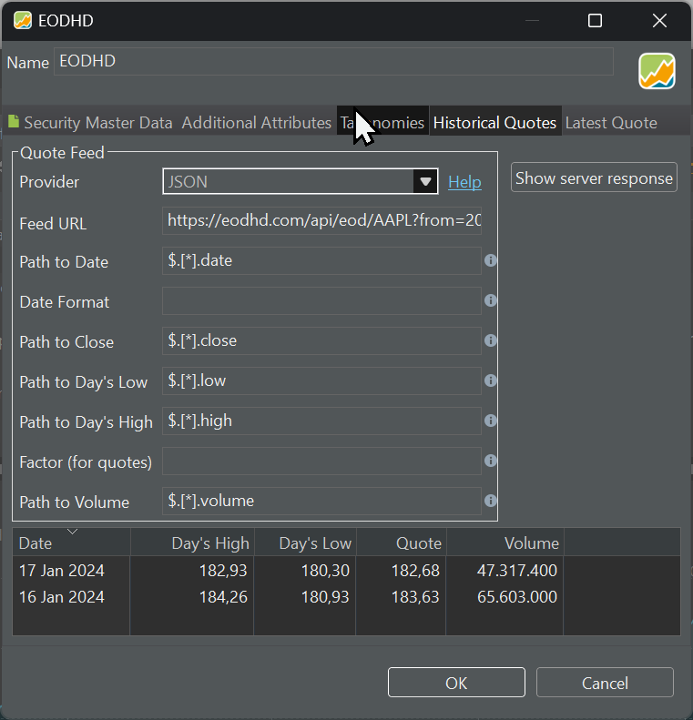
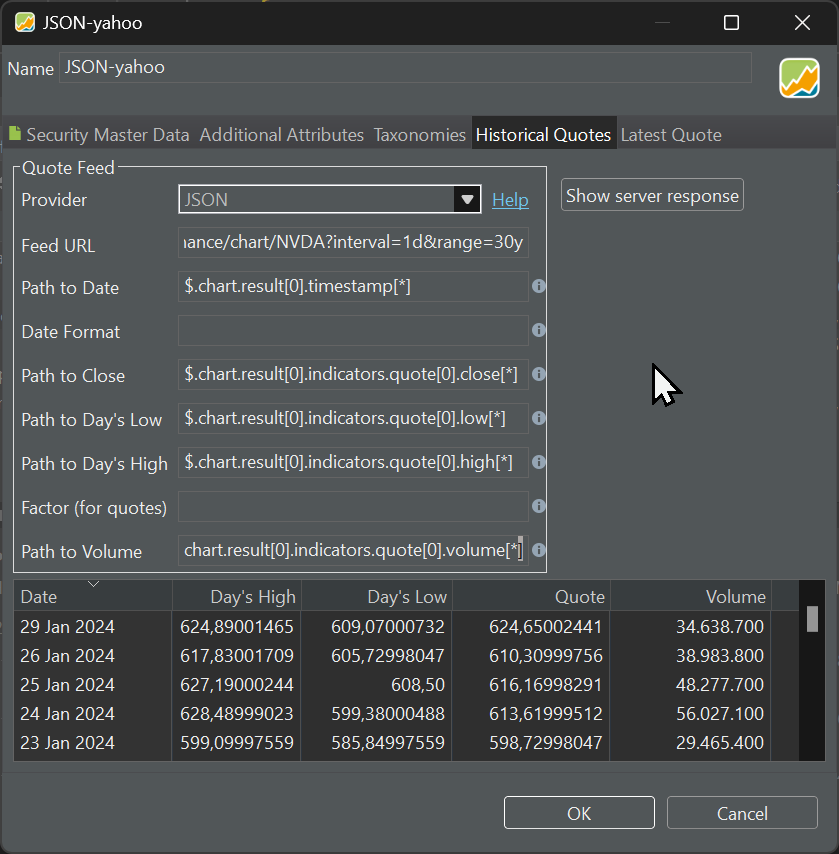

## 使用 API 导入数据 {#import-the-data-with-an-api}

金融服务网站通常通过应用程序编程接口（API）暴露其数据，例如历史价格。要通过 API 访问这些历史价格，用户可以向特定的 API 端点发送 HTTP 请求，指定日期范围、股票代码以及任何其他相关的筛选条件。API 端点（即服务器）处理这些请求，从其数据库中取出所请求的历史价格数据，并以结构化格式（通常是 JSON 或 XML）返回信息。

例如，下面的[端点 URL](https://eodhd.com/api/eod/AAPL?from=2024-01-15&to=2024-01-17&period=d&api_token=demo&fmt=json)可用于向 `eod historical data` 网站请求 2024-01-15 至 2024-01-17 期间 Apple 的历史报价。

`https://eodhd.com/api/eod/AAPL?from=2024-01-15&to=2024-01-17&period=d&api_token=demo&fmt=json`

截至 2024 年 1 月，所提供的演示 API 令牌或密钥仍然有效。如果今后它失效了，请申请一个[免费 API 密钥](./eodhd.md)。

``` JSON
[
    {
        "date": "2024-01-16",
        "open": 182.16,
        "high": 184.26,
        "low": 180.93,
        "close": 183.63,
        "adjusted_close": 183.63,
        "volume": 65603000
    },
    {
        "date": "2024-01-17",
        "open": 181.27,
        "high": 182.93,
        "low": 180.3,
        "close": 182.68,
        "adjusted_close": 182.68,
        "volume": 47317400
    }
]

```

JSON 响应可以包含两类元素：列表和对象。列表是由 [ ] 括起来的有序元素集合，可以通过位置访问。对象是由 { } 括起来的无序键值对集合。键是某个值的唯一标识符，而值可以是任意类型的数据，例如数字、字符串、布尔值、列表或对象。JSON 响应是一种层级结构，这意味着列表可以包含其他列表或对象，对象也可以包含其他列表或对象。

要访问这个层级结构中的某个特定值，你必须指定从根节点到该元素的路径。要访问列表中的元素，需要使用它的索引，即一个表示其在列表中位置的数字。索引从第一个元素的 0 开始。要访问对象中的元素，需要使用它的键，即一个表示其在对象中名称的字符串。键用双引号 " " 括起来。

诸如 *JSONPath*（PP 所使用）这样的查询语言用 $ 符号表示 JSON 响应的根节点。要分隔路径中的各个元素，需要用点号。例如，要访问第二天的收盘价，你需要使用路径 ``$[1].close``。这意味着：从根节点 $ 出发，进入列表中的第二个元素 ``$[1]``（它是一个对象），再进入该对象中键为 "close" 的值 ``$[1].close``，它是一个数字。

你需要这条 JSON 路径来完成 PP 的 JSON 报价馈送提供方的配置。使用以下参数获取历史报价（另见图 1）。关于不同报价价格含义的解释，请参见[概念 > 历史价格](../../concepts/historical-prices.md)。

图： JSON 报价馈送提供方收到的服务器响应（EODHD）。 {class=pp-figure}




- Feed URL: `https://eodhd.com/api/eod/AAPL?from=2024-01-15&to=2024-01-17&period=d&api_token=demo&fmt=json`
- Path to Date: `$[*].date`
- Path to Close: `$[*].close`
- Path to Day's Low: `$[*].low`
- Path to Day's High: `$[*].high`
- Path to Volume: `$[*].volume`


让我们试一个更复杂的例子。下面的端点 URL 可以从 Yahoo Finance 获取 NVIDIA 最近两个交易日的日度报价（点击以下链接查看结果）。

[https://query1.finance.yahoo.com/v8/finance/chart/NVDA?interval=1d&range=5d](https://query1.finance.yahoo.com/v8/finance/chart/NVDA?interval=1d&range=2d)


Yahoo 服务器的响应是一份冗长的 JSON 文档，包含最近 2 天的全部历史报价。为清晰起见，输出已重新组织并作了精简（向下滚动即可看到报价）。

``` JSON
{
  "chart": {
    "result": [
      {
        "meta": {
          "currency": "USD", 
          "symbol": "NVDA"
        },
        "timestamp": [1705415400, 1705501800],
        "indicators": {
          "quote": [
            {
              "close": [563.82, 560.53],
              "open": [550.17, 563.46],
              "high": [568.34, 564.71],
              "low": [549, 547.40],
              "volume": [44958000, 47439400]
            }
          ],
          "adjclose": [
            {
              "adjclose": [563.82, 560.53]
            }
          ]
        }
      }
    ],
    "error": null
  }
}

```

上面这份 JSON 响应是一个由 { } 包围的对象。它包含该证券的元数据、取到的两个日期的 Unix 时间戳，以及各种报价价格。你需要用 JSON 路径来获取不同的值：

- 响应的错误代码：`$.chart.error`
- 证券的元数据：`$.chart.result[0].meta`。result 字段是一个数组，尽管其中只有一个元素，这大概是因为也可以一次请求多只证券的数据。
- 代码名称：`$.chart.result[0].meta.symbol`
- 请求的日期：`$.chart.result[0].timestamp[*]`。其中 * 起通配符的作用，便于获取所有值。
- 第二个日期：`$.chart.result[0].timestamp[1]`
- 全部可用报价（含调整后报价）：`$.chart.result[0].indicators`
- 全部未调整报价：`$.chart.result[0].indicators.quote[0]`
- 收盘报价：`$.chart.result[0].indicators.quote[0].close`
- 第一个日期的收盘报价：`$.chart.result[0].indicators.quote[0].close[0]`

如果你想练习，可以使用 [JSONPath Online Evaluator](https://jsonpath.com/)。把 URL 端点返回的 JSON 结果复制到输入窗口中。另一个实用工具是 [JSONPath Finder](https://jsonpathfinder.com/)。

有了以上信息，向 Portfolio Performance 的 JSON 报价馈送提供方填入正确输入就应当很容易了。

图： JSON 报价馈送提供方参数。 {class=pp-figure}




对大多数服务而言，你需要注册并获得一个 API 密钥，即一个用于验证用户身份并授予其访问该服务权限的唯一标识符。虽然许多金融服务看似免费地提供 API 密钥，但它们的使用条款和长期承诺往往并不令人满意。Portfolio Performance 出于兼容性考虑，在其报价馈送提供方清单中保留了其中若干服务；例如 Alpha Vantage、eodhd、……它们曾经是出色的解决方案，但后来改变了服务内容，作为免费服务已不再那么有用。就实际使用而言，对于典型投资组合，只有 Portfolio Report 和 Yahoo Finance 值得推荐。

### 更多字段 {#further-fields}

#### 日期格式 {#date-format}
Portfolio Performance 会自动识别常见的日期格式。这包括 ISO 日期格式（例如 2025-06-21）和 UNIX 时间戳（自 1970-01-01 午夜起的秒数，UTC）。如果某个 API 用另一种方式表示日期，可以用此字段加以描述。例如，对于月/日/年格式的日期，请输入 "MM/dd/yyyy"。所有可用标识字符的完整列表参见 [https://docs.oracle.com/javase/8/docs/api/java/time/format/DateTimeFormatter.html#patterns](https://docs.oracle.com/javase/8/docs/api/java/time/format/DateTimeFormatter.html#patterns)。

#### 日期时区 {#date-time-zone}
如果某个 API 给出的日期是相对于与交易所时区不同的某个时区，那么报价可能因时间偏移而被归入错误的日期。在这种情况下，你可以手动提供时区信息来加以纠正。该字段接受诸如 "+01:00" 的固定偏移量，或诸如 "Europe/Berlin" 的时区 ID（在这种情况下，偏移量可能随夏令时动态变化）。

#### 系数（用于报价） {#factor-for-quotes}
某些 API 提供的报价可能以美分/便士而非美元/英镑/欧元计。若确实如此，可以用此字段提供一个换算系数。
