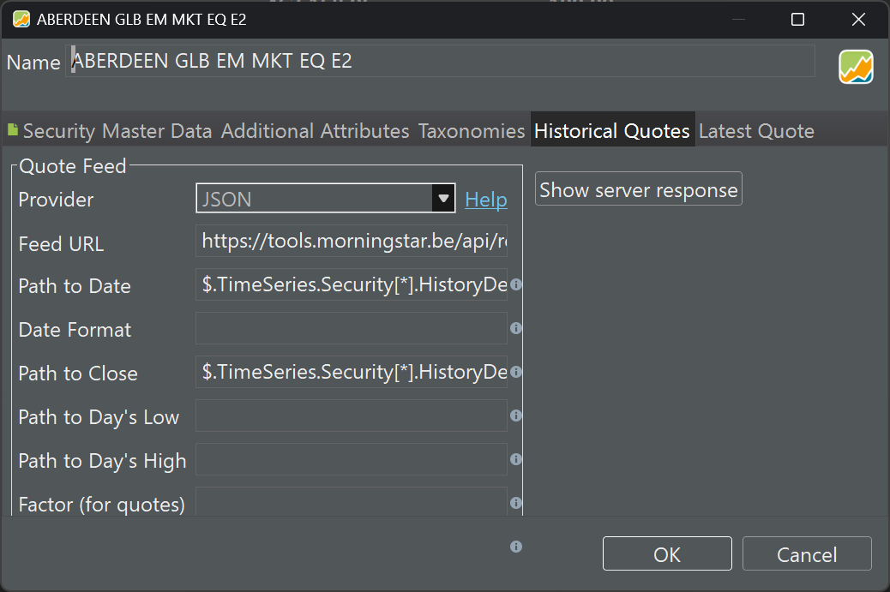

!!! info
    来自 SimonFitz 的**最佳**[论坛](https://forum.portfolio-performance.info/t/import-fund-data-from-morningstar/14516)解答！

Morningstar 的网站以其详尽的基金清单而闻名。通过一点小技巧，你就可以从该网站下载特定基金的历史数据。

首先进入该基金（或信托或 ETF）在 Morningstar 网站上的 Chart 页面；例如 [https://www.morningstar.co.uk/uk/](https://www.morningstar.co.uk/uk/)。我将以 Baillie Gifford Positive Change Fund B Accumulation 基金（ISIN GB00BYVGKV59）为例。

移除其他所有正在绘制的基准等（这并非必要，但会让事情更简单）。打开浏览器的"开发工具"，在 Firefox 和 Edge 中是 F12，其他浏览器大概也一样。转到 "Network" 标签页，按下那个看起来像垃圾桶的清除按钮；同样，这不是必需的，但会让事情更简单。现在按下图表正上方的 "chart settings" 按钮，点击 "display options"，然后点击 "percentage" 按钮 —— 这会把图表切换为显示基金的实际价格而非百分比变化，并且正好方便了我们：它会促使 Morningstar 网站发出一个链接，稍加修改我们就能在 Portfolio Performance 中使用。该链接应显示在浏览器开发工具的 "network" 界面中，于是右键点击来自 "tools.morningstar.co.uk 44" 域名、类型为 "json" 的那条记录，选择 Copy->Copy URL 选项。该链接应为

``` html
https://tools.morningstar.co.uk/api/rest.svc/timeseries_price/
t92wz0sj7c?currencyId=GBP&idtype=Morningstar&frequency=daily&
startDate=2011-02-01&priceType=&outputType=COMPACTJSON&
id=F00000ZB0M]2]0]FOGBR$$ALL&applyTrackRecordExtension=true
```
现在你需要修改链接中的一些选项，并稍作精简，使其变为：

``` html
https://tools.morningstar.co.uk/api/rest.svc/timeseries_price/
t92wz0sj7c?currencyId=GBP&idtype=Morningstar&frequency=daily&
outputType=JSON&startDate=2020-12-31&id=F00000ZB0M]2]0]
FOGBR$$ALL
```

如果想查看数据，你可以在浏览器中访问这个链接。其中有 4 个选项值得说明：frequency 会给出日度价格；outputType 给出一种 Portfolio Performance 能够解析的 JSON 风格；startDate 让你选择回溯多远；id 则是该证券在 Morningstar 中的参考标识 —— 因此要换成任何其他你想用的值。选项的顺序无关紧要，但我在设置多个证券时发现把 id 放在末尾更方便。

现在在 Portfolio Performance 中，在该证券的 "Historical Quotes" 标签页里把提供方选为 JSON，并使用以下值（另见图 1）：

```
Feed URL = the link just created
Path to Date = $.TimeSeries.Security[*].HistoryDetail[*].EndDate
Path to Close = $.TimeSeries.Security[*].HistoryDetail[*].Value
```

{.pp-figure}

务必把显示出来的值与 Morningstar 图表核对一遍。
