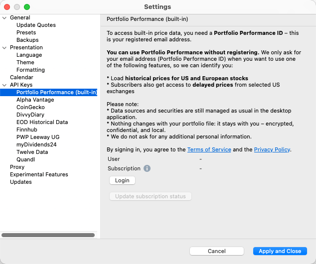
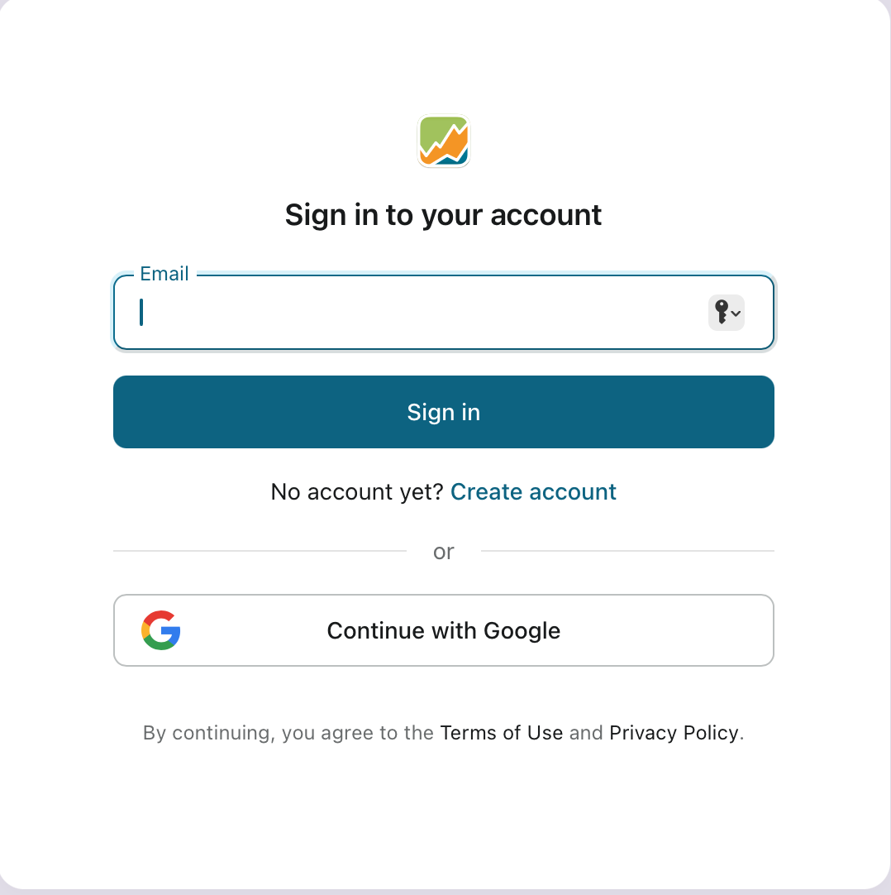
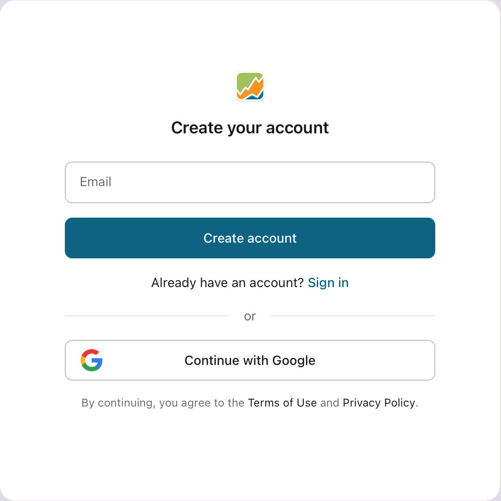
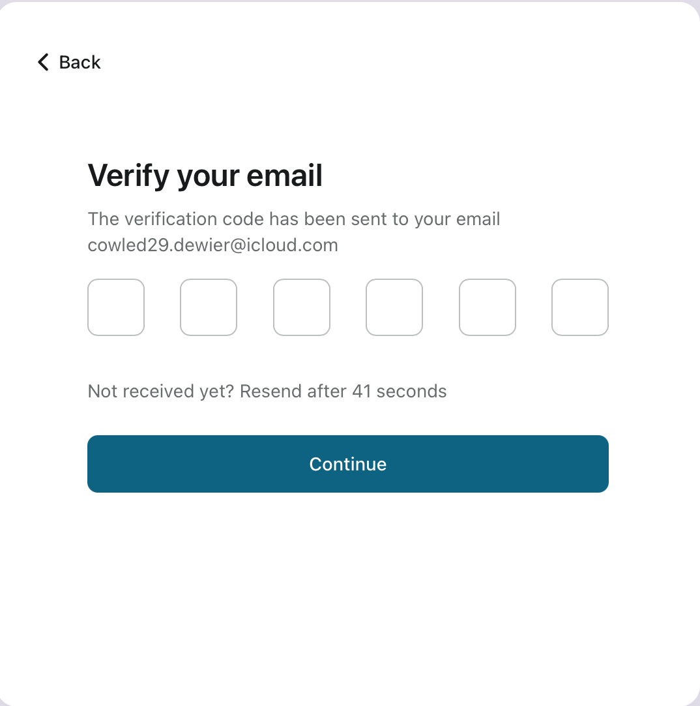
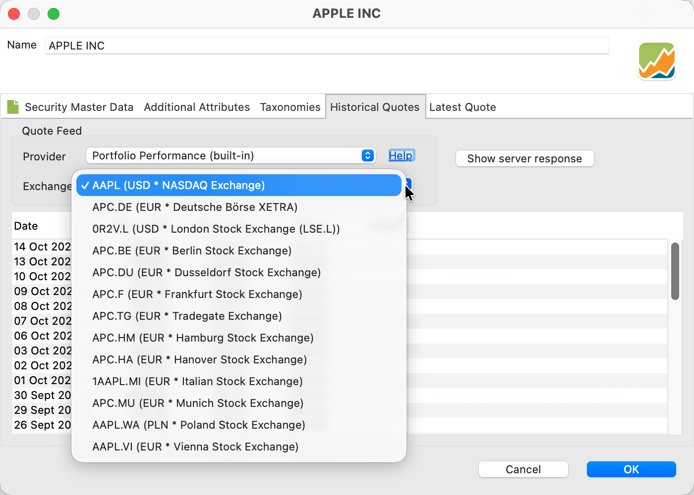

# Portfolio Performance（内置）

用于历史报价的 **Portfolio Performance（内置）** 数据源是最易用、也最可靠的历史市场数据提供方。它覆盖 20 多个欧洲交易市场以及美国的主要证券交易所。该提供方内置于 Portfolio Performance 应用程序中，可免费使用。  

要使用内置提供方，你必须：

- 创建一个 `Portfolio Performance ID`（只需一个可验证的电子邮件地址）。  
- 登录该服务，并大约每三个月刷新一次会话。  
- 将证券的数据源设为内置提供方。  

请注意，内置提供方只是 Portfolio Performance 中可用的 20 多个数据源之一，其他还有 Yahoo Finance、Alpha Vantage、JSON 等（概览见[下载历史价格](./index.md)）。因此，不依赖内置提供方你也能使用 Portfolio Performance。

**1. 创建 Portfolio Performance ID**

使用内置报价提供方之前，你必须注册，即创建一个**免费的 Portfolio Performance ID**。这只需做一次。注册需要一个已验证的电子邮件地址 —— 也就是说，你必须先输入发送到该地址的验证码才能继续。不会索取任何额外的个人信息。注册最便捷的方式是使用**应用程序菜单（macOS）**或**帮助菜单（Windows）**下的**设置/首选项**选项；见图 1a。  

图： 注册你的 Portfolio Performance ID。{class=pp-figure}

- {width="400" .center}
- {width="400" .center}
- {width="400" .center}
- {width="400" .center}

点击 `Login` 按钮会打开[注册/登录网站](https://accounts.portfolio-performance.info/sign-in)（图 1b）。选择 `Create account`，输入一个可验证的电子邮件地址，从你的电子邮件中获取验证码，并按提示粘贴（见图 1d）。  

接下来，为以后的登录设置一个密码。此后你就可以关闭浏览器了。你的凭据被安全地存储在专用的身份服务器上。你随时可以向 [info@portfolio-performance.app](mailto:info@portfolio-performance.app) 发送电子邮件以注销账户。更多细节请参见[隐私政策](https://www.portfolio-performance.app/privacy-policy)网页。

**2. 登录该服务**

使用同一个 `Settings` 面板，你可以用你的 Portfolio Performance ID 和密码登录该服务。  
登录成功后，你的电子邮件地址（Portfolio Performance ID）会显示在设置面板中用户字段的旁边（见图 1a）。

登录会创建一个**刷新令牌**，它存储在本地的 workspace 目录中，而不是投资组合的 XML 文件里。  该登录独立于其他登录，例如论坛所用的登录，或 OneDrive、Google Drive 等云服务的登录。刷新令牌允许在每次刷新历史价格时自动重新认证。它的有效期为 **90 天**，之后你必须重新登录以续期。

此外还有一个单独的 `Subscription` 字段。你可以使用与你的（付费）移动应用账户相同的电子邮件地址订阅该服务。届时订阅类型（例如 `Premium`）会显示在标签旁边。  
订阅用户不仅能下载历史价格，还能访问延迟报价，这些报价可在证券数据面板的[最新报价](../../reference/file/new.md#latest-quote)标签页中使用。

---

**3. 将证券的数据源设为内置提供方**

你可以通过[新建工具向导](../../getting-started/adding-securities.md)把内置数据源指定给证券 —— 该向导涵盖所有步骤，包括 ID 的创建与登录 —— 也可以在证券数据面板的[历史报价](../../reference/file/new.md#historical-quotes)标签页中手动设置。

- 在证券数据面板的[证券主数据](../../reference/file/new.md#security-master-data)标签页中，至少输入你所选交易所使用的 `ticker symbol`（例如，Apple Inc. 在 NASDAQ 上的 `AAPL`）。  
- 然后在 `Historical Quotes` 标签页中，把 `Quote feed provider` 设为 `Portfolio Performance (built-in)`。  
- 如果有多个交易市场可选，你还可以选择相应的市场。  
  如图 2 所示，对于 `AAPL` 这一代码，内置提供方除美国 NASDAQ 之外还支持 12 个欧洲交易市场。  

图： 内置提供方返回的历史报价。{class=pp-figure}

如果你为移动应用购买了付费订阅，还可以指定 `Latest price` 提供方以下载延迟价格。目前该选项仅对美国证券可用。
