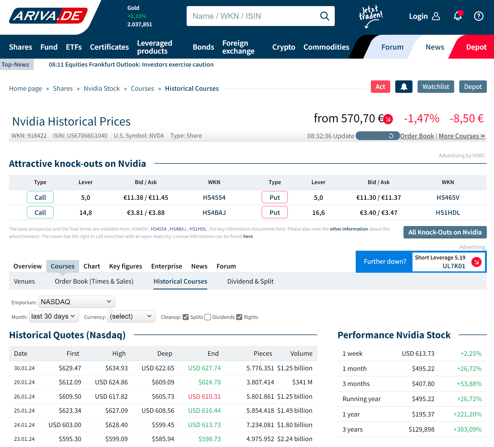
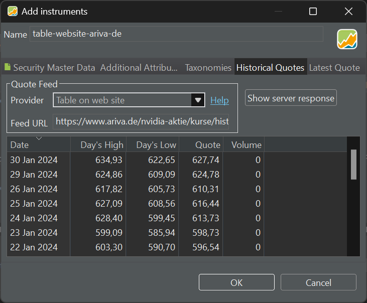
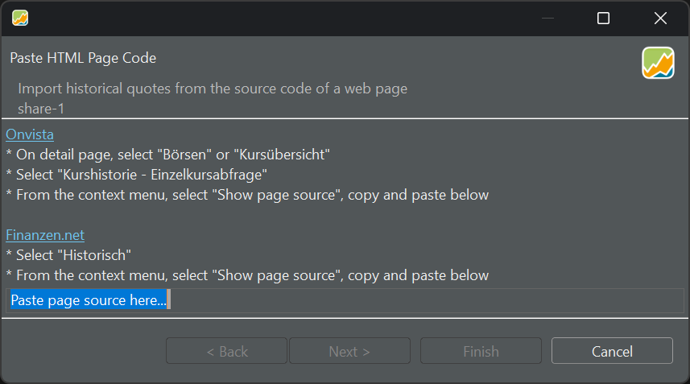

像 NASDAQ 这样的证券交易所会发布在其平台交易的股票的历史报价与实时报价。ariva.de 之类的金融网站提供的范围更广。这些历史价格通常包含在一个表格中，表头如 Date、Open、Close 等。

从网站上抓取这些信息应该是可行的。Portfolio Performance 提供两种方式：自动抓取和手动抓取。

## 自动抓取 {#automatic-scraping}

ARIVA.DE 是一个德国网站，提供金融信息和新闻，如股票价格、市场指数、大宗商品、货币、基金、凭证、债券等。

图： ARIVA.DE 上的历史价格（英文翻译）{class=pp-figure}

图 1 所示网页的 URL 为：
`https://www.ariva.de/nvidia-aktie/kurse/historische-kurse`。  把该 URL 填入图 2 的 Feed URL 字段，就会下载当月的报价。 
用这种方法追加历史报价，只有在你通过打开投资组合或使用 Online 菜单定期更新报价时才会有效。请注意，你也可以选择其他月份，如果你漏掉了一个或几个月，这或许是个解决办法。

图： ARIVA.DE 上的历史价格（英文翻译）{class=pp-figure}

不知为何，Volume 信息没有被获取，Boursorama 的 URL（`https://www.boursorama.com/cours/historique/NVDA`）中的 High & Low 报价同样没有获取。请注意，该链接提供的是月度报价，尽管屏幕上显示的是日度报价。

## 手动抓取 {#manual-scraping}

上述方法并非总是有效。有些网站使用 JavaScript 或其他技术在客户端计算机上构建表格。例如，在 Finanzen.net 网站上，默认 URL `https://www.finanzen.net/historische-kurse/nvidia` 只会显示当天的报价，要查看其他时段需输入开始和结束日期。在这种情况下，可以采用手动抓取来获取这些数据。

图： 手动抓取。{class=pp-figure}

- 以你偏好的下载格式呈现数据。
- 右键点击表格，从上下文菜单中选择 `Page Source`。
- 使用快捷键 Ctrl + A 选中所有文本。
- 使用快捷键 Ctrl + C 复制文本。
- 转到图 3 中的对话框；参见[全部证券视图](../../reference/view/securities/all-securities.md#information-pane)。
- 将文本粘贴（Ctrl + V）到高亮区域。
- 点击 Next，然后点击 Finish。
