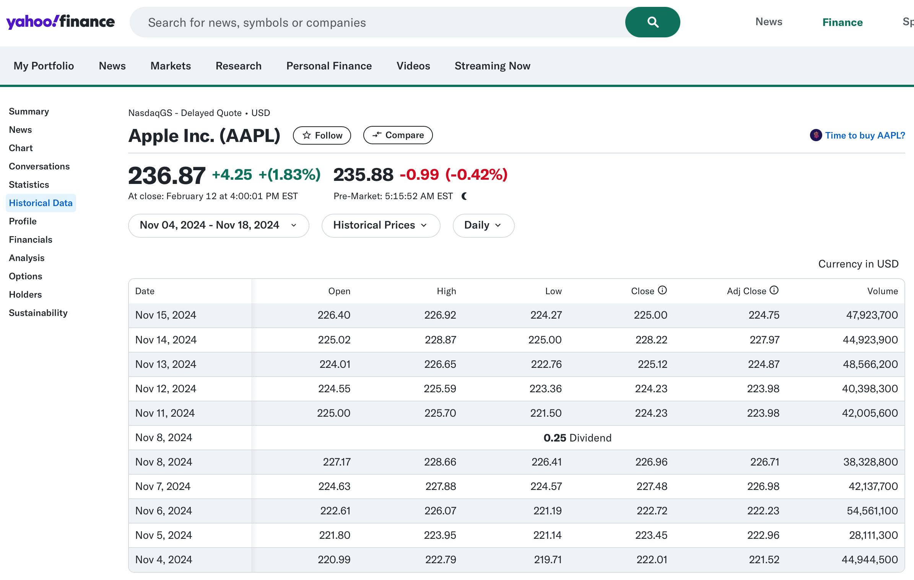
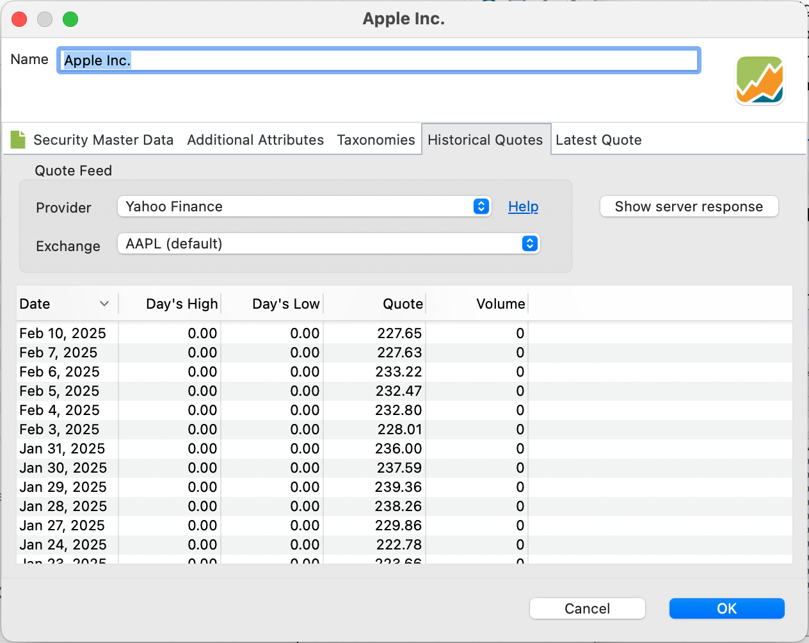

[Yahoo Finance](https://finance.yahoo.com/) 提供种类繁多的工具和金融资源，包括历史与实时股票报价、交互式图表，以及覆盖广泛金融市场的新闻更新。

图： 带有 Apple 历史价格的 Yahoo Finance 网站。{class=pp-figure}

点击顶部的搜索框并输入（部分）名称，例如 "App"。选择正确的证券，本例中为 Apple Inc (AAPL)。切换到第二个菜单，点击 Historical Data（见图 1）。之后你可以按需调整 Time Period 和 Frequency。

!!! Note
    如图 1 所示，Yahoo（代码）显示在证券名称之后的括号中。代码是一串字母，代表一家公开交易的公司或金融工具。例如，Apple Inc. 的代码是 `AAPL`。当可能产生混淆时（就像 `DTE` 一样，它对应两家不同的公司），会再加上交易市场。例如，`DTE.DE` 指在德意志交易所（Deutsche Börse）交易的 Deutsche Telekom 证券，而 `DTE (default)` 指在 NASDAQ 交易的 DTE Energy Company。

自 2024 年末起，若不付费订阅，就无法再把这些历史价格下载为 CSV 文件了。在 [CSV 文件](./csv-file.md)一章中，我们对此有更详细的讨论。

图： 历史报价的数据来源。{class=align-right style="width:40%"}

Portfolio Performance 为 Yahoo Finance 和 Yahoo Finance (Adjusted Close) 预置了报价馈送提供方。请注意，这两种情况下都不会获取 Day's High、Day's Low 和 Volume 信息。

要获取 `Apple` 的历史报价，请在证券主数据中输入代码（AAPL）（见图 1，左上），并在 Historical Quotes 标签页内把 Yahoo Finance 选为报价馈送提供方。此时会显示从今天开始的 30 条报价。

在后台，Portfolio Performance 会发起以下查询（发生错误时可见，例如使用代码 DTE.XX 时）。

`https://query1.finance.yahoo.com/v8/finance/chart/AAPL?range=3mo&interval=1d`

如果你需要不同数量的历史数据、另一个时间段的数据，或者希望包含 High、Low 和 Volume 字段，可以手动发起查询。该功能通过 [JSON 报价馈送提供方](./json.md)即可使用。
