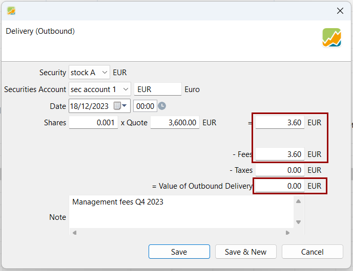
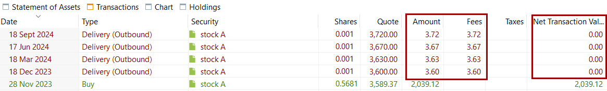
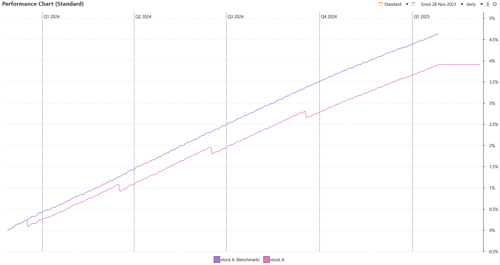
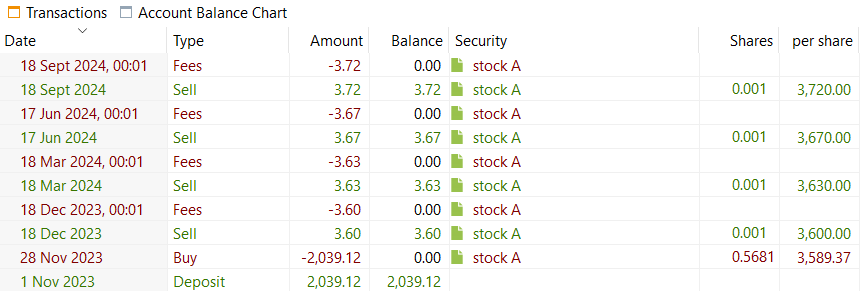

除账目费用之外，有些券商还会收取管理费，通常是按投资组合价值的一定年百分比计算。在这种情况下，券商通过卖出你所持份额中的一小部分来扣除这些费用，从而使你持有的总份额数减少。

这本质上是一笔卖出账目加上一笔费用账目。可以通过一笔 [*证券转出*](../reference/transaction/delivery.md)账目同时记录：在同一笔账目中卖出份额，并把费用计入卖出金额。这样得到的**证券转出总额为 0**。

图： 用证券转出记录费用账目。{class= pp-figure}

要把这些费用记录准确，关键是券商要提供所卖份额的数量。

!!! Note
    这可以在 [*证券转出*](../reference/transaction/delivery.md)中完成，而不能通过 [*卖出*](../reference/transaction/buy-sell.md)，因为 Portfolio Performance 中的卖出账目最终值不能为 null。

!!! info "🇫🇷 法国产品的实际应用"
	法国 *assurances-vies*（人寿保险）产品的证券费用就是用这一方法记录的。

### 示例 {#example}
在本例中，假设你通过某券商持有 `stock-A`的 0.5671 份份额，该券商收取 0.75% 的年管理费，每年分 4 次收取：每季度收取 0.75% / 4 = 0.1875% 的费用，收取日期分别为 12 月 19 日、3 月 18 日、6 月 17 日和 9 月 18 日。

`stock-A`的第一笔季度费用，是卖出 `0.75/100/4 * 0.5671 = 0.001`份份额，其卖出金额即作为费用。
3 月 18 日再次如此：
券商卖出 `0.75/100/4 * 0.5661 = 0.001`份份额，卖出金额作为费用。其他日期同理。

图： 多笔费用账目记为证券转出。{class= pp-figure}

[绩效图表](../reference/view/reports/performance/performance-chart.md)展示了这些费用的影响：与 `stock-A`的价格绩效相比，我们的 `stock-A`绩效在一年中比其基准低 0.75%。

图： 管理费带来的绩效差异。{class= pp-figure}

### 第二种方法 {#second-method}
也可以用以下方式把卖出账目与费用账目分开记录：

1. 先记一笔 [*卖出*](../reference/transaction/buy-sell.md)账目
2. 再在现金账户上记一笔与所卖证券相关的 [*费用*](../reference/transaction/fees-taxes.md)账目。

但这样会产生两笔账目，并且必须使用现金账户。

图： 采用第二种方法时现金账户上的账目列表。{class= pp-figure}

