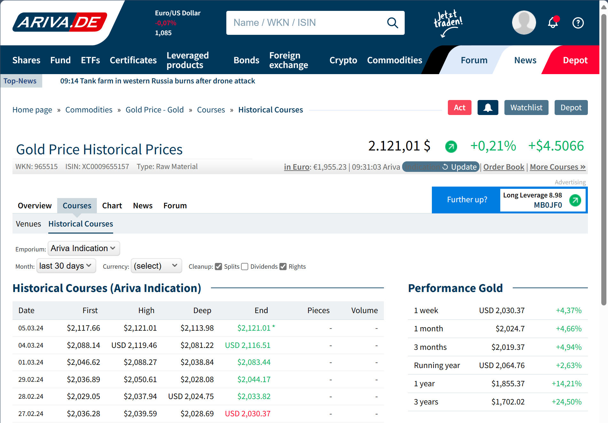
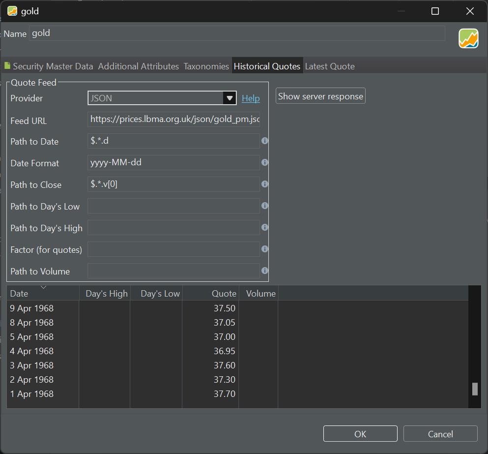
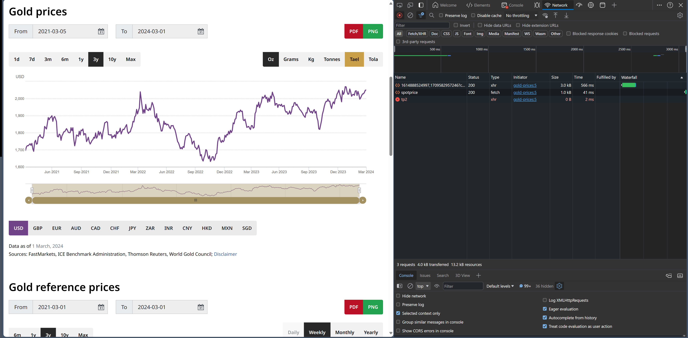
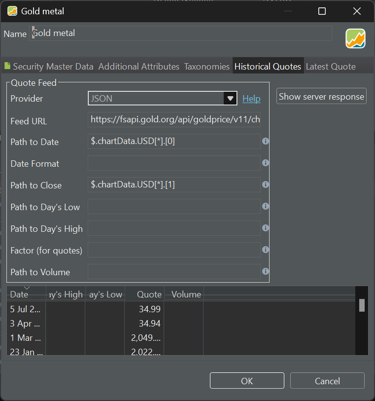

投资黄金常常是经济不确定时期的选择。获得黄金敞口有多种方式。一种流行的方式是投资实物黄金，即购买金条、金币或首饰。另一种方式是投资黄金交易型基金（ETF）或黄金跟踪产品，例如 [Invesco Physical Gold](https://www.invesco.com/uk/en/financial-products/etfs/invesco-physical-gold-etc.html)。这类金融工具通过把实物黄金存放在安全的金库中来复制金价的绩效。投资黄金的第三种（间接的）方式是购买黄金矿业公司的股票。黄金矿业公司从事黄金的勘探、开采与生产，其股价会受到金价的影响。

通过 ETF 和黄金矿业公司股票投资黄金，其处理方式与 Apple Inc. 等普通股类似，便于买入、流动性好，并可能带来收益。虽然实物黄金在若干方面与传统的股票不同（例如黄金不提供公司的所有权，也不赋予持有者获取股息的权利），但它仍可视为一种投资，可以买卖，并作为良好分散的投资组合的一部分进行管理。因此，在 Portfolio Performance 中，它可以作为一只普通证券来处理。

Portfolio Performance 论坛上有一个帖子 [Wo kann ich aktuelle und historische Gold- und Silberkurse laden?](https://forum.portfolio-performance.info/t/wo-kann-ich-aktuelle-und-historische-gold-und-silberkurse-laden/14/49)。本节是该帖所讨论信息的总结与扩展。

## 网站 Ariva.de {#website-arivade}

`ariva.de` 网站有一个专供[大宗商品](https://www.ariva.de/rohstoffe/)的页面，黄金、白银等都在其中。下载最新金价很简单，只需把[报价馈送设为网页](./downloading-historical-prices/table-website.md)并填入 `https://www.ariva.de/goldpreis_gold-kurs/kurse/historische-kurse`。遗憾的是，这种方法只提供最近 30 天的数据。随着时间推移，这种方法会为未来日期更新数据，从而逐步积累起数月的金价历史。

图： Ariva.de 网站（已翻译），其中显示黄金历史价格。{class= pp-figure}



你也可以把馈送 URL 替换成前几个月份中任意一个（例如 `https://www.ariva.de/goldpreis_gold-kurs/kurse/historische-kurse?go=1&boerse_id=172&month=2024-02-29`）。导入数据时，Portfolio Performance 会询问你是否要保留已有的历史价格。若选择保留原有数据，就能为你下载过的所有月份维持一份连续的金价记录。

不过，或许更好的方法是使用动态数据 URL。把上面 URL 中的 `month=2024-02-29`替换为宏版本 `month={DATE:yyyy-MM-32}`。该宏会遍历此前所有月份（一直回溯到 2003 年），每个月发出一次请求，直到没有可用数据为止。如果从头开始，这一过程可能耗时较长，并会给 ariva.de 的服务器带来相当大的负载。

获取黄金历史价格的另一个选择是注册一个免费账户。这样你就可以把历史价格下载为 CSV 文件，再[导入](../reference/file/import/csv-import.md#importing-a-csv-file)到 Portfolio Performance (PP) 中。


## 伦敦金银市场协会 (LBMA) {#london-bullion-market-association-lbma}

[伦敦金银市场](https://www.lbma.org.uk/prices-and-data/precious-metal-prices#/table)是全球最大、最重要的黄金与白银交易市场。你可以获取黄金、白银、铂金和钯金按年计的价格，数据可回溯至 1968 年，以 USD、GBP 和 EUR 计价。每天有两次拍卖（上午场和下午场）。数据可以按年显示为图表或表格。

遗憾的是，Portfolio Performance 无法解析该表格（因为其中不含 `收盘`等必需关键字）。不过，正如用户 [ristretto](https://forum.portfolio-performance.info/t/wo-kann-ich-aktuelle-und-historische-gold-und-silberkurse-laden/14/49)所指出的，你可以通过 JSON `报价馈送`获取价格（见[操作指南 > 下载历史价格](./downloading-historical-prices/json.md)）。下午场拍卖的 `馈送 URL`为 `https://prices.lbma.org.uk/json/gold_pm.json`。"v"（value）键下的三个价格分别代表 USD、GBP 和 EUR。请注意，1968 年没有可用的 EUR 价格。

```
[
    {
        "is_cms_locked": 0,
        "d": "1968-04-01",
        "v": [
            37.7,
            15.68,
            0
        ]
    },
    {
        "is_cms_locked": 0,
        "d": "1968-04-02",
        "v": [
            37.3,
            37.3,
            0
        ]
    },
    ...
]
```

要发现这个 JSON 端点 URL，可以在浏览器中打开开发者工具面板，切换到网络标签页，然后刷新图表。`日期路径`为 `$.*.d`，`日期格式`为 `yyyy-MM-dd`。以 USD 计价的 `收盘价路径`为 `$.*.v[0]`。

图： 通过伦敦金银市场的 JSON 报价馈送获取的黄金价格。{class=pp-figure}



## 网站 Gold.org {#website-goldorg}

gold.org 网站以不同货币、不同数量单位（盎司、克、千克；1 金衡盎司 = 31.1034768 克）提供黄金历史价格。要获取这些数值数据，你需要用一个变通办法。首先，打开[黄金价格图表](https://www.gold.org/goldhub/data/gold-prices)。服务器会发送一个文本文件（JSON 文件）其中包含数据，随后该数据被用来在你的计算机本地生成图表。这种方式在时间和带宽上更为高效。

要找到 JSON 下载的 URL，请按以下步骤操作：

1. 在浏览器中打开开发者工具窗口，通常是按 F12 键。
2. 在图表中改动某项内容，例如改变周期，以触发数据更新。
3. 在开发者工具窗口的网络标签页中查找出现的请求变化。
4. 复制出现的 URL。它应当与图 1 中所示的类似。

图： 显示了开发者工具的 gold.org 网站。{class= pp-figure}



该 URL 应当形如：

`https://fsapi.gold.org/api/goldprice/v11/chart/price/usd/oz/1693853240038,1709582076959?cache`

在浏览器中输入该 URL 后，你会看到如下结果。

```
{
    "system": {
        "request_time": "2024-03-04 20:19:20",
        "APIserverHostname": "fsapi.gold.org",
        "protocol": "https",
        "uri": "https://fsapi.gold.org/api/goldprice/v11/chart/price/usd/oz/1693853240038,1709582076959",
        "route": "fsapi.gold.org",
        "cached": false,
        "q": false,
        "params": {},
        "user": null,
        "response_size": 3318,
        "time_start": "2024-03-04 20:19:21",
        "time_stop": "2024-03-04 20:19:21",
        "mem_start": 32540152,
        "time": "0.021 secs",
        "mem_stop": 57446376,
        "mem_used": "24322.48 KB",
        "size": "3.33 KB"
    },
    "chartData": {
        "USD": [
            [
                1693872000000,
                1926.1
            ],
            [
                1693958400000,
                1922.05
            ],
            [
                1694044800000,
                1918.35
            ],
            [
                1694131200000,
                1927.8
            ],
```

你可以去掉 `?cache` 参数。请记住，如果该网站更新其结构或数据获取方式，这个变通办法可能需要改变。

该 URL 提供两个日期之间的黄金价格 JSON 数据，日期以 Unix 时间戳（自 1970 年 1 月 1 日起的毫秒数）表示，例如 1693853240038 和 1709582076959。你可以使用 [Epoch Converter](https://www.epochconverter.com/) 网站轻松地把这些时间戳转换为可读的日期，反之亦然。所幸，Portfolio Performance 原生就能处理这些日期。

- 1693853240038：2023 年 9 月 4 日，星期一
- 1709582076959：2024 年 3 月 4 日，星期一

当然，你想要的黄金价格是到今天的，而不是到 2024 年 3 月 4 日的。去掉第二个参数即可实现。因此，下面的 URL 会显示从 2023 年 9 月 4 日直到今天的黄金价格（注意末尾的逗号）。

- 馈送 URL：`https://fsapi.gold.org/api/goldprice/v11/chart/price/usd/oz/1693853240038,`
- 日期路径：$.chartData.USD[*].[0]
- 收盘价路径：$.chartData.USD[*].[1]


要提取日期和价格，你需要 JSON 路径（见图 4）。

图： 含馈送 URL 与日期路径、收盘价路径的报价馈送 JSON 提供方。{class= pp-figure}


