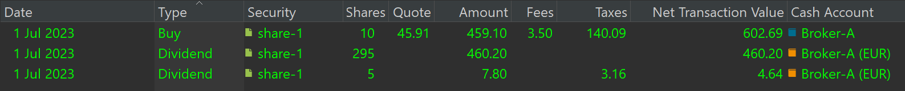

# 处理选择权股息

股息是把公司利润的一部分支付给股东。选择权股息是指股东可以选择领取现金（现金股息）或额外股票（股票股息）。

## NN Group 示例 {#example-nn-group}

例如，荷兰金融服务公司 [NN Group](https://www.nn-group.com/investors/share-information/dividend-policy-and-dividend-history.htm) 让其股东在 2023 年中期股息每股 1.12 EUR 的金额上，自行选择以现金或以股票形式领取。[除权日](../concepts/portfolio-performance-terminology.md)定为 2023 年 8 月 31 日，股息支付安排在 2023 年 9 月 25 日。参考股价定为 36.2513 EUR，其取自 2023 年 9 月 12 日至 18 日期间在阿姆斯特丹泛欧交易所（Euronext Amsterdam）的五个每日历史价格的平均值。

以此参考价格计算，分配比例确定为 1 兑 32.37 股。事实上，要获得 1 股价值 36.2513 EUR 的股票，需要 32.37 股 x 1.12 EUR 股息。

理论上，现金股息与股票股息两种选择应带来相同的总收益。否则股东自然会倾向于更有利的那一种。设想你在除权日持有 100 股 NN Group 股份。选择现金股息将得到 100 股 x 1.12 = 112 EUR 总额。另一方面，选择股票股息将给你约 3.09 股（100 股 / 32.37），按每股 36.2513 EUR 估值。这合计约 112.02 EUR 总额，与现金股息金额大致相当。请注意，零股并不总是可行的；尽管 Portfolio Performance 能轻松处理它们。因此，可能需要为这 0.09 股另寻解决办法。

当然，你的选择会受你对即时流动性的需求（促使你选择现金股息）以及你希望继续投资这家公司的意愿（促使你选择股票股息）所影响。

尽管从总额来看两者理论上等价，但费用、税款以及各种税务与券商规定等因素，会影响最终留存的现金净额。实践中，两种选择确实存在差异。例如，一位持有 100 股的比利时（因而属于外国）股东，收到 68.12 EUR 的现金股息，而股票股息估值为 72.93 EUR；约多出 7%。这一差异主要源于选择股票股息时可免征外国税。

!!! Note

    1. 如果你选择*现金股息*。你收到总额 100 x 1.12 = 112 EUR。净额取决于你所在国家的税务与券商规定。例如，作为*比利时股东*，你要缴纳 10% 的外国税（=11.2 EUR），对剩余金额（112 - 11.2 = 100.8）缴纳 30.24 EUR 或 30% 的本国税，2.44 EUR 或 2% 的券商费用 + 21% 的 TVA。剩余净额为 100.8 - 30.24 - 2.44 = 68.12 EUR。

    2. 你选择*股票股息*。计算会变得复杂得多。你的券商需要处理零股，而你则必须为新获得股份的估值作出决定。

        - 你有权获得 100/32.37 = 3.0893 股。因此你会收到三股新股，券商会把零股部分（.0893）转换为现金股息。这种情形下，最接近的近似值是两股；32.37 x 0.0893 = 2.89，或向下取整（！）为两股。
        - 现金股息遵循与上面相同的规则。这种情形下，比利时券商不收取费用。因此现金股息净额为 2 x 1.12 减去 10% 外国税和 30% 本国税 = 1.41 EUR。
        - 从（比利时）政府的角度看，获得三股是 NN Group 支付股息的结果。全部税款合计为
            - 预扣 30% 的本国税 = 32.63 EUR
            - 因比利时与荷兰之间有双重征税协定，不征外国税
            - 0.35% 或 1.78 EUR 的证券交易所税。
            - 对券商费用征收 21% 的 TVA：0.74 EUR。
        - 从券商的角度看，你买入了 3 股。费用总额看来是固定的 3.5 EUR。
        - 剩下的是三股新获赠股如何估值这个难题。它们在股息支付日值多少？
            - 你可以采用支付日 NN 股票的历史收盘价：3 x 36.33 EUR/股，即 108.99 EUR。
            - 你也可以采用参考价，由此得出总金额为 3 x 36.25 = 108.7632。
            -  由于支付日的收盘价与参考价相差不大（36.33 对 36.25），这里两种估值实际上相同。
        - 那么，你从这笔股票股息中实际得到了多少？
            - 剩余股份的股息净额：1.41 EUR。
            - 三股新获股份的净价：108.73 - 33.74（税款）- 3.5（费用）= 71.52 EUR。
            - 净额合计：72.93 EUR。

当然，上述计算只适用于 2024 年某位特定券商处的比利时股东。股票股息的优势主要来自外国税的差异，而其他国家——尤其是荷兰——的股东，情形可能大不相同。

!!! Important
    请注意，选择现金股息时你会收到钱，而选择股票股息时，你还得投入额外的钱。虽然你得到了股份，但你还必须承担相关的税款与费用。

## 在 PP 中记录选择权股息 {#recording-the-choice-dividend-in-pp}

关于如何在 PP 中记录这些账目，论坛上已有大量[讨论](https://forum.portfolio-performance.info/t/dividend-paid-in-security-stock-dividend-reinvestment-plan-drip/13828/16)。许多用户建议把股息选择视为"领取股息"与"买入股份"这一连串操作。一个可行的工作流如下。

  - 先记录全部股份的股息总额，*不含*费用与税款。这些费用与税款将在下一步中支付。这笔账目在现实中并未发生，所以你的券商没有相关的对账单。你指定的现金账户将增加股息总额；例如上一个例子中的 112 EUR。
  - 在同一天按参考价买入所分得的赠送股份，并计入你从券商处获得的相关费用与税款。
  - 如果你想体现零股带来的那点微小影响（例如上面例子中 2 股对应的股息），就需要把第一笔股息账目拆成两笔。
    -  记录零股部分（例如 2 股）的股息，并计入费用与税款。这部分你应当有券商出具的对账单。
    -  记录其余股份（例如 98 股）的股息，不含费用与税款（这部分你没有券商的对账单）。

{pp-figure}

