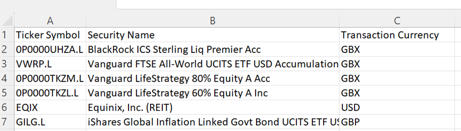
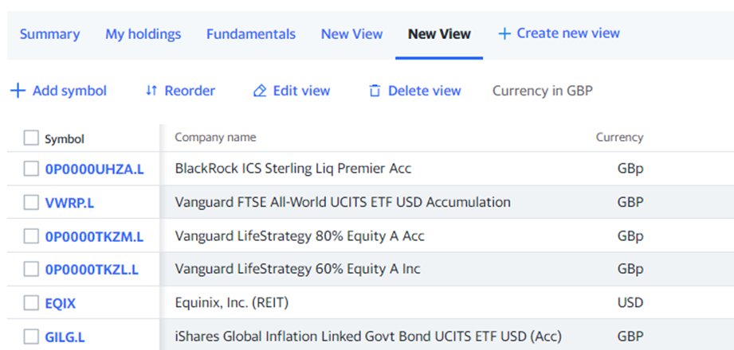
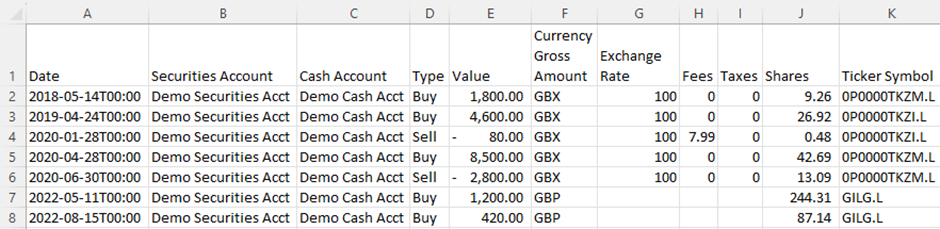
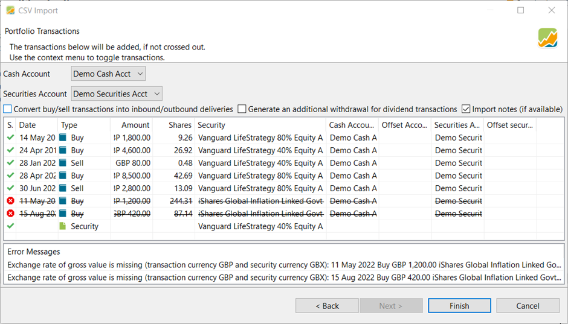
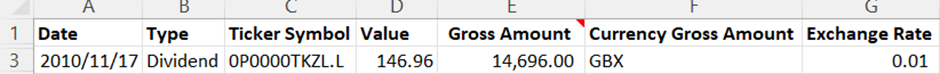
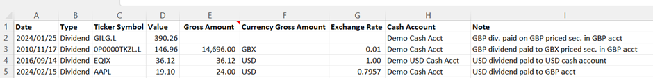

---
title: 如何对以 GBX 计价的证券使用 CSV 导入功能？
--- 
# 如何对以 GBX 计价的证券使用 CSV 导入功能

以下*操作指南*基于英语论坛上的一篇讨论 *[入门：现金账户与关联账户之别](https://forum.portfolio-performance.info/t/getting-started-cash-vs-deposit-reference-accounts/27365/20)*。

## 引言 {#introduction}
Portfolio Performance（下文简称 Portfolio Performance）在导入账目以及现金账户的资金变动时，支持导入不同货币。在阅读本指南之前，你应先参阅关于导入的主指南，其中涵盖了我们在此不再重复的内容。

本指南主要讨论英国市场的习惯做法所带来的特殊情况：某些证券（尤其是基金）以便士计价（在 Portfolio Performance 的术语中即 GBX），而非以英镑（GBP）计价。这会带来麻烦，因为我们的账户（持有实际证券的证券账户，以及用于显示买入出资与卖出所得的现金账户）是以 GBP 计的。在 Portfolio Performance（以及许多其他投资组合工具）看来，GBP 与 GBX 是不同的货币。因此，导入过程中实际上发生了一次被 Portfolio Performance 视为货币兑换的换算——这是一个特殊情况。

该导入器做得不错，但也有局限，而且在错误提示方面有时更友好、有时则不然。要让它正常工作所需的流程并不总是显而易见。也确实可能导入成功，之后才发现账目其实并不正确。

现在有了导入主指南的帮助，情况大有改善。有了这份指南，你可以弄清楚该怎么做。这份补充资料旨在确切说明具体做法，并希望免去你原本可能遇到的种种困扰。

## 基础知识 {#the-basics}

如果你有一个以英镑（GBP）计价的证券账户（很可能还有一个关联的现金账户），而你需要导入的任何内容都是以便士处理的，那么*你就是在导入过程中做一次货币换算*。汇率始终相同（即 1 GBP = 100 GBX），但这仍是一次换算；除非你告诉 Portfolio Performance 相应的货币和汇率，否则它不会自动处理。

本指南**不是**关于把 GBP 与 GBX 账目导入以另一种货币（如欧元或 USD）计值的账户。在这类情形下，其中部分信息可能仍然有用，但它在撰写、核查与测试时都只针对一个特定场景。

值得学习的是如何在电子表格中准备导入数据。这样做得越多，你的导入就越简单可靠。前期的工作会更多（尤其当你需要学一些电子表格技巧时），但日后会带来回报。

眼下我们假定你使用格式正确的电子表格来讲导入。为准确起见，实际导入时我们用的其实是逗号分隔值（CSV）文件，但创建这些文件最可能的方式是使用电子表格工具（如 Excel 或 Google Sheets）。整个流程包括：

- 创建你的证券
- 准备你的账目数据
- 导入证券账目
- 导入股息

## 创建你的证券 {#creating-your-securities}

***处理以 GBX 计价证券时，创建证券需要格外小心。***

最好先在 PP 中创建你的证券。

如果导入账目时某只证券尚不存在，Portfolio Performance 会创建它。但如果证券账户是 GBP，它会以 GBP 作为该证券的货币来创建。

一旦你导入了针对某只证券的账目，就无法再更改该证券的货币，而且这还会带来其他额外工作。因此最好避免这种情况。

你可以手动创建证券，但这里我们讲的是如何使用导入。

### 准备证券数据 {#preparing-securities-data}

导入主指南中讲述了如何导入证券，因此我们在这里只关注创建 GBX 证券时要注意的事项。

**快速版**

创建一个用于导入的 CSV 文件，为每只证券填入正确的标题与信息。正如证券导入主指南所说明的，证券导入没有必填字段，但必须提供该证券的某一项标识信息（代码符号、ISIN、WKN 或证券名称），否则你导入的内容将是空的。

就本指南而言，我们假定你日后想使用 Yahoo! Finance（下文简称 YF）获取历史报价（价格），并将以此情形为重点。如果你打算使用其他历史报价提供方，则值得先查清该来源使用什么代码符号或其他标识（如 ISIN、WKN），并在此阶段一并填入。YF 的代码符号基本只被 YF 自己使用。更为复杂的是，YF 有时确实会使用一些更通用的符号。下面的例子中，VWRP.L、EQIX 和 GILG.L 就属于这种情况。

因此，这份 CSV 中的信息将至少包括：代码符号、货币。

顺便也把证券名称加上。像这样：

图： 证券导入电子表格示例。{class=pp-figure}

上图展示了一个定义了若干证券的电子表格示例。它可以保存为逗号分隔值（CSV）文件，以供导入 PP。

如何导入该文件，请参阅证券导入主指南。

**说明**

值得先把所有你想在全部证券账户中使用的证券列成清单，并附上你所选历史报价（价格）提供方的代码符号以及该证券的货币（如 GBP、USD、GBp/GBX）。如果你打算用 YF 获取历史价格，那么你的券商导出文件很可能不会提供 Yahoo! 的代码符号，因此你需要自行补上。

YF 的投资组合工具在这里会很有帮助：你可以逐个搜索每只证券并加入某个投资组合，从而列出一份证券清单。再把该投资组合的视图设为显示上述所需信息。参见下面的示例：

图： Yahoo! Finance 投资组合视图示例。{class=pp-figure}

遗憾的是，YF 的导出功能**不会**遵循你所创建的视图。请改为在浏览器中选中数据，然后复制粘贴到电子表格中。粘贴时，请选择"仅以文本方式粘贴"。

如果走这条路线，就必须把 YF 用于便士（GBp）的符号改为 PP 的符号（GBX）。但一个简单的"查找/替换"（请记住区分大小写）就能做到。在下面的例子中，列名已改得与 Portfolio Performance 所要求的一致，GBp 也已被替换为 GBX。

这里有必要重申导入主指南中提出的一点。货币这一列的名称应当是"Transaction Currency"。尽管在导入向导中 Portfolio Performance 称其为"Currency"。如果你把该列标为"Currency"，它就不会被自动选中导入（你会看到在导入向导中该列不是绿色的）。不过如有需要，在导入向导中选中该列标题也很简单。

"Transaction Currency"这个名字可能让人困惑。当你实际买卖时，你的券商平台大概会用 GBP 而非 GBX 处理一切，因此在这里用 GBX 定义"Transaction Currency"似乎有些奇怪。真正的含义是证券用于定价/报价的计价单位。Portfolio Performance 需要知道提供方所返回的价格/报价是采用哪种货币。

图： 由 Yahoo! Finance 复制粘贴而来的证券 CSV 导入示例。{class=pp-figure}

### 导入 {#importing}

请按照导入主指南导入证券。

启动导入向导时，请确保你的数据所有列在 Portfolio Performance 中都呈高亮的绿色。各种问题（例如 CSV 列名中含有不可见字符）都可能导致 Portfolio Performance 无法自动识别正确的列名映射。若发生这种情况，请双击显示"Double click here"的位置，并从下拉列表中选择正确的字段名。

正如主指南中所讨论的，虽然 Portfolio Performance 会搜索历史报价（价格）提供方，但它很可能找不到多少，也不会选择 YF 作为来源。

你可以在导入证券之后手动选择历史定价提供方。你也许希望把这一步推迟到检查并导入了一些账目数据之后，这样你就确信自己的证券已被正确创建。

现在证券已经载入，我们可以继续导入针对这些证券的账目。

## **准备你的账目数据** {#preparing-your-transaction-data}

**快速版**

创建一个包含你希望导入的全部账目的 CSV，其列名如下，格式类似下面的（电子表格格式）示例。

图： 投资组合账目导入数据示例。{class=pp-figure}

重要——在导入向导中使用"Portfolio Transactions"（投资组合账目）数据类型。使用默认的 Account Transactions（账户账目）行不通。

**说明**

在这些示例中，账目货币是 GBP。所以金额、费用和税款都以 GBP 计。

这里的目标是确保你的投资组合账目 CSV 在导入之前保持一致，并具有正确的货币单位与汇率。

这是必要的，因为从券商平台导出的数据极不可能完全符合 Portfolio Performance 导入的需要，还需要补充数据。

图： 投资组合账目导入数据示例。{class=pp-figure}

在上例中，我们有以下各列：

Date -- 账目日期。这里我们采用 Portfolio Performance 默认的日期和时间格式。也可以仅用 YYYY-MM-DD 格式。如果使用 Excel，可以通过"自定义"数字格式并输入 YYYY-MM-DD 来更改。日期也可以采用其他格式，但那样你就需要在导入向导中选择正确的格式，这更慢，而且容易忘，从而导致导入的日期不正确。必填。

Securities Account -- 这有助于避免在导入向导中忽略选择正确证券账户所造成的错误。如果你想在同一次导入中把账目导入多个账户，它就是必填的；否则可选。

Account -- 出于与 Securities Account 相同的原因而包含。

Type -- 账目类型。必填。

Value -- 账目在证券账户基准货币中的净金额（即股数 x 该账目以证券账户基准货币计价的价格）。在本例中，此处所有金额均以 GBP（英镑）计，而非 GBX/便士。必填。

Currency Gross Amount -- 证券的计价货币。不是账目金额的货币。当证券的定价货币与证券账户的货币一致时，此项留空；但两者存在差异时为必填。

Exchange Rate -- 用于通过***乘以***把金额从 Value ***换算为***证券的计价货币（GBX）的比率。当货币与证券账户货币不同时为必填——也就是说，当你持有以 GBX 或比如 USD 计价的证券时为必填。仅当证券以 GBP 计价时才非必填。

Fees 与 Taxes -- 含义不言自明，且为可选。这些需要以证券账户/现金账户的基准货币计——在本例中即 GBP/英镑。可选。

Shares —— 交易的数量/份额。必填。

Ticker Symbol —— 用于标识该证券的唯一代码符号。在本例中即 YF 代码。代码符号、证券名称、ISIN 或 WKN 中必须提供一项。当我们创建证券时（见前文），只指定了代码符号和证券名称。两者任选其一即可。

### 导入 {#importing}

请按照导入投资组合账目的主指南操作。

在向导第一屏点击"Next"之后，Portfolio Performance 会在下图的"Status"列中显示哪些账目已成功载入（绿色对勾），哪些可能失败（红圈中的白色叉号，并被划掉）（由于列宽限制，Status 缩写作 S.）。

图： 导入中显示两笔错误账目和一笔证券不存在的账目。{class=pp-figure}

在上例中，有两笔账目被标记为错误。那只证券（iShares Global Inflation Linked Govt...）实际是以 GBP 计价的，但我在本次导入前把 Portfolio Performance 中该证券的货币改成了 GBX，以演示这个错误。

由于导入 CSV（见前文）中没有为该证券的账目提供汇率，Portfolio Performance 不知道该如何从账目货币（GBP）换算为证券货币（GBX）。

另请注意该导入屏幕的最后一行显示账目类型为"Security"。这是因为我在导入账目之前没有在 Portfolio Performance 中创建这只证券（你会注意到它在此前的证券导入示例中是缺失的）。Portfolio Performance 足够聪明，会在你首次导入某笔账目时创建该证券。如果它是一只 GBP 证券，这很有帮助，也省时。

但是，如果该证券是以 GBX 计价的，这就会带来问题，因为 Portfolio Performance 会以 GBP 作为货币创建该证券（它默认采用证券账户的货币）。因此你应当取消导入，先创建该证券以解决问题，然后再重新尝试导入。

如果不这样做，你就需要删除该问题证券的所有账目，删除该证券，以 GBX 货币重新创建它，然后再导入。

你***可以***使用同一个账目 CSV 导入文件，因为 Portfolio Performance 会忽略该文件中已经载入的账目，并把它们显示为错误。

另一种做法是删除所有账目，然后重新完整载入。这样做不会更慢，而且从一张白纸开始或许更稳妥。这样一来，所显示的任何错误都是真正的错误，你也避免了因预期会有重复账目的错误而漏掉真实错误的风险。

账目部分到此为止。如果你想导入现金账目，请继续阅读。

## 导入股息 {#importing-dividends}

**快速版**

导入现金账目在主指南中也有涵盖。为以 GBX 计价的证券导入 GBP 股息，是外币股息的一种情形，导入方式如下。

图： 向以 GBX 计价的证券导入 GBP 股息。{class=pp-figure}
  

**说明**

有些现金账目对现金账户而言是通用的。例如，向现金账户存入和取出资金。这些不与特定证券相关，因此无需特殊流程。

有些现金账目是与买入/卖出账目一起录入的。这些是账目费用和账目税款（英国的印花税）。我们在此不必为此费心（前文和导入主指南中已有论述）。

对于与以 GBX 计价证券相关联的现金账目，情况就不同了。通常这仅涉及股息和均衡支付。较少见的是，公司行动也可能导致资本释放或其他支付。在持有证券期间发生的任何此类现金支付，都会使用股息类型的账目。

导入主指南讲述了在外币情形下如何处理股息导入。对以 GBX 计价证券的股息，可以沿用该流程。

在下面的示例导入文件中有四笔股息：

1. 以 GBP 计价的证券，GBP 股息支付到 GBP 现金账户
2. 以 GBX 计价的证券，GBP 股息支付到 GBP 现金账户
3. 以 USD 计价的证券，USD 股息支付到 USD 现金账户
4. 以 USD 计价的证券，USD 股息支付到 GBP 现金账户。

图： 图 8 - 股息导入数据示例。{class=pp-figure}

Date、Type、Value、Gross Amount 和 Exchange Rate 是必填项。代码符号、证券名称、ISIN 或 WKN 中必须提供一项，以识别所涉及的证券。

如果所有股息都将记入同一个现金账户（在导入向导中指定），Account 通常是可选的。但在这里我们明确指定了 Account，以便能够把涉及多个现金账户的股息一并导入。

Note 为可选。

-  第一行（GBP 到 GBP）可以省略 Gross amount、Currency Gross Amount 和 Exchange Rate
- GBX 股息的 Exchange Rate 始终为 0.01。
- 支付到 USD 现金账户的 USD 股息，其 Exchange Rate 始终为 1。
-  支付到 GBP 现金账户的 USD 股息，其 Exchange Rate 是能在 Gross Amount 与 Value 之间进行换算的汇率（见导入主指南）。

还有一种较少见的股息情形：证券以 GBP 计价，但股息以 USD 收取。HMEF.L 就是这样一只基金。目前似乎还没有通过导入来处理这种情况的方法。

处理这一情况的可选做法是：

- 手动换算为 GBP，然后作为 GBP 导入
- 把 USD 股息手动录入以 USD 计价的现金账户。
