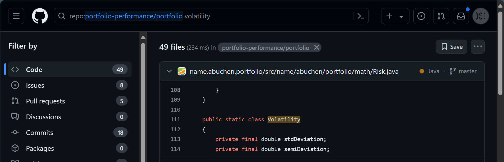

在使用 Portfolio Performance 程序时，你有时会遇到自己未能完全理解的结果。Portfolio Performance 已经通过提供中间结果、带有详细信息的气泡提示，以及以各种格式导出数据（以便用 Excel 等其他工具进一步分析）等方式，很好地解释了其计算过程与结果。

另一种可能是查阅源代码或 XML 文件。像 Portfolio Performance 这样的开源软件，其优势就在于源代码唾手可得。阅读代码能让你对各项指标是如何度量与计算的获得独到的理解。

## 示例 1：波动率指标是如何计算的？ {#example-1-how-is-the-volatility-indicator-calculated}

绩效仪表板（视图 > 报告 > 收益）显示若干绩效与风险指标，其中包括波动率指标。从其他资料中（例如 [Investopedia 的 How Do You Calculate Volatility in Excel?](https://www.investopedia.com/ask/answers/021015/how-can-you-calculate-volatility-excel.asp)），你了解到波动率通常以投资收益率之间的标准差来度量。一个典型的 Excel 公式形如：`= STDEV.S(A1:A100) * SQRT(100)`，假定日收益率位于 Excel 中的 A1:A100 范围内。

在你的投资组合上试用后，得到的结果却不一样。于是，你决定查阅源代码。

1. 前往 GitHub 源代码：[https://github.com/portfolio-performance/portfolio](https://github.com/portfolio-performance/portfolio)。该软件用 Java 编写，分为若干模块。
2. 使用窗口最顶端的搜索栏在仓库 `portfolio-performance/portfolio`中搜索：输入一个相关搜索词，例如 "volatility,"，以找到提到该词的源代码。浏览各模块以形成整体印象。`volatility`为何出现在这些模块中，将相当明显。

    图： 在 PP 的 GitHub 仓库中搜索 'Volatility' 的结果。{class=pp-figure}

    

3. 第一个模块（name.abuchen.portfolio/src/name/abuchen/portfolio/math/Risk.java）最为相关。它讲的是名为 "portfolio/math" 文件夹中的 "Risk"。点击框内即可查看代码。
4. 你会立即被带到第 111 行，Java 类 "Volatility" 就从那里开始。再往下几行，计算了一个名为 "averageLogReturn" 的东西。细看该函数的代码可以发现，它计算的是收益率的算术平均值，但显然用的是 (1 + 收益率)的自然对数。由于无法从负数取对数，因此要加 1。
5. 随后，这个平均值被用于计算标准偏差，同样使用（自然）对数 (1 + 收益率)的值。由于标准偏差与实际平均值无关，加 1 并不影响结果。
6. 到这一步就显而易见，你自己用 Excel 做的计算用错了输入值。回到原来的公式，把它改为 `= STDEV.S(B1:B100) * SQRT(100)`，其中 B 列包含收益率的对数值，例如 `=LN(1 + A1)`，就会得到与 PP 完全相同的波动率。
7. 当然，你本来也可以先读文档。关于波动率以及为何使用自然对数的说明，可以在"基本概念 > 风险"中找到。
