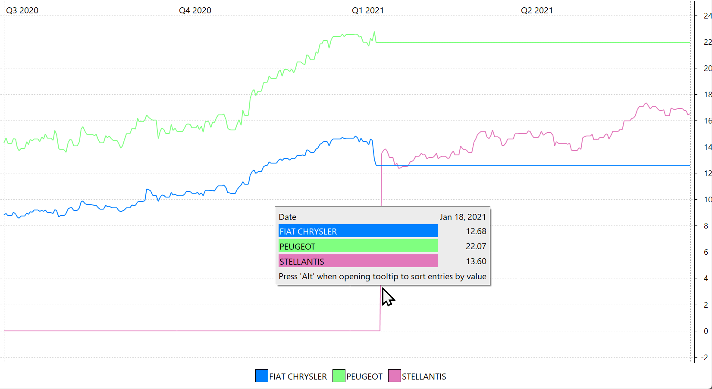

合并是指两家独立公司联合组建一个新组织，而收购则指一家公司接管另一家公司。正如 [Investopedia](https://www.investopedia.com/ask/answers/021815/what-difference-between-merger-and-acquisition.asp) 所解释的，这两个概念之间的界限已日益模糊。

2021 年 1 月 16 日（星期六），Peugeot S.A.（PSA）与 Fiat Chrysler Automobiles N.V.（FCA）的合并正式完成，促成了 Stellantis N.V.（STLA）的成立。图 1 展示了相关公司的历史价格数据，这些数据通过 PortfolioReport 从 XETRA 下载，相应的 ISIN 编号为：FCA（NL0010877643）、PSA（FR0000121501）和 Stellantis（NL00150001Q9）。

图： 2020-07-01 至 2021-07-01 期间 Fiat、Peugeot 与 Stellantis 的历史价格。{class=pp-figure}

在 Stellantis 的合并中，原股东获得的补偿为：

- 每位 FCA 股东每持有 1 股 FCA 股份，可获得 1 股 Stellantis 股份。
- 每位 PSA 股东每持有 1 股 PSA 股份，可获得 1.742 股 Stellantis 股份。

如图 1 所示，在 Stellantis 合并的前一日，两家公司的收盘价分别为：FCA 为 €12.68，PSA 为 €22.07。根据补偿比例，PSA 的价格应等于 1.742 × FCA 价格，即 €12.68 × 1.742 = €22.09，这与 PSA 的收盘价 €22.07 几乎一致。合并完成后，Stellantis 在欧洲股票市场表现抢眼，股价在首个交易日上涨 8%，从 €12.68 升至约 €13.60。

在 Portfolio Performance 中记录这次合并并不复杂，因为它只涉及创建一只新证券。要更新你的投资组合：

1. 按各自的价格卖出 FCA 与 PSA 股份。
2. 买入 Stellantis（STLA）股份。买入的 Stellantis 股数按 1.742 × FCA 股数 + PSA 股数计算。由于零股无法交易，你的券商很可能会将 Stellantis 的股数向下取整，从而在你的现金账户中留下一小笔现金盈余。
