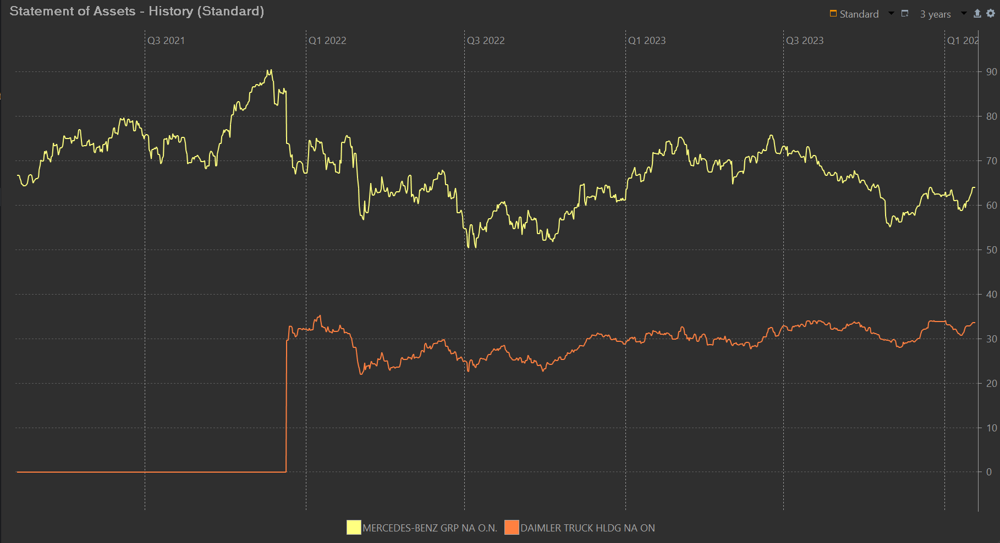
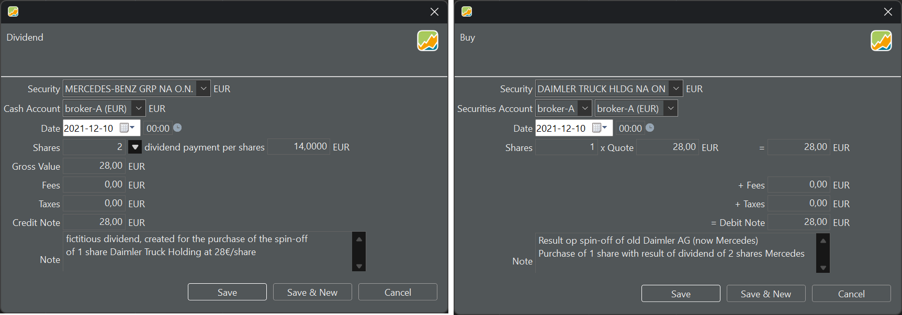

在股票市场的语境下，分拆是指一家公司将其部分业务剥离或"分拆"出去，成立一个新的独立实体的过程。这个新实体成为一家独立的公司，拥有自己的管理层、业务运营，通常还有自己的公开交易股票。

原公司的股东可按其在母公司持股的比例，获得新实体的股份。分配比例决定了每位股东每持有 1 股原公司股份，能获得多少股新实体的股份。

2021 年 12 月 10 日，Daimler AG 成功完成分拆，成立了新实体 [Daimler Truck Holding AG](https://group.mercedes-benz.com/documents/investors/annual-meeting/daimler-ir-egm-2021-spinoffhivedownreport.pdf)。与此同时，原 Daimler AG 更名为 Mercedes-Benz Group AG。因此，XETRA 股票市场如今包含两只不同的证券：Mercedes-Benz（原 Daimler AG）的 ISIN 为 DE0007100000，Daimler Truck Holding AG 的 ISIN 为 DE000DTR0CK8。此次分拆的分配比例为 2:1，即每持有 2 股 Daimler AG 股份，股东可获得 1 股 Daimler Truck Holding AG 股份。

图： Daimler Truck Holding 与 Mercedes-Benz Group 的报价走势。{class=pp-figure}

要在 Portfolio Performance (PP) 中记录一次分拆，根据 Portfolio Performance 论坛上的一次[深入讨论](https://forum.portfolio-performance.info/t/wie-bilde-ich-korrekt-einen-spin-off-ab/4677/20)梳理出这样一个建议工作流，包含以下步骤：

1. 将证券 Daimler AG 更名为 Mercedes-Benz AG，并在你的投资组合中新建一只证券 Daimler Truck Holding AG。

2. 为 Mercedes 这只证券创建一笔 2021 年 12 月 10 日的股息账目。股息价格设为每股 € 14（解释见下文）。

3. 创建一笔买入 n 股 Daimler Truck Holding AG 的买入账目，其中 n 是原 Daimler AG 股数的 1/2。据 XETRA 数据，Daimler Truck Holding AG 在 2021 年 12 月 10 日的[开盘价](https://www.boerse-frankfurt.de/equity/daimler-truck-holding-ag/price-history/historical-prices-and-volumes)为每股 28€（不含费用与税款）。

4. 股息账目与买入账目使用同一个现金账户。这样，这笔虚拟股息账目的结果就会被真实的买入账目抵消。n 股 x 14€/股的股息 = 买入 n/2 股 x 28€/股。

图： 记录 Daimler AG 的分拆。{class=pp-figure}

该工作流用一笔股息账目加上一笔等额买入来模拟，解决了分拆的问题。但缺点是并不存在*真实的*股息，这会削弱股息概览的准确性。反过来，从绩效角度看，把分拆视作股息是合理的。例如，原 Daimler AG 的股价明显下跌，从 2021 年 11 月中约 €90 跌至 2021 年 12 月 10 日的 €74，这说明市场已预见到即将到来的分拆。
