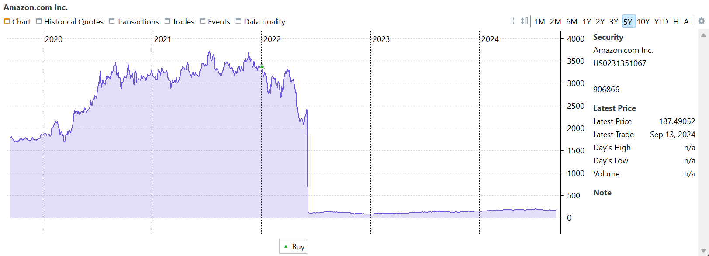
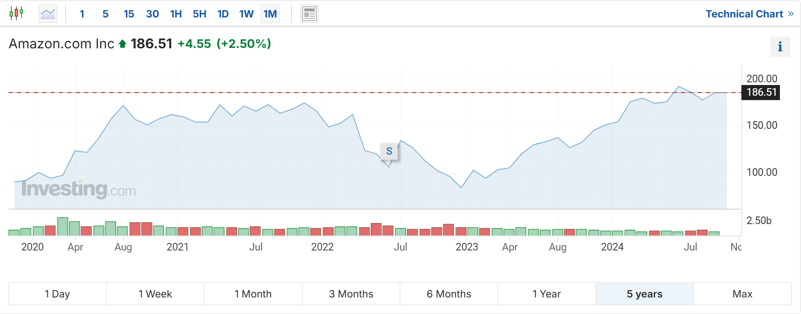
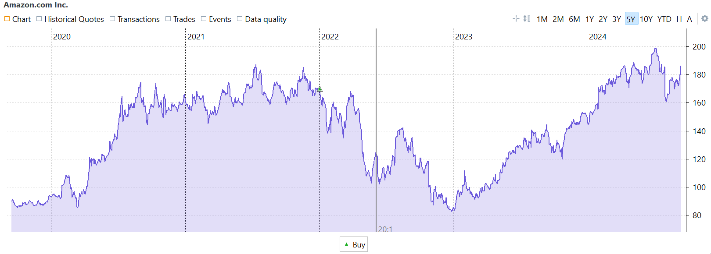
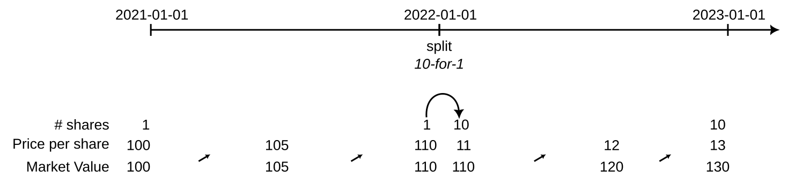

分股会增加一家公司的股份数量。例如在 2 拆 1 之后，每位投资者持有的股份数量翻倍，而每股价值则降至原来的一半。分股会导致单股市场价格下降，但不会改变公司的总市值。分股常被用来降低股价门槛，让更广泛的投资者能够参与，并提升市场流动性。反过来，1 拆 5 的缩股则会减少股份数量，但每股价格更高。

在 PP 中记录分股基本有两种方法：使用内置功能，或采用卖出再买入的操作。每种方法各有其优缺点。

## 使用内置的分股功能 {#use-of-the-built-in-stock-split-function}

Portfolio Performance 目前通过变通办法支持分股，参见[论坛上的讨论](https://forum.portfolio-performance.info/t/aktiensplit-buchen/11758)。其本质是追溯性地假定这些股份*一直*都是拆分后的状态。这样既能确保投资组合在分股*之后*的证券数量正确，又能保持历史上一致的现金流与估值，从而保全该证券的绩效。不过，分股*之前*的股份数量可能与真实的历史情况不符，这会使该证券历史变得难以理解。

此更改具有破坏性，且不易撤销。必要时，可以通过执行一次比例相反的分股来纠正一次执行不当的分股。但更好的做法或许是为投资组合文件创建一个备份副本。

在参考手册关于分股流程的说明中，示例用的是 Amazon 于 2022 年 6 月 6 日进行的 20 拆 1 分股。有关 PP [如何使用内置分股功能](../reference/view/securities/context-menu.md#stock-split)的细节，请先阅读该节。

在图 1 中，展示了最近五年的股价走势。非常明显的是，2022 年 6 月 3 日至 6 日之间有一次大幅下跌。这两天的收盘价分别为 `$ 2447` 与 `$ 124.79`（但请记住，你持有的份额是其 20 倍）。

图： Amazon 的历史报价图表（未调整价格 - 图表来自 PP）。{class=pp-figure}

把该图与大多数其他金融网站的图表作比较时，往往会产生相当多的困惑；例如 [investing.com](https://www.investing.com/equities/amazon-com-inc) 的 5 年图表看起来就大不相同。

图： Amazon 的历史报价图表（已调整价格 - 图表来自 investing.com）。{class=pp-figure}

两张图都跨越五年。但你在 2022 年 1 月前后的买价为 `$ 3408`（图 1），而据 [investing.com](https://www.investing.com/equities/amazon-com-inc) 显示却约为 `$ 150`（图 2）。这种差异产生的原因在于，金融网站在分股之后通常会对所有历史价格作"调整"。这种调整会重新计算分股之前的历史价格，正如 PP 的分股功能所做的那样。

图： Amazon 的历史报价图表（分股后已调整价格 - 图表来自 PP）。{class=pp-figure}

!!! Important

    Yahoo Finance 的*常规*收盘价已经针对分股作过调整。*调整后收盘*价在此基础上，还针对股息和/或资本利得分配作了调整。

**需要考虑的几点**

- 内置的分股功能与大多数金融网站所采用的方法完全一致。因此，已调整价格图表（图 3）与 investing.com 或 Yahoo Finance 等其他平台显示的图表（图 2）完全相同。

- 必须认识到，历史账目*与*价格被永久改动了。这意味着 PP 中过往账目的记录将不再准确反映你纸质文件中记载的实际账目。时间推移后，这会使重建某只证券的历史变得困难。

- 当分股产生零股时会出现一个值得注意的难题，例如 Prosus 于 2023 年 9 月 14 日宣布的 2.1796 拆 1 分股。在这种情形下，原有 10 股会拆成 21.796 股。虽然 Portfolio Performance 能处理零股，但大多数券商或银行不能。它们通常会针对这一特殊情况，发行 21 股新股并对零股部分（本例中为 0.796 股）给予补偿。因此，分股后你需要记录这笔补偿，这本质上就是执行一笔卖出零股的账目。

## 使用卖出再买入的方法 {#use-of-sell-buy-back-operation}

另一种能保持历史价格与账目原样的方法，是如下的卖出再买入流程。在分股日（除权日）：

- 按分股前一日的收盘价卖出全部股份。不要记录任何费用或税款，因为这是一项内部操作。历史价格保持原样。
- 同时，在同一日，按相当于分股理论结果（旧股数 x 分股比例）的新股数买入。确保买入总额与先前确定的卖出金额相符。
- 将新股的股数向下取整到最接近的整数。如有余数，则按与第 2 步相同的价格将其卖出。

我们用一个简化示例来演示这一工作流（见图 4）。2021 年 1 月 1 日，你持有 1 股价格为 100 EUR 的股票。该价格一直到 2021 年 12 月 31 日都基本未变。2022 年 1 月 1 日，发生了 10 拆 1 的分股，得到 10 股。当日收盘价为 11 EUR。到年底，价格已上涨至每股 13 EUR，你的投资组合市值因此为 130 EUR。

图： 卖出再买入式分股的简化示例。{class=pp-figure}

内置分股功能的绩效计算相当直截了当。由于分股功能具有追溯性，最初以每股 100 EUR 买入 1 股（期初市值）会被调整为以每股 10 EUR 买入 10 股。两年报告期结束时，你仍持有 10 股，但其总价值已增至 130 EUR（期末市值）。使用[资金加权收益率 (IRR)](../concepts/performance/money-weighted.md)与[时间加权收益率 (TTWROR)](../concepts/performance/time-weighted.md)一节中的公式：

- IRR：`130 = 100 * (1 + IRR)^2`，即 `IRR = SQRT(130/100) - 1` = 14.0157%。
- TTWROR：`= (130/100) - 1`，即 TTWROR = 30%

使用卖出再买入法时，你需要在最初的买入之后再补录若干账目。在分股日（2022-01-01），你以每股 110 EUR 的价格卖出 1 股，并以每股 11 EUR 的价格买入 10 股。

- IRR：`130 = 100 * (1 + IRR)^(730/365) - 100 * (1 + IRR)^(365/365) + 100 * (1 + IRR)^(365/365)`。由于后两项相互抵消，该公式简化为与内置分股相同的形式，即 `IRR = SQRT(130/100) - 1`，或 14.0157%。关键在于买入与卖出账目必须发生在同一天；否则第二项与第三项就不相等。假设你改为在 12 月 31 日而非 1 月 1 日卖出这 1 股，上式就变为 `130 = 100 x (1+IRR)^(730/365) - 100 x (1+IRR)^(366/365) + 100 x (1+IRR)^(365/365)`，即 `IRR = 14.0355%`，略高于内置函数的结果。请注意，第二项带负号且指数略大，这意味着 IRR 必须略高，才能得到 130 EUR 的期末市值。
- TTWROR：`= ((110/100) x (130/110)) - 1`，即 `(1.1 x 1.1818) - 1 = 30%`。对 TTWROR 计算而言，确切的卖出日期并不重要。

!!! note
    对于买入与卖出账目，我们使用的是分股前一刻的股价。然而，正如前面提到的 IRR 与 TWROR 公式，具体用哪个价格并不关键，只要买入与卖出账目适用同一价格即可。使用分股前一刻价格的好处在于，由此形成（经由卖出账目）的已结头寸能准确反映该股票直至分股时的真实绩效。

    请注意，在[视图 > 报告 > 收益 > 头寸](../reference/view/reports/performance/trades.md)视图中，报告的所有绩效都与报告期无关，而反映的是头寸的真实持有期间。例如，持有期间的结束日期是今天，而非报告期的结束日期。
