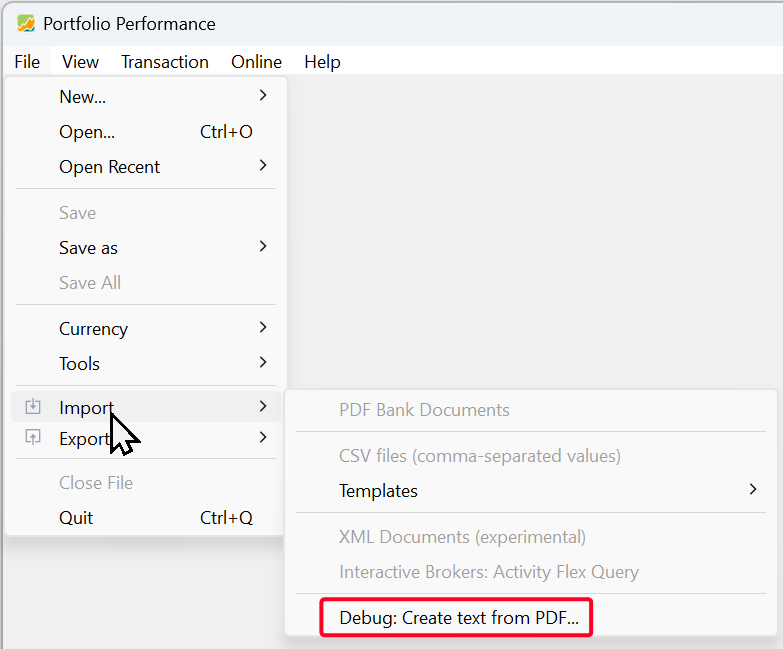
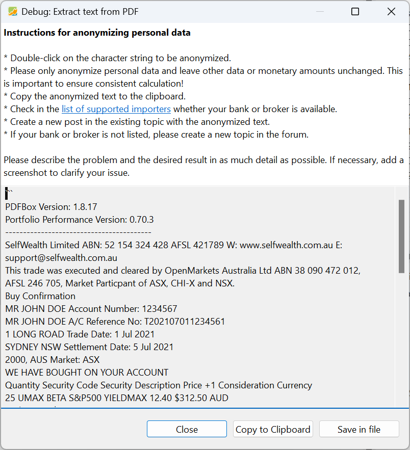

# 申请新的 PDF 导入器

如果 Portfolio Performance 没有针对你的银行或券商的 PDF 导入器，或者没有针对你所需要的特定账目类型的导入器，你可以提出开发该导入器的请求。由于 Portfolio Performance 的开发者无法接触每一家银行或券商，作为用户的你必须提供若干样例 PDF 文档，其中包含与该银行或券商相关的**真实**但**已匿名化**的账目示例。

下面的文字概述了所有必要步骤。你也可以观看页面底部的[配套视频](#video-tutorial)。

---

## 分步指南 {#step-by-step-guide}

### 1. 收集 PDF 文档 {#1-collect-a-pdf-document}

为你想导入 Portfolio Performance 投资组合的每一类账目收集一份 **PDF 文档**。理想情况下，你应各提供一笔**买入**、**卖出**和**股息**账目的示例。

!!! Failure
    不要使用由浏览器转换而来或自行扫描纸质单据生成的 PDF——只有来自银行或券商的**原始文档**才适用。

---

### 2. 把这些 PDF 转换为文本 {#2-convert-these-pdfs-to-text}

使用 PP 内置的解析器，它位于：

`文件 > 导入 > 调试：从 PDF 提取文本`

图： 菜单 文件 > 导入 {class="pp-figure"}



你可以用[这份样例（虚构的）PDF 文档](../assets/SelfwealthBuy01.pdf)进行测试。提取出的文本会显示在说明下方的文本框中：

图： 测试 PDF 提取出的文本 {class="pp-figure"}




---

### 3. 匿名化个人信息 {#3-anonymise-personal-information}

把提取出的文本中的个人信息替换（匿名化）掉，例如：

- 你的姓名
- 你的地址
- 你的账号

你可以双击某个词（例如你的姓名）来完成。文本会被选中并替换为随机字符。

!!! Warning
    个人信息可能在文档中的多个位置出现。

请**保持所有其他信息不变**，尤其是：

- 金额
- 日期
- 证券名称

**重要：** 下列字符串无法自动匿名化，必须保持原样：

- 货币（例如 `EUR`）
- ISIN
- 含以下字符的文本：连字符（`-`）、句点（`.`）、逗号（`,`）、冒号（`:`）、撇号（`'`）、斜杠（`/`）

!!! Danger
    **不要**手动删除或添加任何内容。

---

### 4. 复制或保存匿名化后的文本 {#4-copy-or-save-the-anonymised-text}

把匿名化后的文本复制到剪贴板，或保存为文本文件——稍后提交请求时你会需要它。

---

## 5. 提交你的请求 {#5-submit-your-request}

### 5a. 在论坛上 {#5a-in-the-forum}

如果还没有满足你需要的导入器：

- 在 [Portfolio Performance 论坛](https://forum.portfolio-performance.info/c/english/16)上创建一个新帖，标题为：

  ```
  PDF Import from [your bank or broker]
  ```

- 如果已有帖子与你的银行相符，则改为发表回复。例如：[PDF import from SelfWealth](https://forum.portfolio-performance.info/t/pdf-import-from-selfwealth/17399)

- 分别附上每种账目类型（买入/卖出/股息）的匿名化提取文本。

用**三重引号**把文本包起来，使其被正确格式化为代码：

<pre>
```
Your extracted PDF debug ...
```
</pre>

!!! Note
    提取时会自动插入

!!! Tip
    如果你的账目是外文的，请提供翻译或对所用术语的简短说明。

---

### 5b. 在 GitHub 上 {#5b-on-github}

你也可以直接通过 GitHub 报告 PDF 调试输出：

- 前往 [GitHub issue 表单](https://github.com/portfolio-performance/portfolio/issues/new?template=pdf_report.yml)
- **完整**填写表单，并附上匿名化后的提取文本。

---

## 6. 等待回复 {#6-wait-for-a-reply}

开发者会回复你的请求。一旦导入器完成，它就会被纳入之后的某个 Portfolio Performance 更新中。

---

# 视频教程 {#video-tutorial}

<video width="100%" controls>
  <source src="../../assets/videos/request-importer/PP-request-importer.mp4" type="video/mp4">
</video>
