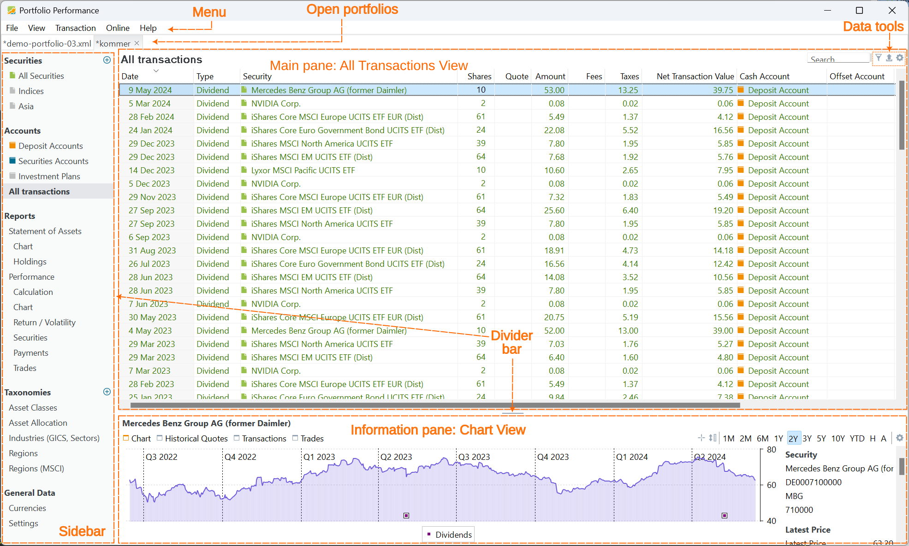

图 1 展示了 Portfolio Performance 一个典型的启动画面，其中打开着两个投资组合：`demo-portfolio-03.xml`与内置的 `kommer`投资组合。当前活动的投资组合是 `kommer`，其内容正显示在屏幕上。

图： Portfolio Performance 程序的典型启动画面。{class=pp-figure}

## 构成元素 {#components}

图 1 展示了选中 `全部账目`视图时出现的用户界面元素，该视图既可通过侧边栏访问，也可通过菜单选项 `视图 > 全部账目`访问。在本例中，选中的是最后一笔股息账目，因此信息窗格中显示的是 `Mercedes Benz Group` 的历史报价图表。

- **菜单栏**包含五个元素：`文件`、`视图`、`账目`、`联机`和`帮助`。这个顶部菜单在各视图中保持一致。但子菜单可能是动态的。例如，`账户之间转账...`菜单项只有在存在多个现金账户时才可用。手册"参考"一节给出了[所有菜单与子菜单的概览](../reference/index.md)。
- **已打开的投资组合**：你可以同时打开多个投资组合。下图中高亮显示的是当前项目。名称前带星号（*）的项目已被改动，关闭前应予保存。在用户界面中，可以[并排](../how-to/copy-securities.md)显示两个项目。
-  **侧边栏**是访问项目中各个视图的便捷快捷方式。所有可用选项也都可以通过 `视图`菜单访问。需注意，侧边栏中的列表与 `视图`菜单中的选项一一对应，提供可用视图的一一映射。所选视图决定了相邻的上、下窗格中显示的内容。在 `证券`与`类别`选项旁边，有一个很小的（绿色）图标，可用来添加新元素。

    要隐藏或显示侧边栏，可以使用菜单选项 `视图 > 选项 > 隐藏/显示侧边栏`。或者，也可以使用快捷键 `Ctrl+K`，以提高操作效率。这样就能按需快速切换侧边栏的显示状态。

- 双窗格视图：在 PP 中，所有视图都由双窗格布局组成，含一个主窗格和一个信息窗格。当你在主窗格中选中某一项时，更详细的信息会显示在信息窗格中。如果你更习惯单窗格视图，可以隐藏信息窗格（见下文），从而营造出类似"设置"视图那样的单窗格效果。
- **主窗格**：在图 1 的示例中，主窗格包含 `全部账目`视图。这是你与投资组合之间所有账目的列表，例如存款、取款、买入和卖出。默认列（如 `日期`、`类型`、`证券`等）初始是可见的。不过你可以用位于右上角的设置（齿轮）图标灵活调整这些列。请注意，右上角的数据工具图标专属于此视图，在其他视图中不一定出现。
- **信息窗格**随主窗格中的选择而变化。例如，在图 1 的主窗格中选中 `NVIDIA Corp`，信息窗格中就会显示该股票的图表。你可以用菜单 `视图 > 选项 > 隐藏/显示信息窗格`来隐藏/显示信息窗格。快捷键是 `Ctrl+L`。
- **分隔条**：上下窗格所占的区域可用分隔条调整。分隔条可以一直拖到最上方或最下方，让你按自己的偏好定制布局。此外，侧边栏右边界处还有一条垂直分隔条。
- **滚动条**在文字无法全部显示时出现。在图 1 中，有两条垂直滚动条和一条水平滚动条。

## 表格操作 {#table-handling}

图 1 中的主窗格由一个表格构成。数据工具中的第一个图标可让你筛选表中的行，例如只显示买入账目。第二个图标可让你把当前显示的表格导出为 CSV 文件。通过第三个图标（齿轮），你可以显示或隐藏表格中的列。

点击列标题可按该列升序（&and;）或降序（&or;）排序。你可以通过拖动列标题来重新排列任意一列。拖动两列之间的分隔线可调整左列的宽度，也可以双击以适应最佳宽度。你可以用上下文菜单（右键点击列标题）重命名或隐藏某一列。添加、删除或把列恢复为原有布局，可用"显示或隐藏列"图标（右上角的齿轮符号）完成。点击齿轮图标会显示所有可用的列。

## 快捷键 {#shortcuts}

侧边栏包含 `视图`菜单中的大多数菜单项，因此是执行命令的便捷方式。你可以用视图菜单"选项"下的第一个菜单项来显示或隐藏侧边栏。

此外还有许多键盘快捷键。例如，Ctrl+K（Windows）或 Cmd+K（Mac）可切换侧边栏。全部快捷键的[完整概览](shortcuts.md)可供查阅。
