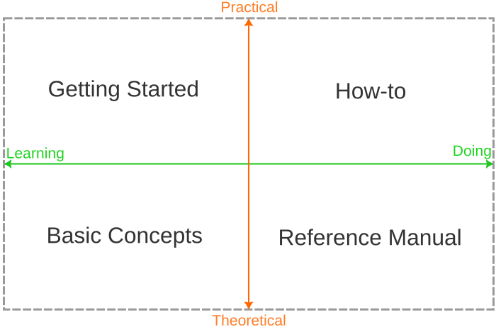

## 什么是 Portfolio Performance？ {#what-is-portfolio-performance}

自 2012 年初起，[Portfolio Performance](https://portfolio-performance.info) 便已可用于计算整体投资组合的绩效——跨越多个证券账户与现金账户——其依据是时间加权收益率（True Time-Weighted Rate of Return）与内部收益率。

*Portfolio Performance* 是一款用于管理证券投资组合的简洁而强大的工具。借助 *Portfolio Performance*，你可以：

- 通过有意义的概览、关键指标与图表，追踪证券投资组合的构成与变化。
- 追踪证券的历史价格走势，以及你的买入与卖出记录。
- 按需对组合中的证券进行分类，并以资产类别、地区等方式可视化其构成。
- 用计划中的资产配置定义并追踪你的投资组合策略，并确保再平衡得以执行。
- 在多个证券账户与关联账户之间建立统一视图。
- 快速便捷地导入网上银行与券商的对账单。

*Portfolio Performance*（PP）本身力求尽可能简单直观。但有时仍需说明——[论坛](https://forum.portfolio-performance.info)中大量相似的问题即为此证。本"手册"旨在陪你完成使用 *Portfolio Performance* 的最初几步，解释基本概念，并记录那些需要说明的功能。

**Portfolio Performance**（PP）指南由四个章节组成，源自一套知名的[文档编写框架](https://fachglossar.platinus.at/docs/Glossar/D-Glossar/Diataxis-Framework/)。文档沿两条轴线组织：实践知识与理论知识，学习与应用。

- [快速上手](getting-started/index.md)
  如果你刚接触 Portfolio Performance，本章将帮助你轻松入门。
  内容涵盖从安装、创建新投资组合、导入证券与账目数据，到评估整个投资组合的全过程。

- [基本概念](concepts/index.md)
  尽管 Portfolio Performance 是极为直观、易用的程序，其背后的金融概念却可能相当复杂。本章力求以简短而清晰的方式，让你理解最重要的 Portfolio Performance 概念，如账户、账目、报告期、内部收益率等。

- [参考手册](reference/index.md)
  是对程序用户界面全部功能与元素的详细技术说明。

- [操作指南](how-to/index.md)
  本章提供常见操作的分步说明，包括数据导入、股息记账、查找历史价格等。此外还描述了一些技巧与特殊情况。

## 一起来帮忙…… {#help-out}

如你所见，本手册中仍有不少空白页面。
如果你有兴趣，也欢迎到论坛与我们联系！[衷心感谢迄今为止所有提供帮助的人。](https://github.com/portfolio-performance/portfolio-help/graphs/contributors)
