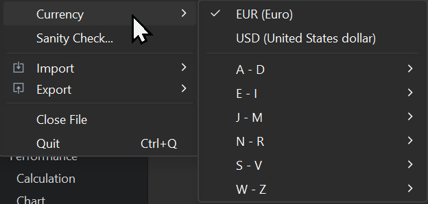
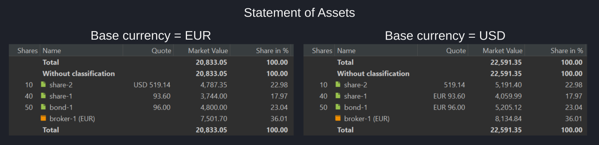

# 文件 &rsaquo; 货币

图： 货币选择器。{class=align-right style="width:20%"}

投资组合的基准货币在创建时即已确定。在 `资产明细` 之类的报表中，有些金额前会冠以货币缩写（如 USD），有些则不会。默认情况下，只有不以基准货币计价的金额才会加上货币缩写。

!!! Note

    若要让所有金额都显示货币代码，请转到 `帮助 > 首选项 > 外观` 菜单，启用 `始终在金额前显示货币` 选项。该改动会在下次启动 PP 时生效，届时所有金额都会加上货币代码。

要添加或更改基准货币，请使用菜单 `文件 > 货币`。在图 1 中，创建投资组合时的原始基准货币是 EUR。另一个可选基准货币 USD 已被添加，但尚未设为基准货币（以未勾选的方框表示）。若要把 AUD 添加为另一个可选基准货币：

1. 点击 `货币` 菜单中的 "A - D" 子菜单，展开可用货币列表。
2. 在列表中找到并选择 "AUD"。

添加之后，你可以通过勾选旁边的方框把 AUD 设为基准货币。这会改变该投资组合的基准货币，并可能影响报表及应用程序其他部分中金额的显示方式。

在图 2 中，share-1 与 bond-1 是以 EUR 交易的欧洲股票，而 share-2 是以 USD 表示的美国股票。资产明细报表生成了两次：一次以 EUR 为基准货币（左图），一次以 USD 为基准货币（右图）。请注意，两个面板中的报价价格都保持不变。但由于基准货币不同，市值会有所差异。

例如，左图中的总市值为 20,833.05 EUR，而右图中为 22,591.35 USD。根据[货币换算器](../view/general-data/currencies.md)，2024-03-20 的汇率为 1.0844 EUR/USD。用该汇率可以验证换算：20,833.05 EUR x 1.0844 = 22,591.35 USD。

图： 两种基准货币下的资产明细。{class=pp-figure}

